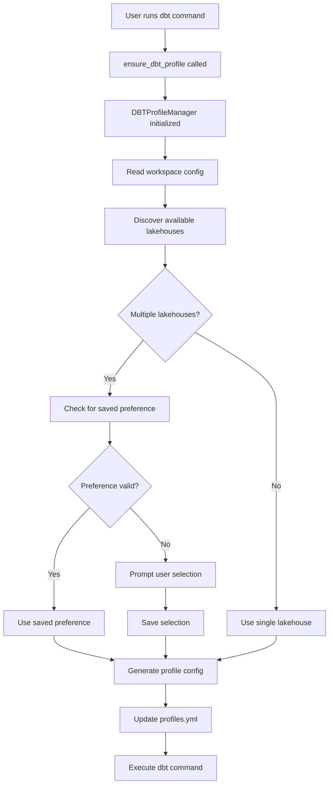

# DBT Profile Manager

[Home](../index.md) > [Developer Guide](index.md) > DBT Profile Manager

The DBT Profile Manager is a component that automatically manages dbt profile configuration for Fabric Spark notebooks, providing intelligent lakehouse selection and preference persistence.

## Architecture

The profile manager is implemented in `ingen_fab/cli_utils/dbt_profile_manager.py` and consists of:

### Core Components

```python
DBTProfileManager
├── __init__(workspace_dir, environment)
├── get_workspace_config() -> Dict
├── get_available_lakehouses(values) -> Dict
├── prompt_for_lakehouse_selection(lakehouses) -> Dict
├── get_saved_lakehouse_preference(config) -> Optional[str]
├── generate_profile_config(ask_for_selection, existing_config) -> Dict
├── read_existing_profile() -> Optional[Dict]
├── write_profile(config) -> None
└── check_and_update_profile(ask_confirmation) -> bool

ensure_dbt_profile(ctx, ask_confirmation) -> bool  # Entry point
```

## Implementation Details

### Lakehouse Discovery

The system discovers lakehouses by scanning environment configuration files for patterns:

```python
def get_available_lakehouses(self, values: Dict[str, Any]) -> Dict[str, Dict[str, str]]:
    """Extract all available lakehouse configurations from the values."""
    lakehouses = {}
    lakehouse_prefixes = set()
    
    # Find all variables ending with "_lakehouse_id"
    for key in values.keys():
        if "_lakehouse_id" in key:
            prefix = key.replace("_lakehouse_id", "")
            lakehouse_prefixes.add(prefix)
    
    # For each prefix, gather related configuration
    for prefix in lakehouse_prefixes:
        lakehouse_id = values.get(f"{prefix}_lakehouse_id", "")
        lakehouse_name = values.get(f"{prefix}_lakehouse_name", prefix)
        workspace_id = values.get(f"{prefix}_workspace_id", "")
        
        # Skip placeholders
        if (lakehouse_id and workspace_id and 
            "REPLACE_WITH" not in lakehouse_id and 
            "REPLACE_WITH" not in workspace_id):
            
            lakehouses[prefix] = {
                "lakehouse_id": lakehouse_id,
                "lakehouse_name": lakehouse_name,
                "workspace_id": workspace_id,
                "workspace_name": workspace_name,
                "prefix": prefix
            }
    
    return lakehouses
```

### Variable Naming Convention

The manager expects variables following this pattern in `valueSets/*.json`:

```json
{
  "variableOverrides": [
    {
      "name": "{prefix}_workspace_id",
      "value": "workspace-guid"
    },
    {
      "name": "{prefix}_lakehouse_id", 
      "value": "lakehouse-guid"
    },
    {
      "name": "{prefix}_lakehouse_name",
      "value": "Human Readable Name"
    }
  ]
}
```

Where `{prefix}` can be any identifier like `bronze`, `silver`, `gold`, `sample_lh`, etc.

### Preference Persistence

User selections are saved in the dbt profile itself using a special field:

```yaml
fabric-spark-testnb:
  outputs:
    my_project_target:
      type: fabricsparknb
      lakehouse: "Selected Lakehouse"
      lakehouseid: "lakehouse-guid"
      workspaceid: "workspace-guid"
      _lakehouse_prefix: "bronze"  # Saved selection
```

The `_lakehouse_prefix` field:
- Is prefixed with underscore to indicate it's metadata
- Stores the prefix of the selected lakehouse
- Is used to restore the selection on subsequent runs
- Is environment-specific (different for dev/test/prod)

### Interactive Selection UI

When multiple lakehouses are available, the manager presents a rich table:

```python
def prompt_for_lakehouse_selection(self, lakehouses: Dict[str, Dict[str, str]]) -> Dict[str, str]:
    table = Table(show_header=True, header_style="bold magenta")
    table.add_column("#", style="cyan", width=3)
    table.add_column("Prefix", style="cyan")
    table.add_column("Lakehouse Name", style="green")
    table.add_column("Workspace Name", style="yellow")
    table.add_column("Lakehouse ID", style="dim")
    
    # Add rows for each lakehouse
    for idx, config in enumerate(options, 1):
        table.add_row(...)
    
    console.print(table)
    
    # Prompt for selection
    choice = Prompt.ask(
        "Select a lakehouse configuration by number",
        default="1",
        choices=[str(i) for i in range(1, len(options) + 1)]
    )
```

## Integration Points

### CLI Commands

The profile manager is integrated at these points:

1. **dbt_commands.py**:
   - `create_additional_notebooks()` - Line 27
   - `generate_notebooks()` - Line 310

2. **cli.py**:
   - `dbt exec` command - Line 1113

### Control Flow



## Configuration Sources

The manager reads configuration from multiple sources in order:

1. **Environment Variable**: `FABRIC_ENVIRONMENT`
2. **Variable Library**: `fabric_workspace_items/config/var_lib.VariableLibrary/valueSets/{environment}.json`
3. **Existing Profile**: `~/.dbt/profiles.yml`

## Error Handling

The manager handles several error scenarios:

- **No lakehouses found**: Falls back to `sample_lh` configuration
- **Invalid configuration**: Displays warning about placeholders
- **Missing environment**: Lists available environments
- **Profile write failure**: Returns false to prevent command execution

## Testing

To test the profile manager:

```python
from pathlib import Path
from ingen_fab.cli_utils.dbt_profile_manager import DBTProfileManager

# Create test environment
manager = DBTProfileManager(Path("./sample_project"), "development")

# Test lakehouse discovery
values = manager.get_workspace_config()
lakehouses = manager.get_available_lakehouses(values)
print(f"Found {len(lakehouses)} lakehouses")

# Test profile generation
config = manager.generate_profile_config(ask_for_selection=False)
print(f"Generated profile for: {config['fabric-spark-testnb']['outputs']['my_project_target']['lakehouse']}")
```

## Extending the Manager

To extend the profile manager for new features:

### Adding New Profile Fields

Modify `generate_profile_config()` to include additional fields:

```python
profile_config = {
    "fabric-spark-testnb": {
        "outputs": {
            "my_project_target": {
                # Existing fields...
                "custom_field": custom_value,  # Add new field
            }
        }
    }
}
```

### Supporting Different Profile Types

Create a new profile type by extending the configuration:

```python
if profile_type == "warehouse":
    profile_config["fabric-warehouse"] = {
        "outputs": {
            "warehouse_target": {
                "type": "fabricwarehouse",
                # Warehouse-specific configuration
            }
        }
    }
```

### Custom Selection Logic

Override the selection method for specific requirements:

```python
def select_lakehouse_by_role(self, lakehouses, user_role):
    """Select lakehouse based on user role."""
    if user_role == "analyst":
        return lakehouses.get("gold", lakehouses.get("silver"))
    elif user_role == "engineer":
        return lakehouses.get("bronze")
    return self.prompt_for_lakehouse_selection(lakehouses)
```

## Best Practices

1. **Naming Conventions**: Use consistent prefixes for lakehouse configurations
2. **Environment Isolation**: Keep separate configurations for each environment
3. **Placeholder Handling**: Always check for "REPLACE_WITH" values
4. **User Experience**: Minimize prompts by saving preferences
5. **Error Messages**: Provide clear guidance when configuration is missing

## Troubleshooting

### Common Issues

1. **Profile not updating**: Check file permissions and YAML validity
2. **Lakehouses not discovered**: Verify naming convention in valueSets
3. **Selection not saved**: Ensure `_lakehouse_prefix` is written
4. **Wrong lakehouse selected**: Check `FABRIC_ENVIRONMENT` value

### Debug Mode

Enable debug output by modifying the manager:

```python
console = Console()
console.print(f"[debug]Environment: {self.environment}")
console.print(f"[debug]Found lakehouses: {lakehouses.keys()}")
console.print(f"[debug]Saved preference: {saved_prefix}")
```

## Related Components

<!-- - [dbt_commands.py](../api/dbt_commands.md) - DBT command implementations -->
- [Variable Library](variable_replacement.md) - Configuration management
<!-- - [CLI Architecture](../api/cli.md) - Command-line interface structure -->