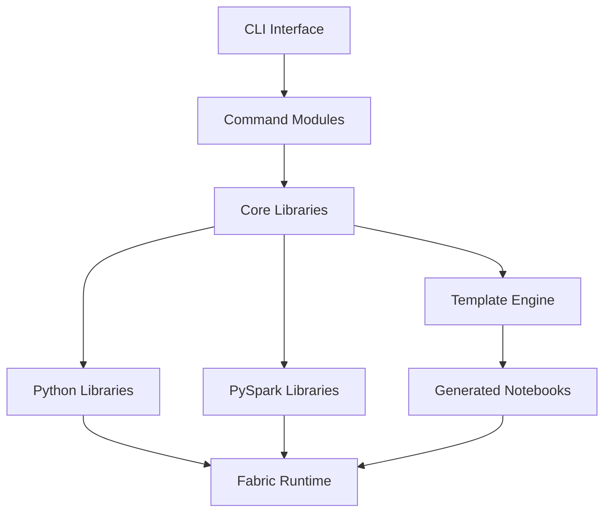

# Developer Guide

Welcome to the Developer Guide for the Ingenious Fabric Accelerator! This section is designed for developers who want to understand the architecture, extend functionality, or contribute to the project.

## Architecture Overview

The Ingenious Fabric Accelerator is built with a modular architecture that separates concerns and enables extensibility:



## Core Components

### [Python Libraries](python_libraries.md)
Reusable Python and PySpark libraries that provide common functionality for Fabric workspaces.

### [DDL Scripts](ddl_scripts.md)
Template system for generating DDL notebooks from SQL and Python scripts.

### [Notebook Utils](notebook_utils.md)
Environment-agnostic utilities that work in both local development and Fabric runtime.

### [SQL Templates](sql_templates.md)
Jinja-based SQL template system supporting multiple database dialects.

## Development Setup

### Prerequisites

- Python 3.12+
- Git
- IDE with Python support (VS Code, PyCharm, etc.)
- Docker (optional, for containerized development)

### Clone and Setup

```bash
# Clone the repository
git clone https://github.com/your-org/ingen_fab.git
cd ingen_fab

# Set up development environment
uv sync --all-extras

# Install pre-commit hooks
pre-commit install

# Verify installation
ingen_fab --help
```

### Development Dependencies

The project uses several development tools:

- **Testing**: pytest, pytest-cov, pytest-asyncio
- **Linting**: ruff, vulture
- **Type checking**: mypy (optional)
- **Documentation**: mkdocs, mkdocs-material
- **Pre-commit**: pre-commit hooks for code quality

### Container Development Setup

For a consistent development environment with Apache Spark and SQL Server, use the provided dev container:

1. **Open in Dev Container**: Use VS Code's "Dev Containers" extension and select "Reopen in Container"

2. **Install PowerShell**:
   ```bash
   source ./scripts/dev_container_scripts/spark_minimal/pwsh_install.sh
   ```

3. **Start PowerShell and install development tools**:
   ```bash
   pwsh
   ```
   ```powershell
   ./scripts/dev_container_scripts/spark_minimal/dev_tools.ps1
   ```

4. **Restart PowerShell session**:
   ```powershell
   . $PROFILE
   ```

5. **Install SQL Server (optional)**:
   ```bash
   bash ./scripts/dev_container_scripts/spark_minimal/sql_install_4_linux.sh
   bash /opt/mssql/bin/mssql-conf setup
   ```
   
   Note: You'll need to provide an SA password and select "Enterprise (2)" and "English" when prompted.

   Once the setup is complete, you can start SQL Server with. (Press Enter after the command completes and sql server will be started in the background. Note you will need to run this command every time you start the container):

   ```bash
   /opt/mssql/bin/sqlservr &
   ```

   Next set the environment variables for SQL Server connection:

   ```bash
   export SQL_SERVER_PASSWORD="YourStrong@Passw0rd"
   ```

   or 

   ``` pwsh 
   $env:SQL_SERVER_PASSWORD = "YourStrong@Passw0rd"
   ```

You now have a minimal setup with Apache Spark, SQL Server, and PowerShell support for local development.

## Project Structure

```
ingen_fab/
├── cli_utils/              # CLI command implementations
│   ├── __init__.py
│   ├── deploy_commands.py  # Deployment commands
│   ├── init_commands.py    # Project initialization
│   ├── notebook_commands.py # Notebook management
│   └── workspace_commands.py # Workspace operations
├── ddl_scripts/            # DDL template system
│   ├── _templates/         # Jinja templates
│   ├── notebook_generator.py # Template processor
│   └── README.md
├── notebook_utils/         # Notebook utilities
│   ├── fabric_cli_notebook.py
│   ├── simple_notebook.py
│   └── templates/
├── python_libs/            # Core Python libraries
│   ├── common/            # Shared utilities
│   ├── interfaces/        # Abstract interfaces
│   ├── python/           # CPython implementations
│   └── pyspark/          # PySpark implementations
├── python_libs_tests/     # Test suites
├── cli.py                 # Main CLI entry point
└── project_config.py      # Project configuration
```

## Development Workflow

### 1. Feature Development

```bash
# Create feature branch
git checkout -b feature/new-feature

# Make changes
# ... develop your feature ...

# Run tests
pytest ./tests/ -v
pytest ./ingen_fab/python_libs_tests/ -v

# Check code quality
ruff check .
ruff format .

# Commit changes
git add .
git commit -m "Add new feature: description"
```

### 2. Testing

```bash
# Run all tests
pytest

# Run specific test modules
pytest ./tests/test_cli.py -v
pytest ./ingen_fab/python_libs_tests/python/test_warehouse_utils_pytest.py -v

# Run with coverage
pytest --cov=ingen_fab --cov-report=html

# Test CLI commands
ingen_fab test local libraries --base-dir .
```

### 3. Documentation

```bash
# Serve documentation locally
mkdocs serve

# Build documentation
mkdocs build

# Deploy documentation
mkdocs gh-deploy
```

## Adding New Features

### Adding a New CLI Command

1. **Create command module**:
   ```python
   # cli_utils/my_new_commands.py
   import typer
   from typing_extensions import Annotated
   
   def my_new_command(
       param: Annotated[str, typer.Option(help="Description")]
   ):
       """My new command description."""
       print(f"Executing with param: {param}")
   ```

2. **Register command in CLI**:
   ```python
   # cli.py
   from cli_utils import my_new_commands
   
   # Add command to app
   app.add_typer(
       my_new_commands.app,
       name="mynew",
       help="My new command group"
   )
   ```

3. **Add tests**:
   ```python
   # tests/test_my_new_commands.py
   from typer.testing import CliRunner
   from ingen_fab.cli import app
   
   def test_my_new_command():
       runner = CliRunner()
       result = runner.invoke(app, ["mynew", "command", "--param", "value"])
       assert result.exit_code == 0
   ```

### Adding a New Python Library

1. **Create the library**:
   ```python
   # python_libs/python/my_new_utils.py
   from typing import Any
   from .notebook_utils_abstraction import get_notebook_utils
   
   class MyNewUtils:
       def __init__(self):
           self.notebook_utils = get_notebook_utils()
       
       def my_function(self) -> Any:
           """New utility function."""
           return "result"
   ```

2. **Create tests**:
   ```python
   # python_libs_tests/python/test_my_new_utils_pytest.py
   import pytest
   from ingen_fab.python_libs.python.my_new_utils import MyNewUtils
   
   def test_my_function():
       utils = MyNewUtils()
       result = utils.my_function()
       assert result == "result"
   ```

3. **Add to template injection**:
   ```python
   # python_libs/gather_python_libs.py
   # Add your library to the collection process
   ```

### Adding a New DDL Template

1. **Create templates**:
   ```jinja2
   <!-- ddl_scripts/_templates/common/my_new_template.py.jinja -->
   # Generated DDL script for {{ entity_name }}
   from my_new_utils import MyNewUtils
   
   utils = MyNewUtils()
   result = utils.my_function()
   print(f"Result: {result}")
   ```

2. **Update notebook generator**:
   ```python
   # ddl_scripts/notebook_generator.py
   # Add template to the generation process
   ```

## Code Standards

### Python Style

- Follow PEP 8 style guidelines
- Use type hints where appropriate
- Write docstrings for all public functions
- Use meaningful variable and function names

### Testing

- Write tests for all new functionality
- Aim for >80% code coverage
- Use descriptive test names
- Test both success and failure cases

### Documentation

- Update documentation for new features
- Include code examples
- Write clear, concise explanations
- Update CLI help text

## Debugging

### Local Development

```bash
# Run with verbose output
ingen_fab --help

# Debug specific commands - use VS Code launch configuration
See .vscode/launch.json for pre-configured debug setups

# Use logging
import logging
logging.basicConfig(level=logging.DEBUG)
```

### Testing Issues

```bash
# Run specific test
pytest ./tests/test_cli.py::test_specific_function -v -s

# Debug test failures
pytest ./tests/test_cli.py::test_specific_function --pdb

# Check test coverage
pytest --cov=ingen_fab --cov-report=term-missing
```

## Contributing

### Pull Request Process

1. **Fork the repository**
2. **Create feature branch**
3. **Make changes with tests**
4. **Update documentation**
5. **Submit pull request**

### Code Review Checklist

- [ ] Code follows style guidelines
- [ ] Tests are included and passing
- [ ] Documentation is updated
- [ ] No breaking changes (or properly documented)
- [ ] Performance impact is considered

## Advanced Topics

### Custom Template Development

Learn how to create custom templates for specific use cases.

### Plugin Architecture

Understand how to extend the CLI with plugins.

### Performance Optimization

Best practices for optimizing generation and deployment performance.

### Integration Testing

Setting up comprehensive integration tests with Fabric.

## Resources

### Internal Documentation

- [Python Libraries](python_libraries.md) - Detailed library documentation
- [DDL Scripts](ddl_scripts.md) - Template system guide
- [Notebook Utils](notebook_utils.md) - Utility abstractions
- [SQL Templates](sql_templates.md) - SQL template reference

### External Resources

- [Typer Documentation](https://typer.tiangolo.com/)
- [Jinja2 Documentation](https://jinja.palletsprojects.com/)
- [Microsoft Fabric Documentation](https://docs.microsoft.com/en-us/fabric/)
- [pytest Documentation](https://docs.pytest.org/)

## Getting Help

- **Documentation**: This site covers most development topics
- **Issues**: Report bugs or request features on GitHub
- **Discussions**: Join community discussions for questions
- **Code Review**: Submit pull requests for feedback

Ready to contribute? Start with the [Python Libraries](python_libraries.md) guide to understand the core architecture!