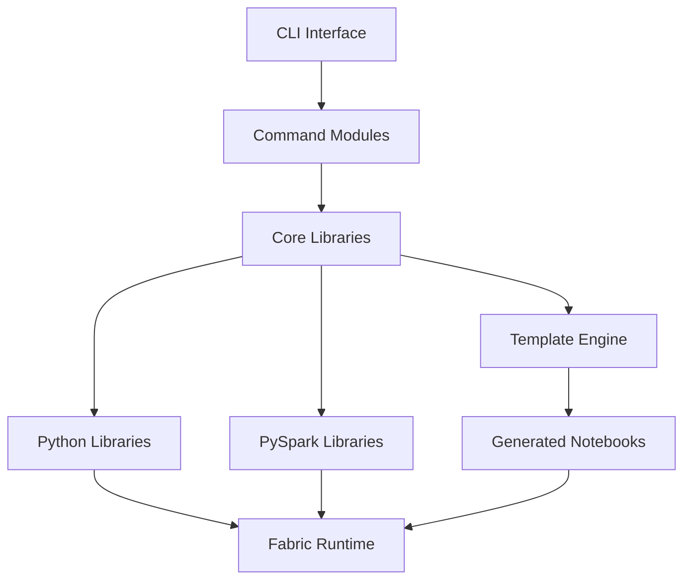

# Developer Guide

[Home](../index.md) > Developer Guide

!!! warning "Documentation Status"
    The documentation in this guide needs to be reviewed and updated.

Welcome to the Developer Guide for the Ingenious Fabric Accelerator! This section is designed for developers who want to understand the architecture, extend functionality, or contribute to the project.

## Architecture Overview

The Ingenious Fabric Accelerator is built with a modular architecture that separates concerns and enables extensibility:


```mermaid
graph TD
    A[CLI Interface] --> B[Command Modules]
    B --> C[Core Libraries]
    C --> D[Python Libraries]
    C --> E[PySpark Libraries]
    C --> F[Template Engine]
    D --> G[Fabric Runtime]
    E --> G
    F --> H[Generated Notebooks]
    H --> G
```

## Core Components

### [Python Libraries](python_libraries.md)
Reusable Python and PySpark libraries that provide common functionality for Fabric workspaces.

### [DDL Scripts](ddl_scripts.md)
Template system for generating DDL notebooks from SQL and Python scripts.

### [Notebook Utils](notebook_utils.md)
Environment-agnostic utilities that work in both local development and Fabric runtime.

### [SQL Templates](sql_templates.md)
Jinja-based SQL template system supporting multiple database dialects.

### [Variable Replacement System](variable_replacement.md)
Environment-specific configuration management through placeholder replacement and code injection.

### [Packages](packages.md)
Extension package system for adding custom functionality and reusable components.

### [DBT Profile Manager](dbt_profile_manager.md)
Automatic dbt profile management and lakehouse integration.

### [Pip Install Testing](pip_install_testing.md)
Testing the package installation and dependencies in various environments.

## Development Setup

### Prerequisites

- Python 3.12+
- Git
- IDE with Python support (VS Code, PyCharm, etc.)
- Docker (optional, for containerized development)

### Clone and Setup

--8<-- "_includes/developer_setup.md"

### Development Dependencies

The project uses several development tools:

- **Testing**: pytest, pytest-cov, pytest-asyncio
- **Linting**: ruff, vulture
- **Type checking**: mypy (optional)
- **Documentation**: mkdocs, mkdocs-material
- **Pre-commit**: pre-commit hooks for code quality

### Container Development Setup

For a consistent development environment, use the provided dev container
(`.devcontainer/spark_minimal/`): Python 3.12, a JVM for local Spark sessions, `uv`, git and
the SQL Server ODBC driver, with the project's virtual environment created automatically.

1. **Open in Dev Container**: Use VS Code's "Dev Containers" extension, select "Reopen in
   Container" and pick `spark_minimal`. On first start `postCreateCommand` runs
   `uv sync --all-extras`; the venv lives at `/opt/venv` inside the container and is on `PATH`.

2. **Verify**:

    ```bash
    ingen_fab --help
    pytest tests/test_promotion_utils.py -q
    ingen_fab test local pyspark lakehouse_utils              # local Spark session with Delta
    bash .devcontainer/spark_minimal/verify.sh                # all of the above in one go
    ```

3. **Azure login** (inside the container; the token cache persists in a named volume):

    ```bash
    az login --use-device-code
    ```

4. **SQL Server (optional)**: the dev container has no Docker CLI, so start SQL Server as a
   separate container **on the host**:

    ```bash
    # on the host
    docker run -e 'ACCEPT_EULA=Y' -e 'SA_PASSWORD=YourStrong!Passw0rd' \
        -p 1433:1433 --name sql_server \
        -d mcr.microsoft.com/mssql/server:2022-latest
    ```

    ```powershell
    # on the host (PowerShell)
    docker run -e 'ACCEPT_EULA=Y' -e 'SA_PASSWORD=YourStrong!Passw0rd' `
        -p 1433:1433 --name sql_server `
        -d mcr.microsoft.com/mssql/server:2022-latest
    ```

    Use single quotes in Bash: `!` inside double quotes triggers history expansion in an
    interactive shell. Inside the dev container the host is `host.docker.internal`, not `localhost`.
    The library's default SQL Server connection string is hard-coded to `SERVER=localhost,1433`
    (only the password is configurable, via `SQL_SERVER_PASSWORD`, which the host-side
    `docker run` does not set inside the dev container), so export the password there and pass
    an explicit connection string:

    ```bash
    # inside the dev container
    export SQL_SERVER_PASSWORD='YourStrong!Passw0rd'
    ```

    ```python
    import os
    from ingen_fab.python_libs.python.warehouse_utils import warehouse_utils

    password = os.environ.get("SQL_SERVER_PASSWORD", "YourStrong!Passw0rd")  # the library's default
    wh = warehouse_utils(
        dialect="sql_server",
        connection_string=(
            "DRIVER={ODBC Driver 18 for SQL Server};SERVER=host.docker.internal,1433;"
            f"UID=sa;PWD={password};TrustServerCertificate=yes;"
        ),
    )
    ```

    With `FABRIC_ENVIRONMENT=local` the warehouse library defaults to the PostgreSQL dialect;
    SQL Server is used only when a caller asks for `dialect="sql_server"`. The scripts under
    `scripts/dev_container_scripts/spark_minimal/` (PowerShell, an in-container SQL Server, a
    PostgreSQL Hive metastore) are optional extras and are no longer required.

!!! note "Base image change"
    The container was based on `bitnami/spark:4.0-debian-12`, which Bitnami withdrew from
    Docker Hub in 2025 (issue #39). It is now `python:3.12-slim-bookworm` plus OpenJDK 17; the
    `pyspark` wheel in the dev dependency group bundles Spark, so only a JVM is needed. See
    `.devcontainer/spark_minimal/readme.md` for the details and the tested legacy fallback.

## Project Structure

```
ingen_fab/
├── cli_utils/              # CLI command implementations
│   ├── __init__.py
│   ├── deploy_commands.py  # Deployment commands
│   ├── init_commands.py    # Project initialization
│   ├── notebook_commands.py # Notebook management
│   └── workspace_commands.py # Workspace operations
├── ddl_scripts/            # DDL template system
│   ├── _templates/         # Jinja templates
│   ├── notebook_generator.py # Template processor
│   └── README.md
├── notebook_utils/         # Notebook utilities
│   ├── fabric_cli_notebook.py
│   ├── simple_notebook.py
│   └── templates/
├── python_libs/            # Core Python libraries
│   ├── common/            # Shared utilities
│   ├── interfaces/        # Abstract interfaces
│   ├── python/           # CPython implementations
│   └── pyspark/          # PySpark implementations
├── python_libs_tests/     # Test suites
├── cli.py                 # Main CLI entry point
└── project_config.py      # Project configuration
```

## API Documentation

### [API Reference](../api/index.md)
Comprehensive API documentation for Python libraries and utilities.

### [Python APIs](../api/python_apis.md)
Detailed documentation of Python API interfaces and implementations.

## Development Workflow

### 1. Feature Development

```bash
# Create feature branch
git checkout -b feature/new-feature

# Make changes
# ... develop your feature ...

# Run tests
pytest ./tests/ -v
pytest ./ingen_fab/python_libs_tests/ -v

# Check code quality
ruff check .
ruff format .

# Commit changes
git add .
git commit -m "Add new feature: description"
```

### 2. Testing

```bash
# Run all tests
pytest

# Run specific test modules
pytest ./tests/test_cli.py -v
pytest ./ingen_fab/python_libs_tests/python/test_warehouse_utils_pytest.py -v

# Run with coverage
pytest --cov=ingen_fab --cov-report=html

# Test Python libraries locally (requires FABRIC_ENVIRONMENT=local)
export FABRIC_ENVIRONMENT=local
ingen_fab test local python
ingen_fab test local pyspark
```

### 3. Documentation

```bash
# Serve documentation locally
mkdocs serve

# Build documentation
mkdocs build

# Deploy documentation
mkdocs gh-deploy
```

## Adding New Features

### Adding a New CLI Command

1. **Create command module**:
   ```python
   # cli_utils/my_new_commands.py
   import typer
   from typing_extensions import Annotated

   def my_new_command(
       param: Annotated[str, typer.Option(help="Description")]
   ):
       """My new command description."""
       print(f"Executing with param: {param}")
   ```

2. **Register command in CLI**:
   ```python
   # cli.py
   from cli_utils import my_new_commands

   # Add command to app
   app.add_typer(
       my_new_commands.app,
       name="mynew",
       help="My new command group"
   )
   ```

3. **Add tests**:
   ```python
   # tests/test_my_new_commands.py
   from typer.testing import CliRunner
   from ingen_fab.cli import app

   def test_my_new_command():
       runner = CliRunner()
       result = runner.invoke(app, ["mynew", "command", "--param", "value"])
       assert result.exit_code == 0
   ```

### Adding a New Python Library

1. **Create the library**:
   ```python
   # python_libs/python/my_new_utils.py
   from typing import Any
   from .notebook_utils_abstraction import get_notebook_utils

   class MyNewUtils:
       def __init__(self):
           self.notebook_utils = get_notebook_utils()

       def my_function(self) -> Any:
           """New utility function."""
           return "result"
   ```

2. **Create tests**:
   ```python
   # python_libs_tests/python/test_my_new_utils_pytest.py
   import pytest
   from ingen_fab.python_libs.python.my_new_utils import MyNewUtils

   def test_my_function():
       utils = MyNewUtils()
       result = utils.my_function()
       assert result == "result"
   ```

3. **Add to template injection**:
   ```python
   # python_libs/gather_python_libs.py
   # Add your library to the collection process
   ```

### Adding a New DDL Template

1. **Create templates**:
   ```jinja2
   <!-- ddl_scripts/_templates/common/my_new_template.py.jinja -->
   # Generated DDL script for {{ entity_name }}
   from my_new_utils import MyNewUtils

   utils = MyNewUtils()
   result = utils.my_function()
   print(f"Result: {result}")
   ```

2. **Update notebook generator**:
   ```python
   # ddl_scripts/notebook_generator.py
   # Add template to the generation process
   ```

## Code Standards

### Python Style

- Follow PEP 8 style guidelines
- Use type hints where appropriate
- Write docstrings for all public functions
- Use meaningful variable and function names

### Testing

- Write tests for all new functionality
- Aim for >80% code coverage
- Use descriptive test names
- Test both success and failure cases

### Documentation

- Update documentation for new features
- Include code examples
- Write clear, concise explanations
- Update CLI help text

## Debugging

### Local Development

```bash
# Run with verbose output
ingen_fab --help

# Debug specific commands - use VS Code launch configuration
See .vscode/launch.json for pre-configured debug setups

# Use logging
import logging
logging.basicConfig(level=logging.DEBUG)
```

### Testing Issues

```bash
# Run specific test
pytest ./tests/test_cli.py::test_specific_function -v -s

# Debug test failures
pytest ./tests/test_cli.py::test_specific_function --pdb

# Check test coverage
pytest --cov=ingen_fab --cov-report=term-missing
```

## Contributing

### Pull Request Process

1. **Fork the repository**
2. **Create feature branch**
3. **Make changes with tests**
4. **Update documentation**
5. **Submit pull request**

### Code Review Checklist

- [ ] Code follows style guidelines
- [ ] Tests are included and passing
- [ ] Documentation is updated
- [ ] No breaking changes (or properly documented)
- [ ] Performance impact is considered

## Advanced Topics

### Custom Template Development

Learn how to create custom templates for specific use cases.

### Plugin Architecture

Understand how to extend the CLI with plugins.

### Performance Optimization

Best practices for optimizing generation and deployment performance.

### Integration Testing

Setting up comprehensive integration tests with Fabric.

## Resources

### Internal Documentation

- [Python Libraries](python_libraries.md) - Detailed library documentation
- [DDL Scripts](ddl_scripts.md) - Template system guide
- [Notebook Utils](notebook_utils.md) - Utility abstractions
- [SQL Templates](sql_templates.md) - SQL template reference
- [Variable Replacement System](variable_replacement.md) - Configuration management guide

### External Resources

- [Typer Documentation](https://typer.tiangolo.com/)
- [Jinja2 Documentation](https://jinja.palletsprojects.com/)
- [Microsoft Fabric Documentation](https://docs.microsoft.com/en-us/fabric/)
- [pytest Documentation](https://docs.pytest.org/)

## Getting Help

- **Documentation**: This site covers most development topics
- **CLI Help**: Use `ingen_fab --help` and `ingen_fab COMMAND --help` for command assistance
- **Code Examples**: Check the sample_project/ directory for working examples
- **Testing**: Run `pytest` to verify your development environment

Ready to contribute? Start with the [Python Libraries](python_libraries.md) guide to understand the core architecture!
