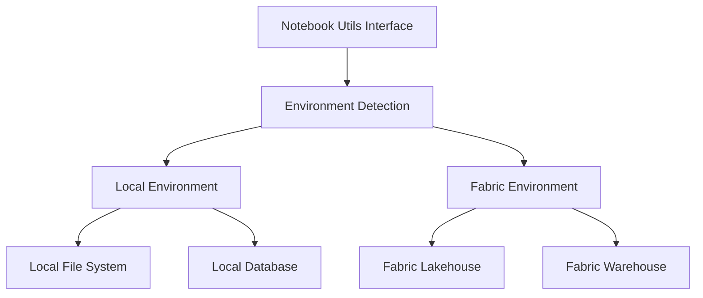

# Notebook Utils

## Overview

The Notebook Utils module provides environment-agnostic utilities that work seamlessly in both local development and Microsoft Fabric runtime environments. These utilities abstract away the differences between environments and provide consistent interfaces for common operations.

## Architecture

The notebook utilities are designed with a layered architecture:



## Key Components

### Environment Abstraction

The utilities automatically detect the runtime environment and provide appropriate implementations:

- **Local Development**: Uses local file system and database connections
- **Fabric Runtime**: Uses Fabric-specific APIs and storage

### Core Utilities

#### Simple Notebook
- Basic notebook operations
- Cell management
- Execution tracking

#### Fabric CLI Notebook
- Fabric-specific notebook operations
- Integration with Fabric APIs
- Workspace management

#### Notebook Block Injector
- Dynamic code injection
- Template processing
- Environment-specific customization

## Usage

### Basic Operations

```python
from ingen_fab.notebook_utils import get_notebook_utils

# Get environment-appropriate utilities
utils = get_notebook_utils()

# Perform operations
result = utils.execute_query("SELECT * FROM my_table")
```

### Environment Detection

```python
from ingen_fab.notebook_utils import detect_environment

env = detect_environment()
if env == 'fabric':
    # Fabric-specific code
    pass
elif env == 'local':
    # Local development code
    pass
```

### File Operations

```python
# Read files (works in both environments)
data = utils.read_file("path/to/file.csv")

# Write files
utils.write_file("output.json", data)
```

## Configuration

### Environment Variables

The utilities respect environment-specific configuration:

```bash
# Local development
export NOTEBOOK_ENV=local
export DB_CONNECTION_STRING=...

# Fabric runtime (automatically detected)
export FABRIC_WORKSPACE_ID=...
```

### Settings Files

Configuration can be managed through settings files:

```json
{
    "environment": "local",
    "database": {
        "connection_string": "...",
        "timeout": 30
    },
    "logging": {
        "level": "INFO"
    }
}
```

## API Reference

### NotebookUtils Interface

```python
class NotebookUtils:
    def execute_query(self, query: str) -> Any:
        """Execute SQL query in current environment"""
        pass
    
    def read_file(self, path: str) -> Any:
        """Read file from storage"""
        pass
    
    def write_file(self, path: str, data: Any) -> None:
        """Write file to storage"""
        pass
    
    def get_connection(self) -> Any:
        """Get database connection"""
        pass
```

### Environment-Specific Implementations

#### Local Environment

```python
class LocalNotebookUtils(NotebookUtils):
    """Local development implementation"""
    pass
```

#### Fabric Environment

```python
class FabricNotebookUtils(NotebookUtils):
    """Microsoft Fabric implementation"""
    pass
```

## Testing

### Unit Tests

```python
import pytest
from notebook_utils import get_notebook_utils

def test_environment_detection():
    utils = get_notebook_utils()
    assert utils is not None

def test_query_execution():
    utils = get_notebook_utils()
    result = utils.execute_query("SELECT 1")
    assert result is not None
```

### Integration Tests

```python
def test_fabric_integration():
    """Test integration with Fabric environment"""
    # Integration test code
    pass
```

## Best Practices

### Error Handling

```python
try:
    result = utils.execute_query(query)
except NotebookUtilsError as e:
    logger.error(f"Query failed: {e}")
    # Handle error appropriately
```

### Resource Management

```python
# Use context managers when available
with utils.get_connection() as conn:
    result = conn.execute(query)
```

### Logging

```python
import logging

logger = logging.getLogger(__name__)
logger.info("Executing notebook operation")
```

## Advanced Features

### Custom Implementations

You can create custom implementations for specific use cases:

```python
class CustomNotebookUtils(NotebookUtils):
    def custom_operation(self):
        """Custom functionality"""
        pass
```

### Plugin System

The utilities support a plugin system for extending functionality:

```python
from notebook_utils import register_plugin

register_plugin('my_plugin', MyPlugin)
```

## Troubleshooting

### Common Issues

1. **Environment Detection Failures**: Check environment variables
2. **Connection Issues**: Verify database credentials
3. **File Access Errors**: Check file permissions
4. **API Failures**: Verify Fabric workspace settings

### Debugging

Enable debug logging:

```python
import logging
logging.basicConfig(level=logging.DEBUG)
```

## Examples

See the `examples/` directory for complete usage examples and patterns.

## Integration

The notebook utilities integrate with:

- [DDL Scripts](ddl_scripts.md) for template processing
- [Python Libraries](python_libraries.md) for core functionality
- [SQL Templates](sql_templates.md) for query generation