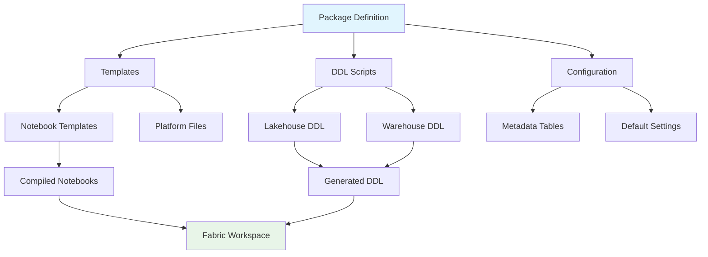

# Packages

Packages are reusable workload extensions that provide specialized functionality for common data processing scenarios in Microsoft Fabric. They extend the Ingenious Fabric Accelerator with pre-built templates, configurations, and processing logic for specific use cases.

## Overview

The package system enables you to:

- **Extend functionality** with specialized workloads
- **Standardize implementations** across projects
- **Accelerate development** with pre-built templates
- **Maintain consistency** in data processing patterns
- **Share solutions** across teams and projects

## Architecture



## Package Structure

A package follows a standardized directory structure:

```
ingen_fab/packages/package_name/
├── __init__.py                 # Package initialization
├── package_name.py             # Main package module
├── templates/                  # Jinja2 templates
│   ├── notebook_template.py.jinja
│   └── config_template.json.jinja
├── ddl_scripts/               # DDL script templates
│   ├── lakehouse_config.py
│   ├── lakehouse_log.py
│   ├── warehouse_config.sql
│   └── warehouse_log.sql
└── README.md                  # Package documentation
```

## Core Components

### 1. Package Module

The main package module (`package_name.py`) contains:

- **Compiler class** - Handles template compilation
- **Configuration logic** - Manages package settings
- **Utility functions** - Common package operations

```python
class PackageCompiler:
    """Base compiler for package templates"""
    
    def __init__(self, fabric_workspace_repo_dir: str = None):
        self.package_dir = Path(__file__).parent
        self.templates_dir = self.package_dir / "templates"
        self.ddl_scripts_dir = self.package_dir / "ddl_scripts"
        
    def compile_notebook(self, template_vars: Dict[str, Any] = None) -> Path:
        """Compile notebook template"""
        # Implementation here
        
    def compile_ddl_scripts(self) -> List[Path]:
        """Compile DDL scripts"""
        # Implementation here
        
    def compile_all(self) -> Dict[str, Any]:
        """Compile all package components"""
        # Implementation here
```

### 2. Templates

Templates use Jinja2 syntax and support:

- **Variable substitution** - `{{ variable_name }}`
- **Configuration injection** - `{{ varlib.config_value }}`
- **Conditional logic** - ``
- **Loops** - ``

#### Notebook Template Example

```jinja2

# Fabric notebook source

# METADATA ********************
# META {
# META   "kernel_info": {
# META     "name": "synapse_pyspark",
# META     "display_name": "PySpark (Synapse)"
# META   }
# META }

# PARAMETERS CELL ********************
package_config_id = "{{ config_id | default('') }}"
execution_group = {{ execution_group | default(1) }}
environment = "{{ environment | default('development') }}"

# CELL ********************
# Import required libraries
from ingen_fab.python_libs.common.config_utils import get_configs_as_object
from ingen_fab.python_libs.pyspark.lakehouse_utils import lakehouse_utils

# Your package logic here

```

### 3. DDL Scripts

DDL scripts define the metadata tables required by the package:

#### Lakehouse DDL (PySpark)

```python
# Configuration table schema
from pyspark.sql.types import StructType, StructField, StringType, IntegerType

schema = StructType([
    StructField("config_id", StringType(), nullable=False),
    StructField("config_name", StringType(), nullable=False),
    StructField("active_yn", StringType(), nullable=False),
    # Additional fields...
])

target_lakehouse.create_table(
    table_name="config_package_name",
    schema=schema,
    mode="overwrite"
)
```

#### Warehouse DDL (SQL)

```sql
-- Configuration table for package
CREATE TABLE config_package_name (
    config_id NVARCHAR(50) NOT NULL,
    config_name NVARCHAR(255) NOT NULL,
    active_yn NVARCHAR(1) NOT NULL,
    CONSTRAINT PK_config_package_name PRIMARY KEY (config_id)
);
```

## CLI Integration

Packages integrate with the CLI through a structured command hierarchy:

```bash
# Package command structure
ingen_fab run package <package-name> <command> [options]

# Example commands
ingen_fab run package flat-file-ingestion compile
ingen_fab run package flat-file-ingestion run --config-id=my-config
```

### Adding CLI Commands

To add CLI commands for your package:

1. **Create command structure in `cli.py`**:

```python
# Add to cli.py
package_app = typer.Typer()
my_package_app = typer.Typer()

package_app.add_typer(
    my_package_app,
    name="my-package",
    help="Commands for my package.",
)

@my_package_app.command()
def compile(ctx: typer.Context):
    """Compile package templates."""
    from ingen_fab.packages.my_package.my_package import compile_my_package
    compile_my_package(ctx.obj["fabric_workspace_repo_dir"])

@my_package_app.command()
def run(ctx: typer.Context, config_id: str = ""):
    """Run package with configuration."""
    # Implementation here
```

## Creating a New Package

### Step 1: Create Package Structure

```bash
mkdir -p ingen_fab/packages/my_package/{templates,ddl_scripts}
touch ingen_fab/packages/my_package/__init__.py
touch ingen_fab/packages/my_package/my_package.py
```

### Step 2: Define Package Module

```python
# ingen_fab/packages/my_package/my_package.py
from pathlib import Path
from typing import Dict, Any
from jinja2 import Environment, FileSystemLoader

class MyPackageCompiler:
    def __init__(self, fabric_workspace_repo_dir: str = None):
        self.package_dir = Path(__file__).parent
        # Initialize compiler...
    
    def compile_all(self) -> Dict[str, Any]:
        # Implementation here
        pass

def compile_my_package(fabric_workspace_repo_dir: str = None) -> Dict[str, Any]:
    """Main compilation function"""
    compiler = MyPackageCompiler(fabric_workspace_repo_dir)
    return compiler.compile_all()
```

### Step 3: Create Templates

Create Jinja2 templates for:
- Notebook processing logic
- Configuration schemas
- Platform metadata files

### Step 4: Create DDL Scripts

Define metadata tables for:
- Configuration storage
- Execution logging
- State management

### Step 5: Add CLI Integration

Update `cli.py` to include your package commands.

### Step 6: Add Documentation

Create comprehensive documentation for your package.

## Best Practices

### Template Development

1. **Use consistent naming** - Follow established patterns
2. **Include parameter validation** - Validate inputs early
3. **Add error handling** - Graceful failure modes
4. **Support configuration** - Make templates configurable
5. **Include logging** - Add comprehensive logging

### DDL Design

1. **Use descriptive names** - Clear table and column names
2. **Include constraints** - Enforce data integrity
3. **Add indexes** - Performance optimization
4. **Version schemas** - Support schema evolution
5. **Document relationships** - Clear foreign key relationships

### Package Architecture

1. **Single responsibility** - One package per use case
2. **Minimal dependencies** - Reduce coupling
3. **Clear interfaces** - Well-defined APIs
4. **Configuration-driven** - Avoid hardcoded values
5. **Testable design** - Enable unit testing

## Testing Packages

### Unit Tests

```python
# tests/test_my_package.py
import pytest
from ingen_fab.packages.my_package.my_package import MyPackageCompiler

def test_package_compilation():
    compiler = MyPackageCompiler()
    result = compiler.compile_all()
    assert result["success"] is True
    assert result["notebook_file"] is not None
```

### Integration Tests

```python
def test_package_cli():
    runner = CliRunner()
    result = runner.invoke(app, ["run", "package", "my-package", "compile"])
    assert result.exit_code == 0
```

## Available Packages

### Flat File Ingestion

Processes various file formats (CSV, JSON, Parquet, Avro, XML) and loads them into Delta tables.

**Features:**
- Multi-format support
- Configurable parsing options
- Data validation
- Error handling strategies
- Comprehensive logging

**Usage:**
```bash
# Compile package
ingen_fab package ingest compile --target-datastore lakehouse

# Run ingestion
ingen_fab package ingest run --config-id=my-config
```

See [Flat File Ingestion Package](../packages/flat_file_ingestion.md) for detailed documentation.

### Extract Generation

Manages automated file extracts from Fabric warehouses and lakehouses with flexible formatting options.

**Features:**
- Multiple file formats (CSV, TSV, Parquet, JSON)
- Compression support
- File splitting for large datasets
- Incremental extracts
- Trigger file generation

**Usage:**
```bash
# Compile package
ingen_fab package extract compile --include-samples

# Run extraction
ingen_fab package extract run --extract-name=CUSTOMER_EXPORT
```

See [Extract Generation Package](../packages/extract_generation.md) for detailed documentation.

### Synapse Sync

Enables bidirectional data synchronization between Microsoft Fabric and Azure Synapse Analytics.

**Features:**
- Bidirectional sync capabilities
- Incremental updates
- Schema mapping
- Conflict resolution
- Performance optimization

**Usage:**
```bash
# Compile package
ingen_fab package synapse compile --include-samples

# Run synchronization
ingen_fab package synapse run --object-id=CUSTOMER_SYNC
```

See [Synapse Sync Package](../packages/synapse_sync.md) for detailed documentation.

### Synthetic Data Generation

Generates realistic synthetic datasets for testing and development at any scale.

**Features:**
- Predefined industry datasets
- Scalable generation (thousands to billions of rows)
- Referential integrity
- Reproducible with seeds
- Multiple output formats

**Usage:**
```bash
# List available datasets
ingen_fab package synthetic-data list-datasets

# Generate dataset
ingen_fab package synthetic-data generate retail_oltp_small --target-rows 10000
```

See [Synthetic Data Generation Package](../packages/synthetic_data_generation.md) for detailed documentation.

## Package Lifecycle

### 1. Development Phase

- Design package architecture
- Create templates and DDL scripts
- Implement compiler logic
- Add CLI integration
- Write tests and documentation

### 2. Testing Phase

- Unit test individual components
- Integration test CLI commands
- Validate generated artifacts
- Test in development environment

### 3. Release Phase

- Update package version
- Create release documentation
- Deploy to shared repositories
- Notify teams of availability

### 4. Maintenance Phase

- Monitor package usage
- Address bug reports
- Add new features
- Update documentation

## Advanced Topics

### Custom Template Functions

Add custom Jinja2 functions for advanced template processing:

```python
def custom_filter(value):
    """Custom Jinja2 filter"""
    return value.upper()

# Register in environment
jinja_env.filters['custom'] = custom_filter
```

### Package Dependencies

Manage dependencies between packages:

```python
# package_dependencies.py
DEPENDENCIES = {
    "advanced_package": ["flat_file_ingestion", "data_validation"]
}
```

### Configuration Management

Advanced configuration patterns:

```python
# Support environment-specific configurations
config_files = {
    "development": "config_dev.json",
    "production": "config_prod.json"
}
```

## Resources

### Documentation Templates

- Package README Template (coming soon)
- API Documentation Template (coming soon)

### Code Examples

- [Flat File Ingestion Package](../packages/flat_file_ingestion.md)
- Package Development Examples (coming soon)

### Related Topics

- [DDL Scripts](ddl_scripts.md) - Template system details
- [Python Libraries](python_libraries.md) - Core library architecture
- [CLI Reference](../user_guide/cli_reference.md) - Command documentation

## Getting Help

- **Package Development**: See examples and templates
- **Bug Reports**: Create GitHub issues
- **Feature Requests**: Join community discussions
- **Code Review**: Submit pull requests

Ready to create your first package? Start with the [Flat File Ingestion Package](../packages/flat_file_ingestion.md) as a reference implementation!