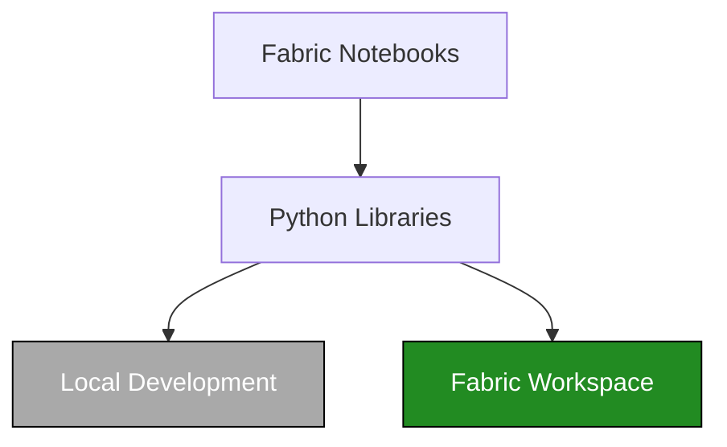
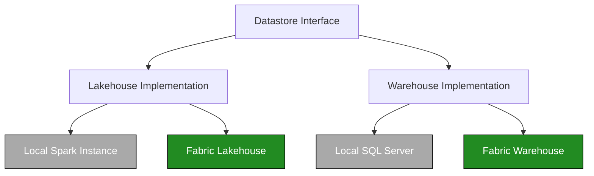

# Python Libraries

[Home](../index.md) > [Developer Guide](index.md) > Python Libraries

The Python libraries are the heart of the Ingenious Fabric Accelerator, providing reusable components that work seamlessly across both local development and Fabric runtime environments. This allows developers to build high quality, reusable code libraries that can be both unit tested and functionally tested locally before being deployed to Fabric.

## Architecture

The library architecture follows a layered approach:


### Library Abstraction


### Table Operation Abstractions



## Directory Structure

```
python_libs/
├── common/                    # Shared utilities
│   ├── config_utils.py       # Configuration management
│   ├── data_utils.py         # Data processing utilities
│   └── workflow_utils.py     # Workflow orchestration
├── interfaces/               # Abstract interfaces
│   ├── data_store_interface.py
│   └── ddl_utils_interface.py
├── python/                   # CPython implementations
│   ├── ddl_utils.py          # DDL execution utilities
│   ├── lakehouse_utils.py    # Lakehouse operations
│   ├── notebook_utils_abstraction.py
│   ├── pipeline_utils.py     # Pipeline utilities
│   ├── sql_template_factory/ # SQL template system
│   └── warehouse_utils.py    # Warehouse operations
├── pyspark/                  # PySpark implementations
│   ├── ddl_utils.py          # Spark DDL utilities
│   ├── lakehouse_utils.py    # Spark lakehouse operations
│   ├── notebook_utils_abstraction.py
│   └── parquet_load_utils.py # Parquet processing
└── gather_python_libs.py    # Library collection script
```

## Core Components

### Common Utilities

#### `config_utils.py`
Configuration management with environment-specific settings:

```python
from ingen_fab.python_libs.common.config_utils import ConfigUtils

# Load configuration from variable library
config_utils = ConfigUtils()

# Access configuration values
fabric_environment = config_utils.get_fabric_environment()
workspace_id = config_utils.get_variable('config_workspace_id')
lakehouse_id = config_utils.get_variable('config_lakehouse_id')
```

#### `data_utils.py`
Data processing and validation utilities:

```python
from ingen_fab.python_libs.common.data_utils import DataUtils

# Data processing utilities
data_utils = DataUtils()

# Common data operations would be implemented here
# Note: The actual implementation may vary based on specific use cases
```

#### `workflow_utils.py`
Workflow orchestration and dependency management:

```python
from ingen_fab.python_libs.common.workflow_utils import WorkflowUtils

# Workflow utilities for orchestration
workflow_utils = WorkflowUtils()

# Common workflow operations would be implemented here
# Note: The actual implementation may vary based on specific use cases
```

### Interfaces

#### `data_store_interface.py`
Abstract interface for data store operations:

```python
from abc import ABC, abstractmethod

class DataStoreInterface(ABC):
    @abstractmethod
    def read_table(self, table_name: str) -> Any:
        pass
    
    @abstractmethod
    def write_table(self, table_name: str, data: Any) -> None:
        pass
```

#### `ddl_utils_interface.py`
Interface for DDL execution:

```python
class DDLUtilsInterface(ABC):
    @abstractmethod
    def execute_ddl(self, sql: str, description: str) -> None:
        pass
    
    @abstractmethod
    def log_execution(self, script_name: str, description: str) -> None:
        pass
```

### Python Implementation

#### `ddl_utils.py`
DDL execution with logging and error handling:

```python
from ingen_fab.python_libs.python.ddl_utils import DDLUtils

ddl_utils = DDLUtils(
    target_warehouse_id="warehouse-guid",
    target_workspace_id="workspace-guid",
    config_workspace_id="config-workspace-guid",
    config_lakehouse_id="config-lakehouse-guid"
)

# Execute DDL with logging
ddl_utils.execute_ddl(
    sql="CREATE TABLE test (id INT, name STRING)",
    description="Create test table"
)
```

#### `lakehouse_utils.py`
Lakehouse operations for file and table management:

```python
from ingen_fab.python_libs.python.lakehouse_utils import LakehouseUtils

lakehouse_utils = LakehouseUtils(
    target_lakehouse_id="lakehouse-guid",
    target_workspace_id="workspace-guid"
)

# Table operations
tables = lakehouse_utils.list_tables()
df = lakehouse_utils.read_table("config.metadata")
lakehouse_utils.write_table(df, "output_table")
```

#### `warehouse_utils.py`
Warehouse connectivity and query execution:

```python
from ingen_fab.python_libs.python.warehouse_utils import WarehouseUtils

warehouse_utils = WarehouseUtils(
    target_warehouse_id="warehouse-guid",
    target_workspace_id="workspace-guid",
    dialect="fabric"  # or "sqlserver"
)

# Execute queries
result = warehouse_utils.execute_query("SELECT * FROM config.metadata")
warehouse_utils.execute_non_query("INSERT INTO logs VALUES (...)")
```

#### `notebook_utils_abstraction.py`
Environment-agnostic notebook utilities:

```python
from ingen_fab.python_libs.python.notebook_utils_abstraction import get_notebook_utils

# Automatically detects environment
utils = get_notebook_utils()

# Works in both local and Fabric environments
utils.display(dataframe)
connection = utils.connect_to_warehouse(warehouse_id, workspace_id)
# Note: Secret management functionality depends on environment setup
```

#### `synthetic_data_utils.py`
Synthetic data generation utilities:

```python
from ingen_fab.python_libs.python.synthetic_data_utils import SyntheticDataGenerator

# Create generator instance
generator = SyntheticDataGenerator(seed=42)

# Generate sample data
customers_df = generator.generate_customers(num_rows=1000)
orders_df = generator.generate_orders(customer_ids=customers_df['customer_id'])

# Generate with specific patterns
time_series_df = generator.generate_time_series(
    start_date='2024-01-01',
    end_date='2024-12-31',
    frequency='daily'
)
```

#### `synapse_extract_utils.py`
Azure Synapse Analytics integration utilities:

```python
from ingen_fab.python_libs.python.synapse_extract_utils import SynapseExtractUtils

# Initialize with connection details
synapse_utils = SynapseExtractUtils(
    server='synapse-server.sql.azuresynapse.net',
    database='synapse_db',
    authentication='service_principal'
)

# Extract data from Synapse
data = synapse_utils.extract_table('schema.table_name')

# Run extraction query
result = synapse_utils.extract_query(
    "SELECT * FROM sales WHERE date >= '2024-01-01'"
)
```

#### `synapse_orchestrator.py`
Synapse sync orchestration and workflow management:

```python
from ingen_fab.python_libs.python.synapse_orchestrator import SynapseOrchestrator

# Create orchestrator
orchestrator = SynapseOrchestrator(
    workspace_id='workspace-guid',
    synapse_config=synapse_config
)

# Run sync job
job_result = orchestrator.run_sync_job(
    source_table='fabric.schema.table',
    target_table='synapse.schema.table',
    sync_type='incremental',
    sync_column='last_modified'
)

# Monitor job status
status = orchestrator.get_job_status(job_result.job_id)
```

#### `error_categorization.py`
Error handling and categorization utilities:

```python
from ingen_fab.python_libs.python.error_categorization import ErrorCategorizer

# Create error categorizer
error_cat = ErrorCategorizer()

try:
    # Some operation that might fail
    pass
except Exception as e:
    # Categorize the error
    error_info = error_cat.categorize(e)
    
    # Get error details
    print(f"Category: {error_info.category}")
    print(f"Severity: {error_info.severity}")
    print(f"Action: {error_info.recommended_action}")
    
    # Log structured error
    error_cat.log_error(e, context={'operation': 'data_load'})
```

#### `sql_translator.py`
SQL dialect translation utilities:

```python
from ingen_fab.python_libs.python.sql_translator import SQLTranslator

# Create translator
translator = SQLTranslator(source_dialect='tsql', target_dialect='spark')

# Translate T-SQL to Spark SQL
tsql_query = "SELECT TOP 10 * FROM [schema].[table] WITH (NOLOCK)"
spark_query = translator.translate(tsql_query)
# Result: "SELECT * FROM schema.table LIMIT 10"

# Batch translate DDL scripts
ddl_scripts = [
    "CREATE TABLE [dbo].[customers] (id INT IDENTITY(1,1))",
    "CREATE INDEX idx_customer ON [dbo].[customers] (id)"
]
translated = translator.translate_batch(ddl_scripts)
```

#### `pipeline_utils.py`
Data pipeline orchestration utilities:

```python
from ingen_fab.python_libs.python.pipeline_utils import PipelineUtils

# Create pipeline utilities
pipeline = PipelineUtils(
    workspace_id='workspace-guid',
    pipeline_name='data_processing_pipeline'
)

# Define pipeline stages
pipeline.add_stage('extract', extract_function)
pipeline.add_stage('transform', transform_function)
pipeline.add_stage('load', load_function)

# Run pipeline with retry logic
result = pipeline.run(
    retry_count=3,
    retry_delay=60,
    on_failure='continue'
)

# Check pipeline status
status = pipeline.get_status()
```

### PySpark Implementation

#### `ddl_utils.py`
Spark-compatible DDL execution:

```python
from ingen_fab.python_libs.pyspark.ddl_utils import DDLUtils

ddl_utils = DDLUtils(
    target_lakehouse_id="lakehouse-guid",
    target_workspace_id="workspace-guid",
    spark_session=spark
)

# Execute DDL in Spark context
ddl_utils.execute_ddl(
    sql="CREATE TABLE delta_table USING DELTA AS SELECT * FROM source",
    description="Create Delta table"
)
```

#### `lakehouse_utils.py`
Spark-based lakehouse operations:

```python
from ingen_fab.python_libs.pyspark.lakehouse_utils import LakehouseUtils

lakehouse_utils = LakehouseUtils(
    target_lakehouse_id="lakehouse-guid",
    target_workspace_id="workspace-guid",
    spark_session=spark
)

# Read/write tables using Spark
df = lakehouse_utils.read_table("config.metadata")
lakehouse_utils.write_table(df, "output_results")
```

#### `parquet_load_utils.py`
Parquet file processing utilities:

```python
from ingen_fab.python_libs.pyspark.parquet_load_utils import ParquetLoadUtils

parquet_utils = ParquetLoadUtils(spark_session=spark)

# Load parquet files with schema inference
df = parquet_utils.load_parquet(
    path='Files/data/*.parquet',
    schema_inference=True
)

# Load with specific schema
from pyspark.sql.types import StructType, StructField, StringType, IntegerType

schema = StructType([
    StructField("id", IntegerType(), nullable=False),
    StructField("name", StringType(), nullable=True)
])

df = parquet_utils.load_parquet(
    path='Files/customers.parquet',
    schema=schema
)

# Write with optimizations
parquet_utils.write_parquet(
    df=transformed_df,
    path='Files/output',
    mode='overwrite',
    partition_by=['year', 'month'],
    compression='snappy'
)
```

#### `synthetic_data_utils.py` (PySpark)
Large-scale synthetic data generation using Spark:

```python
from ingen_fab.python_libs.pyspark.synthetic_data_utils import SparkSyntheticDataGenerator

# Create generator for large datasets
generator = SparkSyntheticDataGenerator(spark_session=spark, seed=42)

# Generate millions of rows efficiently
customers_df = generator.generate_customers(
    num_rows=10_000_000,
    partitions=100
)

# Generate related data maintaining referential integrity
orders_df = generator.generate_orders(
    customer_df=customers_df,
    orders_per_customer_range=(1, 10),
    date_range=('2020-01-01', '2024-12-31')
)

# Generate star schema datasets
fact_sales, dim_tables = generator.generate_star_schema(
    schema_type='retail',
    fact_rows=100_000_000,
    dimension_scale='medium'
)
```

## SQL Template Factory

The SQL template system provides database-agnostic SQL generation:

```python
from ingen_fab.python_libs.python.sql_templates import SQLTemplateFactory

# Create templates instance
template_factory = SQLTemplateFactory(dialect="fabric")  # or "sql_server"

# Generate SQL
sql = template_factory.get_sql("check_table_exists", 
                               schema_name="config", 
                               table_name="metadata")
```

Available templates:
- `check_table_exists` - Check if table exists
- `create_table` - Create table with schema
- `drop_table` - Drop table if exists
- `insert_row` - Insert single row
- `list_tables` - List all tables
- `get_table_schema` - Get table schema information

## Testing

### Unit Tests

Each library has comprehensive unit tests:

```bash
# Run all library tests
pytest ./ingen_fab/python_libs_tests/ -v

# Run specific library tests
pytest ./ingen_fab/python_libs_tests/python/test_warehouse_utils_pytest.py -v
pytest ./ingen_fab/python_libs_tests/pyspark/test_lakehouse_utils_pytest.py -v

# Run with coverage
pytest ./ingen_fab/python_libs_tests/ --cov=ingen_fab.python_libs --cov-report=html
```

### Platform Tests

Test with actual Fabric workspaces:

```bash
# Generate platform test notebooks
ingen_fab test platform generate

# The generated notebooks can then be run in Fabric to test the libraries
```

## Development Guidelines

### Adding New Libraries

1. **Create the library module**:
   ```python
   # python_libs/python/my_new_utils.py
   from .notebook_utils_abstraction import get_notebook_utils
   
   class MyNewUtils:
       def __init__(self):
           self.notebook_utils = get_notebook_utils()
       
       def my_method(self):
           return "result"
   ```

2. **Add corresponding tests**:
   ```python
   # python_libs_tests/python/test_my_new_utils_pytest.py
   import pytest
   from ingen_fab.python_libs.python.my_new_utils import MyNewUtils
   
   def test_my_method():
       utils = MyNewUtils()
       assert utils.my_method() == "result"
   ```

3. **Update library collection**:
   ```python
   # python_libs/gather_python_libs.py
   # Add your library to the collection process
   ```

### Interface Implementation

When creating new implementations:

1. **Define interface first**:
   ```python
   # interfaces/my_interface.py
   from abc import ABC, abstractmethod
   
   class MyInterface(ABC):
       @abstractmethod
       def my_method(self) -> str:
           pass
   ```

2. **Implement for both runtimes**:
   ```python
   # python/my_implementation.py
   from ..interfaces.my_interface import MyInterface
   
   class MyImplementation(MyInterface):
       def my_method(self) -> str:
           return "python implementation"
   ```

3. **Create PySpark version**:
   ```python
   # pyspark/my_implementation.py
   from ..interfaces.my_interface import MyInterface
   
   class MyImplementation(MyInterface):
       def my_method(self) -> str:
           return "pyspark implementation"
   ```

### Best Practices

1. **Environment Agnostic**: Use abstractions to work in both local and Fabric environments
2. **Error Handling**: Always include proper error handling and logging
3. **Type Hints**: Use type hints for better code documentation
4. **Testing**: Write comprehensive tests for all functionality
5. **Documentation**: Include docstrings and usage examples

## Library Injection

Libraries are automatically injected into generated notebooks:

```python
# In generated notebook (libraries are injected automatically)
from lakehouse_utils import LakehouseUtils
from warehouse_utils import WarehouseUtils  
from ddl_utils import DDLUtils

# Libraries are available for use with proper initialization
lakehouse_utils = LakehouseUtils(
    target_lakehouse_id=target_lakehouse_id,
    target_workspace_id=target_workspace_id
)
warehouse_utils = WarehouseUtils(
    target_warehouse_id=target_warehouse_id,
    target_workspace_id=target_workspace_id
)
ddl_utils = DDLUtils(
    config_workspace_id=config_workspace_id,
    config_lakehouse_id=config_lakehouse_id
)
```

## Performance Considerations

- **Lazy Loading**: Libraries use lazy loading where possible
- **Connection Pooling**: Database connections are reused
- **Caching**: Results are cached when appropriate
- **Memory Management**: Large datasets are processed in chunks

## Troubleshooting

### Common Issues

1. **Import Errors**: Check that libraries are properly injected
2. **Connection Failures**: Verify workspace and lakehouse IDs
3. **Permission Errors**: Ensure proper authentication
4. **Type Errors**: Use type hints and validation

### Debugging

```python
# Enable debug logging
import logging
logging.basicConfig(level=logging.DEBUG)

# Test library functionality
from python.warehouse_utils import WarehouseUtils
utils = WarehouseUtils()
utils.test_connection()
```

The Python libraries provide a robust foundation for building Fabric applications with consistent, testable, and maintainable code.