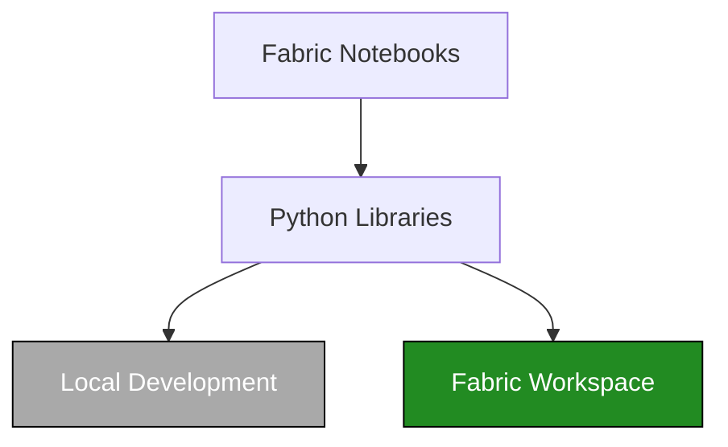
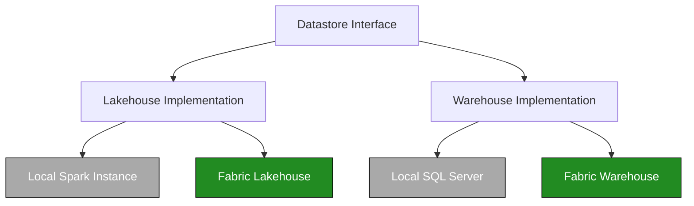

# Python Libraries

The Python libraries are the heart of the Ingenious Fabric Accelerator, providing reusable components that work seamlessly across both local development and Fabric runtime environments. This allows developers to build high quality, reusable code libraries that can be both unit tested and functionally tested locally before being deployed to Fabric.

## Architecture

The library architecture follows a layered approach:


### Library Abstraction


### Table Operation Abstractions



## Directory Structure

```
python_libs/
├── common/                    # Shared utilities
│   ├── config_utils.py       # Configuration management
│   ├── data_utils.py         # Data processing utilities
│   └── workflow_utils.py     # Workflow orchestration
├── interfaces/               # Abstract interfaces
│   ├── data_store_interface.py
│   └── ddl_utils_interface.py
├── python/                   # CPython implementations
│   ├── ddl_utils.py          # DDL execution utilities
│   ├── lakehouse_utils.py    # Lakehouse operations
│   ├── notebook_utils_abstraction.py
│   ├── pipeline_utils.py     # Pipeline utilities
│   ├── sql_template_factory/ # SQL template system
│   └── warehouse_utils.py    # Warehouse operations
├── pyspark/                  # PySpark implementations
│   ├── ddl_utils.py          # Spark DDL utilities
│   ├── lakehouse_utils.py    # Spark lakehouse operations
│   ├── notebook_utils_abstraction.py
│   └── parquet_load_utils.py # Parquet processing
└── gather_python_libs.py    # Library collection script
```

## Core Components

### Common Utilities

#### `config_utils.py`
Configuration management with environment-specific settings:

```python
from common.config_utils import FabricConfig

# Load configuration from environment
config = FabricConfig.from_environment()

# Access configuration values
workspace_id = config.workspace_id
lakehouse_id = config.lakehouse_id
```

#### `data_utils.py`
Data processing and validation utilities:

```python
from common.data_utils import DataValidator, DataTransformer

# Validate data
validator = DataValidator()
is_valid = validator.validate_schema(dataframe, expected_schema)

# Transform data
transformer = DataTransformer()
cleaned_data = transformer.clean_data(dataframe)
```

#### `workflow_utils.py`
Workflow orchestration and dependency management:

```python
from common.workflow_utils import WorkflowOrchestrator

# Create workflow
orchestrator = WorkflowOrchestrator()
orchestrator.add_task("task1", dependencies=[])
orchestrator.add_task("task2", dependencies=["task1"])
orchestrator.execute()
```

### Interfaces

#### `data_store_interface.py`
Abstract interface for data store operations:

```python
from abc import ABC, abstractmethod

class DataStoreInterface(ABC):
    @abstractmethod
    def read_table(self, table_name: str) -> Any:
        pass
    
    @abstractmethod
    def write_table(self, table_name: str, data: Any) -> None:
        pass
```

#### `ddl_utils_interface.py`
Interface for DDL execution:

```python
class DDLUtilsInterface(ABC):
    @abstractmethod
    def execute_ddl(self, sql: str, description: str) -> None:
        pass
    
    @abstractmethod
    def log_execution(self, script_name: str, description: str) -> None:
        pass
```

### Python Implementation

#### `ddl_utils.py`
DDL execution with logging and error handling:

```python
from python.ddl_utils import DDLUtils

ddl_utils = DDLUtils(
    target_warehouse_id="warehouse-guid",
    target_workspace_id="workspace-guid",
    config_workspace_id="config-workspace-guid",
    config_lakehouse_id="config-lakehouse-guid"
)

# Execute DDL with logging
ddl_utils.execute_ddl(
    sql="CREATE TABLE test (id INT, name STRING)",
    description="Create test table"
)
```

#### `lakehouse_utils.py`
Lakehouse operations for file and table management:

```python
from python.lakehouse_utils import LakehouseUtils

lakehouse_utils = LakehouseUtils(
    target_lakehouse_id="lakehouse-guid",
    target_workspace_id="workspace-guid"
)

# File operations
files = lakehouse_utils.list_files("Tables/")
lakehouse_utils.upload_file("local_file.csv", "Files/data/")

# Table operations
tables = lakehouse_utils.list_tables()
df = lakehouse_utils.read_table("config.metadata")
```

#### `warehouse_utils.py`
Warehouse connectivity and query execution:

```python
from python.warehouse_utils import WarehouseUtils

warehouse_utils = WarehouseUtils(
    target_warehouse_id="warehouse-guid",
    target_workspace_id="workspace-guid",
    dialect="fabric"  # or "sqlserver"
)

# Execute queries
result = warehouse_utils.execute_query("SELECT * FROM config.metadata")
warehouse_utils.execute_non_query("INSERT INTO logs VALUES (...)")
```

#### `notebook_utils_abstraction.py`
Environment-agnostic notebook utilities:

```python
from python.notebook_utils_abstraction import get_notebook_utils

# Automatically detects environment
utils = get_notebook_utils()

# Works in both local and Fabric environments
utils.display(dataframe)
connection = utils.connect_to_artifact(warehouse_id, workspace_id)
secret = utils.get_secret("API_KEY", "key-vault-name")
```

### PySpark Implementation

#### `ddl_utils.py`
Spark-compatible DDL execution:

```python
from pyspark.ddl_utils import DDLUtils

ddl_utils = DDLUtils(
    target_lakehouse_id="lakehouse-guid",
    target_workspace_id="workspace-guid",
    spark_session=spark
)

# Execute DDL in Spark context
ddl_utils.execute_ddl(
    sql="CREATE TABLE delta_table USING DELTA AS SELECT * FROM source",
    description="Create Delta table"
)
```

#### `lakehouse_utils.py`
Spark-based lakehouse operations:

```python
from pyspark.lakehouse_utils import LakehouseUtils

lakehouse_utils = LakehouseUtils(
    target_lakehouse_id="lakehouse-guid",
    target_workspace_id="workspace-guid",
    spark_session=spark
)

# Read/write Delta tables
df = lakehouse_utils.read_delta_table("config.metadata")
lakehouse_utils.write_delta_table(df, "output.results")
```

#### `parquet_load_utils.py`
Parquet file processing utilities:

```python
from pyspark.parquet_load_utils import ParquetLoadUtils

parquet_utils = ParquetLoadUtils(spark_session=spark)

# Load and process parquet files
df = parquet_utils.load_parquet_files("path/to/files/*.parquet")
processed_df = parquet_utils.process_parquet_data(df, transformations)
parquet_utils.save_to_delta("output_table", processed_df)
```

## SQL Template Factory

The SQL template system provides database-agnostic SQL generation:

```python
from python.sql_templates import SQLTemplates

# Create templates instance
templates = SQLTemplates(dialect="fabric")  # or "sqlserver"

# Generate SQL
sql = templates.render("check_table_exists", 
                      schema_name="config", 
                      table_name="metadata")
```

Available templates:
- `check_table_exists` - Check if table exists
- `create_table` - Create table with schema
- `drop_table` - Drop table if exists
- `insert_row` - Insert single row
- `list_tables` - List all tables
- `get_table_schema` - Get table schema information

## Testing

### Unit Tests

Each library has comprehensive unit tests:

```bash
# Run all library tests
pytest ./ingen_fab/python_libs_tests/ -v

# Run specific library tests
pytest ./ingen_fab/python_libs_tests/python/test_warehouse_utils_pytest.py -v
pytest ./ingen_fab/python_libs_tests/pyspark/test_lakehouse_utils_pytest.py -v

# Run with coverage
pytest ./ingen_fab/python_libs_tests/ --cov=ingen_fab.python_libs --cov-report=html
```

### Integration Tests

Test with actual Fabric workspaces:

```bash
# Test with environment variables set
export FABRIC_WORKSPACE_ID="your-workspace-id"
export FABRIC_LAKEHOUSE_ID="your-lakehouse-id"
pytest ./ingen_fab/python_libs_tests/integration/ -v
```

## Development Guidelines

### Adding New Libraries

1. **Create the library module**:
   ```python
   # python_libs/python/my_new_utils.py
   from .notebook_utils_abstraction import get_notebook_utils
   
   class MyNewUtils:
       def __init__(self):
           self.notebook_utils = get_notebook_utils()
       
       def my_method(self):
           return "result"
   ```

2. **Add corresponding tests**:
   ```python
   # python_libs_tests/python/test_my_new_utils_pytest.py
   import pytest
   from ingen_fab.python_libs.python.my_new_utils import MyNewUtils
   
   def test_my_method():
       utils = MyNewUtils()
       assert utils.my_method() == "result"
   ```

3. **Update library collection**:
   ```python
   # python_libs/gather_python_libs.py
   # Add your library to the collection process
   ```

### Interface Implementation

When creating new implementations:

1. **Define interface first**:
   ```python
   # interfaces/my_interface.py
   from abc import ABC, abstractmethod
   
   class MyInterface(ABC):
       @abstractmethod
       def my_method(self) -> str:
           pass
   ```

2. **Implement for both runtimes**:
   ```python
   # python/my_implementation.py
   from ..interfaces.my_interface import MyInterface
   
   class MyImplementation(MyInterface):
       def my_method(self) -> str:
           return "python implementation"
   ```

3. **Create PySpark version**:
   ```python
   # pyspark/my_implementation.py
   from ..interfaces.my_interface import MyInterface
   
   class MyImplementation(MyInterface):
       def my_method(self) -> str:
           return "pyspark implementation"
   ```

### Best Practices

1. **Environment Agnostic**: Use abstractions to work in both local and Fabric environments
2. **Error Handling**: Always include proper error handling and logging
3. **Type Hints**: Use type hints for better code documentation
4. **Testing**: Write comprehensive tests for all functionality
5. **Documentation**: Include docstrings and usage examples

## Library Injection

Libraries are automatically injected into generated notebooks:

```python
# In generated notebook
from lakehouse_utils import LakehouseUtils
from warehouse_utils import WarehouseUtils
from ddl_utils import DDLUtils

# Libraries are available for use
lakehouse_utils = LakehouseUtils()
warehouse_utils = WarehouseUtils()
ddl_utils = DDLUtils()
```

## Performance Considerations

- **Lazy Loading**: Libraries use lazy loading where possible
- **Connection Pooling**: Database connections are reused
- **Caching**: Results are cached when appropriate
- **Memory Management**: Large datasets are processed in chunks

## Troubleshooting

### Common Issues

1. **Import Errors**: Check that libraries are properly injected
2. **Connection Failures**: Verify workspace and lakehouse IDs
3. **Permission Errors**: Ensure proper authentication
4. **Type Errors**: Use type hints and validation

### Debugging

```python
# Enable debug logging
import logging
logging.basicConfig(level=logging.DEBUG)

# Test library functionality
from python.warehouse_utils import WarehouseUtils
utils = WarehouseUtils()
utils.test_connection()
```

The Python libraries provide a robust foundation for building Fabric applications with consistent, testable, and maintainable code.