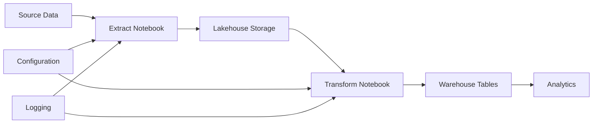

# Sample Project Walkthrough

[Home](../index.md) > [Examples](index.md) > Sample Project

This comprehensive walkthrough demonstrates the complete workflow for managing a Microsoft Fabric workspace using the Ingenious Fabric Accelerator. The sample project includes everything you need to understand the tool's capabilities and best practices.

## What You'll Learn

By following this walkthrough, you'll understand:

- Complete project structure and organization
- Environment-specific variable management
- DDL script development and organization
- Notebook generation and deployment
- Testing strategies and validation
- Multi-environment deployment workflows

## Project Overview

The sample project demonstrates a typical data platform setup with:

- **Configuration Management**: Environment-specific settings and variables
- **Data Architecture**: Lakehouse and warehouse implementations
- **Demo data**: seven bronze tables generated deterministically by DDL scripts
- **dbt transformations**: the same silver and gold models run four ways with Microsoft's
  `dbt-fabricspark` and `dbt-fabric` adapters (see [Step 9: dbt in Fabric](#step-9-dbt-in-fabric))
- **Monitoring**: every dbt run logged by dbt itself into `dbt_batch` and `dbt_execution_log`,
  in the log lakehouse `lh_log` for the lakehouse project and the log warehouse `wh_log` for
  the warehouse project; a failed orchestrator run also keeps its step logs, dbt's log files
  and its error file in `lh_log`

## Project Structure

```
sample_project/
├── ddl_scripts/                      # DDL scripts, compiled into orchestrator notebooks
│   ├── Lakehouses/
│   │   ├── lh_bronze/
│   │   │   ├── 001_Initial_Creation/
│   │   │   ├── 002_Change/
│   │   │   └── 003_Sales_Demo_Data/  # seven generated bronze tables (about 150,000 order lines)
│   │   ├── lh_silver/001_Initial_Creation/
│   │   └── lh_gold/001_Initial_Creation/
│   └── Warehouses/wh_gold/001_Initial_Creation/
├── dbt_project/                      # Spark SQL models for lakehouses (dbt-fabricspark)
│   ├── dbt_project.yml               # profile named after the project; lakehouse targets as vars
│   ├── models/{bronze,silver,gold}/  # 13 models, 27 tests
│   ├── profiles/                     # written by `ingen_fab dbt profile`
│   └── requirements.txt
├── dbt_warehouse/                    # the same models in T-SQL for warehouses (dbt-fabric)
│   ├── dbt_project.yml               # gold routed to wh_gold with +database
│   ├── models/{bronze,silver,gold}/
│   └── profiles/profiles.yml         # hand-written; the endpoint comes from the environment
├── fabric_config/
│   └── storage_config.yaml           # the lakehouses, warehouses and SQL database to create
├── fabric_workspace_items/           # Fabric items, deployed as they are
│   ├── config/var_lib.VariableLibrary/
│   │   ├── variables.json
│   │   └── valueSets/{development,test,local}.json
│   ├── lakehouses/                   # config, lh_bronze, lh_silver, lh_gold, lh_silver_nb, lh_gold_nb, lh_log
│   ├── warehouses/                   # wh_silver, wh_gold, wh_log
│   ├── notebooks/                    # dbtload_lakehouse, dbtload_warehouse (generated by `ingen_fab dbt orchestrator`)
│   └── dbt_jobs/                     # dbtjob_warehouse.DataBuildToolJob (the Fabric dbt job item)
├── deployment/{github,devops}/       # CI workflows
├── metadata/
└── README.md
```

## Step-by-Step Walkthrough

### Step 1: Prerequisites

Before starting, ensure you have:

- [x] Microsoft Fabric workspace created
- [x] Ingenious Fabric Accelerator installed
- [x] Azure authentication configured
- [x] Lakehouse and warehouse IDs available

### Step 2: Environment Configuration

The sample project includes pre-configured environment files. Update them with your workspace details:

=== "Development Environment"
    ```json
    {
      "fabric_environment": "development",
      "config_workspace_id": "your-workspace-guid",
      "config_lakehouse_id": "your-lakehouse-guid",
      "edw_workspace_id": "your-workspace-guid",
      "edw_lakehouse_id": "your-lakehouse-guid",
      "edw_warehouse_id": "your-warehouse-guid"
    }
    ```

=== "Test Environment"
    ```json
    {
      "fabric_environment": "test",
      "config_workspace_id": "your-test-workspace-guid",
      "config_lakehouse_id": "your-test-lakehouse-guid",
      "edw_workspace_id": "your-test-workspace-guid",
      "edw_lakehouse_id": "your-test-lakehouse-guid",
      "edw_warehouse_id": "your-test-warehouse-guid"
    }
    ```

=== "Production Environment"
    ```json
    {
      "fabric_environment": "production",
      "config_workspace_id": "your-prod-workspace-guid",
      "config_lakehouse_id": "your-prod-lakehouse-guid",
      "edw_workspace_id": "your-prod-workspace-guid",
      "edw_lakehouse_id": "your-prod-lakehouse-guid",
      "edw_warehouse_id": "your-prod-warehouse-guid"
    }
    ```

### Step 3: Understanding the DDL Scripts

The sample project includes comprehensive DDL scripts that demonstrate best practices:

#### Lakehouse DDL Scripts

**Configuration Tables Creation:**
```python
# 001_config_parquet_loads_create.py
from lakehouse_utils import LakehouseUtils
from ddl_utils import DDLUtils

lakehouse_utils = LakehouseUtils()
ddl_utils = DDLUtils()

# Create parquet load configuration table
sql_create_config = """
CREATE TABLE IF NOT EXISTS config.parquet_loads (
    load_id STRING,
    source_path STRING,
    target_table STRING,
    load_type STRING,
    schedule STRING,
    is_active BOOLEAN,
    created_date TIMESTAMP,
    last_updated TIMESTAMP
) USING DELTA
LOCATION 'Tables/config/parquet_loads'
"""

ddl_utils.execute_ddl(sql_create_config, "Create parquet loads configuration table")
print("✅ Parquet loads configuration table created")
```

**Logging Tables Creation:**
```python
# 003_log_parquet_loads_create.py
from lakehouse_utils import LakehouseUtils
from ddl_utils import DDLUtils

lakehouse_utils = LakehouseUtils()
ddl_utils = DDLUtils()

# Create parquet load logging table
sql_create_log = """
CREATE TABLE IF NOT EXISTS log.parquet_loads (
    log_id STRING,
    load_id STRING,
    execution_date TIMESTAMP,
    status STRING,
    records_processed BIGINT,
    execution_time_seconds DOUBLE,
    error_message STRING,
    created_date TIMESTAMP
) USING DELTA
LOCATION 'Tables/log/parquet_loads'
"""

ddl_utils.execute_ddl(sql_create_log, "Create parquet loads logging table")
print("✅ Parquet loads logging table created")
```

#### Warehouse DDL Scripts

**SQL-based Configuration:**
```sql
-- 001_config_parquet_loads_create.sql
CREATE TABLE IF NOT EXISTS config.parquet_loads (
    load_id NVARCHAR(50) NOT NULL,
    source_path NVARCHAR(500) NOT NULL,
    target_table NVARCHAR(200) NOT NULL,
    load_type NVARCHAR(20) NOT NULL,
    schedule NVARCHAR(100),
    is_active BIT NOT NULL DEFAULT 1,
    created_date DATETIME2 NOT NULL DEFAULT GETDATE(),
    last_updated DATETIME2 NOT NULL DEFAULT GETDATE(),
    PRIMARY KEY (load_id)
);
```

### Step 4: Generate DDL Notebooks

Transform the DDL scripts into executable notebooks:

Run these from the parent folder of the project (the folder you ran `ingen_fab init new` in). `--fabric-workspace-repo-dir` and `--fabric-environment` are options of `ingen_fab` itself, so they go before the command group; after `ddl compile` they are rejected with `No such option`. Setting `FABRIC_WORKSPACE_REPO_DIR` and `FABRIC_ENVIRONMENT` instead (see [Environment Variables](../reference/environment-variables.md)) lets you leave both out.

=== "macOS/Linux"

    ```bash
    # Generate DDL notebooks for warehouses
    ingen_fab --fabric-workspace-repo-dir sample_project --fabric-environment development \
        ddl compile --output-mode fabric_workspace_repo --generation-mode Warehouse

    # Generate DDL notebooks for lakehouses
    ingen_fab --fabric-workspace-repo-dir sample_project --fabric-environment development \
        ddl compile --output-mode fabric_workspace_repo --generation-mode Lakehouse
    ```

=== "Windows"

    ```powershell
    # Generate DDL notebooks for warehouses
    ingen_fab --fabric-workspace-repo-dir sample_project --fabric-environment development ddl compile --output-mode fabric_workspace_repo --generation-mode Warehouse

    # Generate DDL notebooks for lakehouses
    ingen_fab --fabric-workspace-repo-dir sample_project --fabric-environment development ddl compile --output-mode fabric_workspace_repo --generation-mode Lakehouse
    ```

This generates several types of notebooks:

**Individual DDL Notebooks:**
- One notebook per DDL script
- Includes error handling and logging
- Environment-specific variable substitution

**Orchestrator Notebooks:**
- `00_orchestrator_Config_lakehouse.Notebook` - Runs all lakehouse DDL scripts
- `00_orchestrator_Config_warehouse.Notebook` - Runs all warehouse DDL scripts
- `00_all_lakehouses_orchestrator.Notebook` - Master orchestrator for all lakehouses
- `00_all_warehouses_orchestrator.Notebook` - Master orchestrator for all warehouses

### Step 5: Deploy to Fabric

Deploy the complete solution to your Fabric workspace. The workspace's capacity must be Active: on a paused capacity Fabric rejects the first item with `CapacityNotActive` and nothing is deployed.

=== "macOS/Linux"

    ```bash
    # Deploy all artifacts to development environment
    ingen_fab --fabric-workspace-repo-dir sample_project --fabric-environment development deploy deploy
    ```

=== "Windows"

    ```powershell
    # Deploy all artifacts to development environment
    ingen_fab --fabric-workspace-repo-dir sample_project --fabric-environment development deploy deploy
    ```

Set `AUTO_UPDATE_ITEM_IDS=true` in the environment before this deploy (`export AUTO_UPDATE_ITEM_IDS=true`, or `$env:AUTO_UPDATE_ITEM_IDS = "true"`): the deploy then writes the id of every item it published back into the value set, which Step 9 needs. Without it, `ingen_fab init workspace --workspace-name <name>` fills the ids afterwards.

The first deployment writes `sample_project/platform_manifest_development.yml`, the record of the deployed items' ids; `Manifest file not found` on that first run is expected. The dbt job item `dbtjob_warehouse` is created with its connection still pointing at the placeholder endpoint; it cannot run until Step 9.1 fills the endpoint and deploys again.

Then upload the runtime libraries the DDL notebooks import, to the config lakehouse:

```bash
ingen_fab deploy upload-python-libs
```

This deployment includes:
- Variable library with environment-specific configurations
- All generated DDL notebooks
- Data extraction and loading notebooks
- Platform testing notebooks
- Lakehouse and warehouse definitions

### Step 6: Execute DDL Scripts

Navigate to your Fabric workspace and execute the DDL scripts:

1. **Open your Fabric workspace**
2. **Navigate to the `ddl_scripts` folder**
3. **Run the orchestrator notebooks in sequence:**
   - First: `00_all_warehouses_orchestrator` (if using warehouses)
   - Then: `00_all_lakehouses_orchestrator` (if using lakehouses)

The orchestrator notebooks will:
- Execute all DDL scripts in the correct order
- Track execution state to prevent duplicate runs
- Provide comprehensive logging and error handling
- Display progress and results

### Step 7: Verify Your Deployment

Test that everything is working correctly:

```bash
# Test the deployment using CLI
ingen_fab --fabric-workspace-repo-dir sample_project --fabric-environment development test platform generate
```

Or run the platform testing notebooks directly in Fabric:
- `platform_testing/python_platform_test.Notebook`
- `platform_testing/pyspark_platform_test.Notebook`

### Step 8: Explore the Data Architecture

Once deployed, you'll have the following data architecture:

#### Configuration Schema
- `config.parquet_loads` - Parquet loading configuration
- `config.synapse_extract_objects` - Synapse extraction settings
- `config.synapse_loads` - Synapse loading configuration

#### Logging Schema
- `log.parquet_loads` - Parquet loading execution logs
- `log.synapse_loads` - Synapse loading execution logs

#### Sample Data Flow


### Step 9: dbt in Fabric

The DDL orchestrator (Step 6) loaded bronze: seven tables under `lh_bronze` (`countries`,
`state_provinces`, `cities`, `customers`, `stock_items`, `orders`, `order_lines`), plus a
`countries_backup_<timestamp>` table left by the change script. dbt builds
silver and gold from them: 13 models and 27 tests, the model SQL written once under
`dbt_project/models`. The sample runs that one transformation four ways, each into its own
targets, so you can run them side by side and compare the outputs (they hold identical rows):

| # | Way | What runs where | Writes to | Logs to |
| --- | --- | --- | --- | --- |
| 1 | dbt from your machine | `ingen_fab dbt build`; the models execute in a Spark (Livy) session on the workspace | `lh_silver`, `lh_gold` | `lh_log` |
| 2 | Lakehouse notebook | the notebook `dbtload_lakehouse` runs the same project inside Fabric | `lh_silver_nb`, `lh_gold_nb` | `lh_log` |
| 3 | Warehouse notebook | the notebook `dbtload_warehouse` runs `dbt_warehouse` (the same models in T-SQL) with `dbt-fabric` | `wh_silver.dbt_notebook`, `wh_gold.dbt_notebook` | `wh_log` |
| 4 | Fabric dbt job item | the item `dbtjob_warehouse`; Fabric runs dbt on the copy of `dbt_warehouse` inside the item | `wh_silver.dbt_job`, `wh_gold.dbt_job` | `wh_log` |

Each run is logged by dbt itself, through the `on-run-end` hook in the project: one row in
`dbt_batch`, one row per model and test in `dbt_execution_log`, in the log store of the
engine (`lh_log` for the lakehouse project, `wh_log` for the warehouse project).

#### 9.1 Before the first run

Every command in this step runs from the parent folder of the project, the folder you ran
`ingen_fab init new` in, with the virtual environment that holds `ingen_fab` active. Set the
project folder and the environment once; `dp` is whatever name you gave `init new`:

=== "macOS/Linux"

    ```bash
    export FABRIC_WORKSPACE_REPO_DIR="dp"
    export FABRIC_ENVIRONMENT="development"
    ```

=== "Windows"

    ```powershell
    $env:FABRIC_WORKSPACE_REPO_DIR = "dp"
    $env:FABRIC_ENVIRONMENT = "development"
    ```

Then check each of these, in order:

1. **Bronze is loaded.** Step 6 ran `00_all_lakehouses_orchestrator` and the seven tables
   exist in `lh_bronze`.
2. **The runtime libraries are uploaded.** Step 5 ran `ingen_fab deploy upload-python-libs`;
   the DDL run of Step 6 could not have succeeded without it.
3. **The item ids are in the value set.** Open
   `dp/fabric_workspace_items/config/var_lib.VariableLibrary/valueSets/development.json` and
   look for `REPLACE_WITH_..._ID`. The deploy of Step 5 wrote the ids back if
   `AUTO_UPDATE_ITEM_IDS=true` was set for it. If any id is still a placeholder, fill them
   from the workspace:

    ```bash
    ingen_fab init workspace --workspace-name "<your workspace name>"
    ```

    It asks whether this is a single workspace; answer yes. `ingen_fab dbt profile` needs the
    lakehouse ids and the upload needs the config lakehouse id.

4. **The warehouse SQL endpoint is in the value set, and deployed.** One value is required,
   `wh_silver_warehouse_endpoint`: ways 3 and 4 connect through it, and it is not written
   back. In the workspace open `wh_silver`, choose **Settings** > **SQL endpoint**, and copy
   the SQL connection string, a host name like `<id>.datawarehouse.fabric.microsoft.com`,
   without a port, into `development.json`. The other endpoint variables
   (`wh_gold_warehouse_endpoint`, `wh_log_warehouse_endpoint`, the two `lh_..._sql_endpoint`)
   are read by nothing in the sample; every warehouse of a workspace shares the same host, so
   the same value can be pasted there. Then deploy again:

    ```bash
    ingen_fab deploy deploy
    ```

    This second deploy puts the endpoint into the Variable Library item (the warehouse
    notebook reads it at run time) and into the dbt job item's connection. Ways 3 and 4
    cannot run before it.

5. **The adapter is installed on your machine**, in the same environment as `ingen_fab`:

    ```bash
    pip install "dbt-fabricspark>=1.13,<2"
    ```

    `dbt profile` validates the profile with the adapter before writing it, so ways 1 and 2
    both need this. Ways 3 and 4 install what they need inside Fabric.

6. **The profile is written, then both projects are uploaded**, in this order (the upload
   carries the profile):

    ```bash
    ingen_fab dbt profile --dbt-project dbt_project
    ingen_fab deploy upload-dbt-project --dbt-project dbt_project
    ingen_fab deploy upload-dbt-project --dbt-project dbt_warehouse
    ```

    `dbt profile` writes `dp/dbt_project/profiles/profiles.yml` with a `development` target
    (your machine) and a `development-notebook` target (the notebook). `dbt_warehouse` ships a
    hand-written profile, which is left alone. The uploads copy each project to the config
    lakehouse, under `Files/<project>`.

7. **The capacity has room for Spark.** Ways 1 and 2 each open a Spark session. On a small
   capacity run one at a time, leave a buffer between them, and wait a few minutes after
   stopping a run before starting the next.

#### 9.2 Way 1: dbt from your machine

```bash
ingen_fab dbt build --dbt-project dbt_project
```

What happens: the profile is regenerated, `dbt build` runs with the `development` target, the
first statement opens a Livy session on the workspace (named `dbt-dp-development`, after the
profile, which is the project name; it appears in the Monitor hub), the 13 models are built and the 27 tests run, the session closes when
dbt exits. dbt's output ends with `Done. PASS=40 WARN=0 ERROR=0 SKIP=0 TOTAL=40`.

Result: seven tables in `lh_silver`, six in `lh_gold` (`dim_cities`, `dim_geography`,
`dim_customers`, `dim_stock_items`, `fct_sales`, `agg_sales_country_month`). One row in
`lh_log.dbt_batch` with `runner = cli`, and 40 rows for that batch in
`lh_log.dbt_execution_log`.

#### 9.3 Way 2: the lakehouse notebook

In the workspace, open the folder `notebooks`, open `dbtload_lakehouse`, and run all cells.
Its parameters are set: `dbt_command = "build"`, `dbt_select = "path:models"`,
`dbt_vars = "{silver_lakehouse: lh_silver_nb, gold_lakehouse: lh_gold_nb}"`. The vars point
the same models at the `_nb` lakehouses, so this run does not overwrite way 1.

What happens: the notebook attaches the config lakehouse, installs the adapter from the
uploaded `requirements.txt` (`pip_install` step), fetches a Fabric token in the kernel, and
runs `dbt build` against `Files/dbt_project` with the `development-notebook` target (Livy
session `dbt-dp-development-notebook`). The last cell prints a summary with
`"status": "succeeded"` and the seconds of each step.

Result: the same tables in `lh_silver_nb` and `lh_gold_nb`. One row in `lh_log.dbt_batch`
with `runner = notebook/dbtload_lakehouse`, and 40 rows for that batch in
`lh_log.dbt_execution_log`.

#### 9.4 Way 3: the warehouse notebook

In the folder `notebooks`, open `dbtload_warehouse` and run all cells. Its parameters:
`dbt_command = "build"`, `dbt_select = "path:models"`, `dbt_target = "notebook"`.

What happens: the notebook installs `dbt-fabric`, reads `wh_silver_warehouse_endpoint` from
the Variable Library and exports it to dbt as `DBT_WAREHOUSE_ENDPOINT` (the profile's
`server`), and runs `dbt build` against `Files/dbt_warehouse`, connected to `wh_silver` with
the notebook's identity. Bronze is read through the lakehouse SQL endpoint
(`lh_bronze.dbo.<table>`); the gold folder is routed to `wh_gold` with `+database`. No Spark.
The summary cell prints `"status": "succeeded"`.

Result: seven tables in `wh_silver` under schema `dbt_notebook`, six in `wh_gold` under
`dbt_notebook`. One row in `wh_log.dbo.dbt_batch` with `runner = notebook/dbtload_warehouse`,
and 40 rows for that batch in `wh_log.dbo.dbt_execution_log`.

#### 9.5 Way 4: the Fabric dbt job item

In the folder `dbt_jobs`, open `dbtjob_warehouse` and select **Run**. The item holds its own
copy of `dbt_warehouse` under `Code/dbt` and a connection to `wh_silver` that the deploy
filled from the value set (workspace id, warehouse id, endpoint). Fabric runs `dbt build`
itself with schema `dbt_job`.

What happens: the item's run page shows the dbt output; its files land under
`Output/<run id>/` in the item's OneLake folder. The item reports **Completed** when dbt
finishes, including when the logging hook failed, so read the log row, not only the status.

Result: seven tables in `wh_silver` under schema `dbt_job`, six in `wh_gold` under `dbt_job`.
One row in `wh_log.dbo.dbt_batch` with `runner = cli` (the item passes no runner var; it is
the `cli` row next to the notebook's), and 40 rows for that batch in
`wh_log.dbo.dbt_execution_log`.

#### 9.6 Confirming the runs

The lakehouse log, through the SQL analytics endpoint of `lh_log` in the portal, or from your
machine over Spark:

```bash
ingen_fab dbt show --dbt-project dbt_project -- --inline "select batch_id, runner, command, status, total_nodes, success_count, error_count, started_at from lh_log.dbt_batch order by started_at desc" --limit 20
```

The warehouse log, in the query editor of `wh_log`:

```sql
SELECT batch_id, runner, command, status, total_nodes, success_count, error_count, started_at
FROM wh_log.dbo.dbt_batch ORDER BY started_at DESC;
```

Expect one row per run, `status = success`, `total_nodes = 40`, `success_count = 40`,
`error_count = 0`; and, for each `batch_id`, 40 rows in `dbt_execution_log`, one per model
and test, with their `execution_time`.

The four outputs hold the same rows. Compare one table across them, for example `fct_sales`:
`lh_gold.fct_sales`, `lh_gold_nb.fct_sales` (lakehouse SQL endpoints),
`wh_gold.dbt_notebook.fct_sales`, `wh_gold.dbt_job.fct_sales` (warehouse query editor). The
counts are identical.

#### 9.7 What a first run hits

| Symptom | Cause | Fix |
| --- | --- | --- |
| way 3: `pip_install` passes, `dbt_build` fails at the connection (login error, or a server named `REPLACE_WITH_...`) | the warehouse endpoint is not in the Variable Library item | 9.1 step 4: fill the endpoint, deploy again |
| way 4: the run fails at the connection | the item was deployed while the endpoint was a placeholder and not deployed again | same as above |
| way 2 or 3: the notebook cannot find the project, or `pip_install` finds no `requirements.txt` | `upload-dbt-project` not run for that project | 9.1 step 6 |
| way 2: dbt reports the target `development-notebook` does not exist | the project was uploaded before `dbt profile` was run | run `dbt profile`, upload again |
| way 1: `no lakehouse with a real id in the value set`, or `lakehouse 'lh_silver' is declared but has no id yet` | ids still `REPLACE_WITH_...` | 9.1 step 3 |
| `dbt profile`: `dbt-fabricspark is not installed in this environment` | the adapter is missing on your machine | 9.1 step 5 |
| way 1 or 2: the Livy session is refused | another Spark session is still open, or the previous one just stopped | 9.1 step 7 |
| the Monitor hub shows a **Failed** `LivySession` on `lh_silver` right after a successful way 1 or way 2 run, or the next Spark run fails with error 430 `TooManyRequestsForCapacity` | the run's Livy session stays alive for about a minute after dbt exits, then Livy ends it with `LIVY_JOB_TIMED_OUT`; a session started inside that minute is refused on a small capacity | the run itself succeeded, check its log row; wait a minute before the next Spark run (9.1 step 7) |
| way 3 or 4: `Invalid object name 'lh_bronze.dbo.<table>'` right after Step 6 | the SQL analytics endpoint of `lh_bronze` has not yet picked up the new tables | refresh the endpoint's metadata, then run again: in the portal open the SQL analytics endpoint of `lh_bronze` and choose **Refresh**, or call `POST https://api.fabric.microsoft.com/v1/workspaces/<workspace id>/sqlEndpoints/<endpoint id>/refreshMetadata?preview=true` with an empty body (the endpoint id is in the item's URL); it reports each table as synced in seconds |
| a run is missing from `dbt_batch` | the hook runs after `build`, `run`, `test`, `seed`, `snapshot` only; a selection that matches nothing leaves no row | check the selector; `compile` never logs |
| a failed notebook run | the notebook kept `pip_install.log`, `dbt_build.log`, dbt's log files and `notebook_error.log` under `Files/dbt_failures/<project>/<notebook>/<UTC timestamp>_<run id>/` of `lh_log` | open `lh_log` in the workspace, then **Files** in the lakehouse explorer |

How the two notebooks and the job item are built, and every option of the commands above, is
in the [dbt integration guide](../user_guide/dbt_integration.md).

## Key Features Demonstrated

### 1. Environment-Specific Configuration

The sample shows how to manage multiple environments:

- **Development**: For development and testing
- **Test**: For integration testing
- **Production**: For live production workloads

Each environment has its own variable set with appropriate workspace and resource IDs.

### 2. DDL Script Organization

The project demonstrates best practices for DDL script organization:

- **Numbered Sequences**: Scripts execute in order (001_, 002_, etc.)
- **Logical Grouping**: Related scripts are grouped in folders
- **Mixed Languages**: Both Python and SQL scripts are supported
- **Idempotent Operations**: Scripts can be run multiple times safely

### 3. Comprehensive Logging

Every operation is logged with:

- **Execution Status**: Success or failure
- **Timing Information**: Execution duration
- **Error Details**: Detailed error messages when failures occur
- **Audit Trail**: Who, what, when for all operations

### 4. Testing Framework

The sample includes multiple levels of testing:

- **Local Testing**: Test libraries and logic locally
- **Platform Testing**: Validate deployment on Fabric
- **Integration Testing**: End-to-end workflow validation

### 5. Data Pipeline Configuration

Configuration-driven data pipelines:

- **Parquet Processing**: Configurable parquet file processing
- **Synapse Integration**: Legacy Synapse data source integration
- **Flexible Scheduling**: Configurable execution schedules
- **Error Handling**: Comprehensive error handling and recovery

## Customization Guide

### Adding New DDL Scripts

1. **Create new script file**:
   ```python
   # ddl_scripts/Lakehouses/Config/001_Initial_Creation/007_new_table_create.py
   from lakehouse_utils import LakehouseUtils
   from ddl_utils import DDLUtils
   
   lakehouse_utils = LakehouseUtils()
   ddl_utils = DDLUtils()
   
   sql = """
   CREATE TABLE IF NOT EXISTS config.new_table (
       id BIGINT,
       name STRING,
       created_date TIMESTAMP
   ) USING DELTA
   LOCATION 'Tables/config/new_table'
   """
   
   ddl_utils.execute_ddl(sql, "Create new table")
   print("✅ New table created successfully")
   ```

2. **Regenerate notebooks**:
   ```bash
   ingen_fab ddl compile --output-mode fabric_workspace_repo --generation-mode Lakehouse
   ```

3. **Redeploy**:

    === "macOS/Linux"

        ```bash
        # Ensure environment variables are set
        export FABRIC_WORKSPACE_REPO_DIR="sample_project"
        export FABRIC_ENVIRONMENT="development"
        ingen_fab deploy deploy
        ```

    === "Windows"

        ```powershell
        # Ensure environment variables are set
        $env:FABRIC_WORKSPACE_REPO_DIR = "sample_project"
        $env:FABRIC_ENVIRONMENT = "development"
        ingen_fab deploy deploy
        ```

### Adding New Environments

1. **Create new variable set**:
   ```json
   # fabric_workspace_items/config/var_lib.VariableLibrary/valueSets/staging.json
   {
     "fabric_environment": "staging",
     "config_workspace_id": "staging-workspace-guid",
     "config_lakehouse_id": "staging-lakehouse-guid"
   }
   ```

2. **Create platform manifest**:
   ```yaml
   # platform_manifest_staging.yml
   environment: staging
   workspace_id: staging-workspace-guid
   # ... other staging-specific settings
   ```

3. **Deploy to new environment**:

    === "macOS/Linux"

        ```bash
        export FABRIC_WORKSPACE_REPO_DIR="sample_project"
        export FABRIC_ENVIRONMENT="staging"
        ingen_fab deploy deploy
        ```

    === "Windows"

        ```powershell
        $env:FABRIC_WORKSPACE_REPO_DIR = "sample_project"
        $env:FABRIC_ENVIRONMENT = "staging"
        ingen_fab deploy deploy
        ```

## Advanced Usage

### Multi-Project Setup

Use the sample as a template for multiple projects:

=== "macOS/Linux"

    ```bash
    # Create multiple projects based on the sample
    for project in analytics ml-platform reporting; do
        cp -r sample_project $project
        # Update configuration for specific project
        vim $project/fabric_workspace_items/config/var_lib.VariableLibrary/valueSets/development.json
    done
    ```

=== "Windows"

    ```powershell
    # Create multiple projects based on the sample
    foreach ($project in "analytics", "ml-platform", "reporting") {
        Copy-Item -Recurse sample_project $project
        # Update configuration for specific project
        code $project\fabric_workspace_items\config\var_lib.VariableLibrary\valueSets\development.json
    }
    ```

### CI/CD Integration

Integrate with CI/CD pipelines:

```yaml
# .github/workflows/deploy.yml
name: Deploy Sample Project

on:
  push:
    branches: [ main ]
    paths: [ 'sample_project/**' ]

jobs:
  deploy:
    runs-on: ubuntu-latest
    steps:
    - uses: actions/checkout@v4
    
    - name: Setup Python
      uses: actions/setup-python@v4
      with:
        python-version: '3.12'
    
    - name: Install dependencies
      run: |
        pip install uv
        uv sync
    
    - name: Deploy sample project
      run: |
        cd sample_project
        uv run ingen_fab ddl compile --output-mode fabric_workspace_repo --generation-mode Warehouse
        uv run ingen_fab ddl compile --output-mode fabric_workspace_repo --generation-mode Lakehouse
        uv run ingen_fab deploy deploy
      env:
        FABRIC_WORKSPACE_REPO_DIR: "."
        FABRIC_ENVIRONMENT: "development"
        AZURE_TENANT_ID: ${{ "{{" }} secrets.AZURE_TENANT_ID {{ "}}" }}
        AZURE_CLIENT_ID: ${{ "{{" }} secrets.AZURE_CLIENT_ID {{ "}}" }}
        AZURE_CLIENT_SECRET: ${{ "{{" }} secrets.AZURE_CLIENT_SECRET {{ "}}" }}
```

## Troubleshooting

### Common Issues

1. **Authentication Errors**:

    === "macOS/Linux"

        ```bash
        # Check Azure authentication
        az account show

        # Or use environment variables
        export AZURE_TENANT_ID="your-tenant-id"
        export AZURE_CLIENT_ID="your-client-id"
        export AZURE_CLIENT_SECRET="your-client-secret"
        ```

    === "Windows"

        ```powershell
        # Check Azure authentication
        az account show

        # Or use environment variables
        $env:AZURE_TENANT_ID = "your-tenant-id"
        $env:AZURE_CLIENT_ID = "your-client-id"
        $env:AZURE_CLIENT_SECRET = "your-client-secret"
        ```

2. **Variable Resolution Issues**:

    === "macOS/Linux"

        ```bash
        # Verify variable files exist and are valid JSON
        cat fabric_workspace_items/config/var_lib.VariableLibrary/valueSets/development.json | jq .
        ```

    === "Windows"

        ```powershell
        # Verify variable files exist and are valid JSON
        Get-Content fabric_workspace_items/config/var_lib.VariableLibrary/valueSets/development.json | ConvertFrom-Json
        ```

    There is no `--dry-run` option: check the value set by hand or run the deploy command directly.

3. **DDL Script Failures**:
   - Check workspace and lakehouse IDs are correct
   - Verify DDL script syntax
   - Review execution logs in Fabric notebook output

### Getting Help

- **Documentation**: Review the [User Guide](../user_guide/index.md) for detailed command usage
- **CLI Help**: Use `ingen_fab --help` for command-specific help
- **Examples**: Check other examples in this section
- **Support**: Reach out to your platform team for assistance

## Next Steps

Now that you've explored the sample project:

1. **Customize it** for your specific use case
2. **Create your own project** using the patterns you've learned
3. **Explore advanced features** in the [Developer Guide](../developer_guide/index.md)
4. **Learn about Python libraries** that power the functionality
5. **Contribute back** by sharing your own examples and improvements

The sample project provides a solid foundation for building sophisticated data platforms with the Ingenious Fabric Accelerator. Use it as a starting point for your own projects and adapt the patterns to meet your specific requirements.