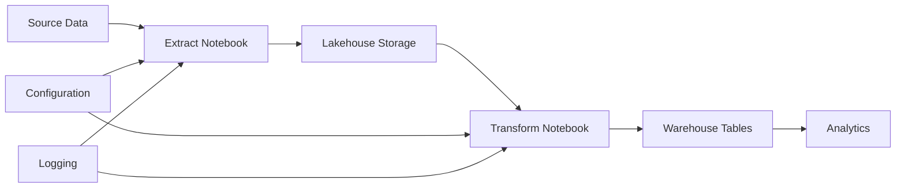

# Your First Project

[Home](../index.md) > [Getting Started](../user_guide/index.md) > First Project

This comprehensive walkthrough demonstrates the complete workflow for managing a Microsoft Fabric workspace using the Ingenious Fabric Accelerator. Follow along with the sample project to understand the tool's capabilities and best practices.

!!! tip "Learning Path"
    **New User Journey**: [Installation](../user_guide/installation.md) → [Quick Start](../user_guide/quick_start.md) → First Project (you are here) → [CLI Reference](../user_guide/cli_reference.md)

!!! info "Prerequisites"
    Complete the [Quick Start](../user_guide/quick_start.md) guide before starting this walkthrough.

## What You'll Learn

By following this walkthrough, you'll understand:

- Complete project structure and organization
- Environment-specific variable management
- DDL script development and organization
- Notebook generation and deployment
- Testing strategies and validation
- Multi-environment deployment workflows

## Project Overview

The sample project demonstrates a typical data platform setup with:

- **Configuration Management**: Environment-specific settings and variables
- **Data Architecture**: Lakehouse and warehouse implementations
- **ETL Pipelines**: Data extraction, transformation, and loading
- **Monitoring**: Logging and execution tracking
- **Testing**: Both local and platform testing capabilities

## Project Structure

```
sample_project/
├── ddl_scripts/              # DDL scripts for tables and configuration
│   ├── Lakehouses/          # Lakehouse DDL scripts
│   │   └── Config/          # Configuration tables
│   │       └── 001_Initial_Creation/
│   │           ├── 001_config_parquet_loads_create.py
│   │           ├── 002_config.synapse_extract_objects.py
│   │           ├── 003_log_parquet_loads_create.py
│   │           ├── 004_log_synapse_loads_create.py
│   │           ├── 005_config_synapse_loads_insert.py
│   │           └── 006_config_parquet_loads_insert.py
│   └── Warehouses/          # Warehouse DDL scripts
│       └── Config/          # Configuration tables
│           └── 001_Initial_Creation/
│               ├── 001_config_parquet_loads_create.sql
│               ├── 002_config_synapse_loads_create.sql
│               ├── 003_log_parquet_loads_create.sql
│               ├── 004_log_synapse_loads_create.sql
│               ├── 005_config_synapse_loads_insert.sql
│               └── 006_config_parquet_loads_insert.sql
├── fabric_workspace_items/   # Generated Fabric artifacts
│   ├── config/              # Variable library
│   │   └── var_lib.VariableLibrary/
│   │       ├── settings.json
│   │       ├── variables.json
│   │       └── valueSets/
│   │           ├── development.json
│   │           ├── test.json
│   │           └── production.json
│   ├── ddl_scripts/         # Generated DDL notebooks
│   ├── extract/             # Data extraction notebooks
│   ├── load/                # Data loading notebooks
│   ├── lakehouses/          # Lakehouse definitions
│   ├── platform_testing/    # Platform testing notebooks
│   └── warehouses/          # Warehouse definitions
├── diagrams/                # Architecture diagrams
└── platform_manifest_*.yml  # Environment-specific configurations
```

## Step-by-Step Walkthrough

### Step 1: Prerequisites

Before starting, ensure you have:

- [x] Microsoft Fabric workspace created
- [x] Ingenious Fabric Accelerator installed
- [x] Azure authentication configured
- [x] Lakehouse and warehouse IDs available

### Step 2: Environment Configuration

The sample project includes pre-configured environment files. Update them with your workspace details:

=== "Development Environment"
    ```json
    {
      "fabric_environment": "development",
      "config_workspace_id": "your-workspace-guid",
      "config_lakehouse_id": "your-lakehouse-guid",
      "edw_workspace_id": "your-workspace-guid",
      "edw_lakehouse_id": "your-lakehouse-guid",
      "edw_warehouse_id": "your-warehouse-guid"
    }
    ```

=== "Test Environment"
    ```json
    {
      "fabric_environment": "test",
      "config_workspace_id": "your-test-workspace-guid",
      "config_lakehouse_id": "your-test-lakehouse-guid",
      "edw_workspace_id": "your-test-workspace-guid",
      "edw_lakehouse_id": "your-test-lakehouse-guid",
      "edw_warehouse_id": "your-test-warehouse-guid"
    }
    ```

=== "Production Environment"
    ```json
    {
      "fabric_environment": "production",
      "config_workspace_id": "your-prod-workspace-guid",
      "config_lakehouse_id": "your-prod-lakehouse-guid",
      "edw_workspace_id": "your-prod-workspace-guid",
      "edw_lakehouse_id": "your-prod-lakehouse-guid",
      "edw_warehouse_id": "your-prod-warehouse-guid"
    }
    ```

### Step 3: Understanding the DDL Scripts

The sample project includes comprehensive DDL scripts that demonstrate best practices:

#### Lakehouse DDL Scripts

**Configuration Tables Creation:**
```python
# 001_config_parquet_loads_create.py
from lakehouse_utils import LakehouseUtils
from ddl_utils import DDLUtils

lakehouse_utils = LakehouseUtils()
ddl_utils = DDLUtils()

# Create parquet load configuration table
sql_create_config = """
CREATE TABLE IF NOT EXISTS config.parquet_loads (
    load_id STRING,
    source_path STRING,
    target_table STRING,
    load_type STRING,
    schedule STRING,
    is_active BOOLEAN,
    created_date TIMESTAMP,
    last_updated TIMESTAMP
) USING DELTA
LOCATION 'Tables/config/parquet_loads'
"""

ddl_utils.execute_ddl(sql_create_config, "Create parquet loads configuration table")
print("✅ Parquet loads configuration table created")
```

**Logging Tables Creation:**
```python
# 003_log_parquet_loads_create.py
from lakehouse_utils import LakehouseUtils
from ddl_utils import DDLUtils

lakehouse_utils = LakehouseUtils()
ddl_utils = DDLUtils()

# Create parquet load logging table
sql_create_log = """
CREATE TABLE IF NOT EXISTS log.parquet_loads (
    log_id STRING,
    load_id STRING,
    execution_date TIMESTAMP,
    status STRING,
    records_processed BIGINT,
    execution_time_seconds DOUBLE,
    error_message STRING,
    created_date TIMESTAMP
) USING DELTA
LOCATION 'Tables/log/parquet_loads'
"""

ddl_utils.execute_ddl(sql_create_log, "Create parquet loads logging table")
print("✅ Parquet loads logging table created")
```

#### Warehouse DDL Scripts

**SQL-based Configuration:**
```sql
-- 001_config_parquet_loads_create.sql
CREATE TABLE IF NOT EXISTS config.parquet_loads (
    load_id NVARCHAR(50) NOT NULL,
    source_path NVARCHAR(500) NOT NULL,
    target_table NVARCHAR(200) NOT NULL,
    load_type NVARCHAR(20) NOT NULL,
    schedule NVARCHAR(100),
    is_active BIT NOT NULL DEFAULT 1,
    created_date DATETIME2 NOT NULL DEFAULT GETDATE(),
    last_updated DATETIME2 NOT NULL DEFAULT GETDATE(),
    PRIMARY KEY (load_id)
);
```

### Step 4: Generate DDL Notebooks

Transform the DDL scripts into executable notebooks:

```bash
# Navigate to the project root
cd sample_project

# Generate DDL notebooks for warehouses
ingen_fab ddl compile \
    --fabric-workspace-repo-dir . \
    --fabric-environment development \
    --output-mode fabric_workspace_repo \
    --generation-mode Warehouse

# Generate DDL notebooks for lakehouses
ingen_fab ddl compile \
    --fabric-workspace-repo-dir . \
    --fabric-environment development \
    --output-mode fabric_workspace_repo \
    --generation-mode Lakehouse
```

This generates several types of notebooks:

**Individual DDL Notebooks:**
- One notebook per DDL script
- Includes error handling and logging
- Environment-specific variable substitution

**Orchestrator Notebooks:**
- `00_orchestrator_Config_lakehouse.Notebook` - Runs all lakehouse DDL scripts
- `00_orchestrator_Config_warehouse.Notebook` - Runs all warehouse DDL scripts
- `00_all_lakehouses_orchestrator.Notebook` - Master orchestrator for all lakehouses
- `00_all_warehouses_orchestrator.Notebook` - Master orchestrator for all warehouses

### Step 5: Deploy to Fabric

Deploy the complete solution to your Fabric workspace:

```bash
# Deploy all artifacts to development environment
ingen_fab deploy deploy \
    --fabric-workspace-repo-dir . \
    --fabric-environment development
```

This deployment includes:
- Variable library with environment-specific configurations
- All generated DDL notebooks
- Data extraction and loading notebooks
- Platform testing notebooks
- Lakehouse and warehouse definitions

### Step 6: Execute DDL Scripts

Navigate to your Fabric workspace and execute the DDL scripts:

1. **Open your Fabric workspace**
2. **Navigate to the `ddl_scripts` folder**
3. **Run the orchestrator notebooks in sequence:**
   - First: `00_all_warehouses_orchestrator` (if using warehouses)
   - Then: `00_all_lakehouses_orchestrator` (if using lakehouses)

The orchestrator notebooks will:
- Execute all DDL scripts in the correct order
- Track execution state to prevent duplicate runs
- Provide comprehensive logging and error handling
- Display progress and results

### Step 7: Verify Your Deployment

Test that everything is working correctly:

```bash
# Test the deployment using CLI
ingen_fab test platform generate \
    --fabric-workspace-repo-dir . \
    --fabric-environment development
```

Or run the platform testing notebooks directly in Fabric:
- `platform_testing/python_platform_test.Notebook`
- `platform_testing/pyspark_platform_test.Notebook`

### Step 8: Explore the Data Architecture

Once deployed, you'll have the following data architecture:

#### Configuration Schema
- `config.parquet_loads` - Parquet loading configuration
- `config.synapse_extract_objects` - Synapse extraction settings
- `config.synapse_loads` - Synapse loading configuration

#### Logging Schema
- `log.parquet_loads` - Parquet loading execution logs
- `log.synapse_loads` - Synapse loading execution logs

#### Sample Data Flow


## Key Features Demonstrated

### 1. Environment-Specific Configuration

The sample shows how to manage multiple environments:

- **Development**: For development and testing
- **Test**: For integration testing
- **Production**: For live production workloads

Each environment has its own variable set with appropriate workspace and resource IDs.

### 2. DDL Script Organization

The project demonstrates best practices for DDL script organization:

- **Numbered Sequences**: Scripts execute in order (001_, 002_, etc.)
- **Logical Grouping**: Related scripts are grouped in folders
- **Mixed Languages**: Both Python and SQL scripts are supported
- **Idempotent Operations**: Scripts can be run multiple times safely

### 3. Comprehensive Logging

Every operation is logged with:

- **Execution Status**: Success or failure
- **Timing Information**: Execution duration
- **Error Details**: Detailed error messages when failures occur
- **Audit Trail**: Who, what, when for all operations

### 4. Testing Framework

The sample includes multiple levels of testing:

- **Local Testing**: Test libraries and logic locally
- **Platform Testing**: Validate deployment on Fabric
- **Integration Testing**: End-to-end workflow validation

### 5. Data Pipeline Configuration

Configuration-driven data pipelines:

- **Parquet Processing**: Configurable parquet file processing
- **Synapse Integration**: Legacy Synapse data source integration
- **Flexible Scheduling**: Configurable execution schedules
- **Error Handling**: Comprehensive error handling and recovery

## Customization Guide

### Adding New DDL Scripts

1. **Create new script file**:
   ```python
   # ddl_scripts/Lakehouses/Config/001_Initial_Creation/007_new_table_create.py
   from lakehouse_utils import LakehouseUtils
   from ddl_utils import DDLUtils
   
   lakehouse_utils = LakehouseUtils()
   ddl_utils = DDLUtils()
   
   sql = """
   CREATE TABLE IF NOT EXISTS config.new_table (
       id BIGINT,
       name STRING,
       created_date TIMESTAMP
   ) USING DELTA
   LOCATION 'Tables/config/new_table'
   """
   
   ddl_utils.execute_ddl(sql, "Create new table")
   print("✅ New table created successfully")
   ```

2. **Regenerate notebooks**:
   ```bash
   ingen_fab ddl compile --output-mode fabric_workspace_repo --generation-mode Lakehouse
   ```

3. **Redeploy**:
   ```bash
   ingen_fab deploy deploy
   ```

### Adding New Environments

1. **Create new variable set**:
   ```json
   # fabric_workspace_items/config/var_lib.VariableLibrary/valueSets/staging.json
   {
     "fabric_environment": "staging",
     "config_workspace_id": "staging-workspace-guid",
     "config_lakehouse_id": "staging-lakehouse-guid"
   }
   ```

2. **Create platform manifest**:
   ```yaml
   # platform_manifest_staging.yml
   environment: staging
   workspace_id: staging-workspace-guid
   # ... other staging-specific settings
   ```

3. **Deploy to new environment**:
   ```bash
   $env:FABRIC_WORKSPACE_REPO_DIR = "dp"
   $env:FABRIC_ENVIRONMENT = "development"

   ingen_fab deploy deploy
   ```

## Advanced Usage

### Multi-Project Setup

Use the sample as a template for multiple projects:

```bash
# Create multiple projects based on the sample
for project in analytics ml-platform reporting; do
    cp -r sample_project $project
    cd $project
    # Update configuration for specific project
    vim fabric_workspace_items/config/var_lib.VariableLibrary/valueSets/development.json
    cd ..
done
```

### CI/CD Integration

Integrate with CI/CD pipelines:

```yaml
# .github/workflows/deploy.yml
name: Deploy Sample Project

on:
  push:
    branches: [ main ]
    paths: [ 'sample_project/**' ]

jobs:
  deploy:
    runs-on: ubuntu-latest
    steps:
    - uses: actions/checkout@v4
    
    - name: Setup Python
      uses: actions/setup-python@v4
      with:
        python-version: '3.12'
    
    - name: Install dependencies
      run: |
        pip install uv
        uv sync
    
    - name: Deploy sample project
      run: |
        cd sample_project
        uv run ingen_fab ddl compile --output-mode fabric_workspace_repo --generation-mode Warehouse
        uv run ingen_fab ddl compile --output-mode fabric_workspace_repo --generation-mode Lakehouse
        uv run ingen_fab deploy deploy
      env:
        FABRIC_WORKSPACE_REPO_DIR: "."
        FABRIC_ENVIRONMENT: "development"
        AZURE_TENANT_ID: ${{ "{{" }} secrets.AZURE_TENANT_ID {{ "}}" }}
        AZURE_CLIENT_ID: ${{ "{{" }} secrets.AZURE_CLIENT_ID {{ "}}" }}
        AZURE_CLIENT_SECRET: ${{ "{{" }} secrets.AZURE_CLIENT_SECRET {{ "}}" }}
```

## Troubleshooting

### Common Issues

1. **Authentication Errors**:
   ```bash
   # Check Azure authentication
   az account show
   
   # Or use environment variables
   export AZURE_TENANT_ID="your-tenant-id"
   export AZURE_CLIENT_ID="your-client-id"
   export AZURE_CLIENT_SECRET="your-client-secret"
   ```

2. **Variable Resolution Issues**:
   ```bash
   # Verify variable files exist and are valid JSON
   cat fabric_workspace_items/config/var_lib.VariableLibrary/valueSets/development.json | jq .
   
   # Test variable injection (Note: --dry-run option not implemented)
   # Check variable files manually or use the deploy command directly
   ```

3. **DDL Script Failures**:
   - Check workspace and lakehouse IDs are correct
   - Verify DDL script syntax
   - Review execution logs in Fabric notebook output

### Getting Help

- **Documentation**: Review the [User Guide](../user_guide/index.md) for detailed command usage
- **CLI Help**: Use `ingen_fab --help` for command-specific help
- **Examples**: Check other examples in this section
- **Support**: Reach out to your platform team for assistance

## Next Steps

Now that you've explored the sample project:

1. **Customize it** for your specific use case
2. **Create your own project** using the patterns you've learned
3. **Explore advanced features** in the [Developer Guide](../developer_guide/index.md)
4. **Learn about Python libraries** that power the functionality
5. **Contribute back** by sharing your own examples and improvements

The sample project provides a solid foundation for building sophisticated data platforms with the Ingenious Fabric Accelerator. Use it as a starting point for your own projects and adapt the patterns to meet your specific requirements.