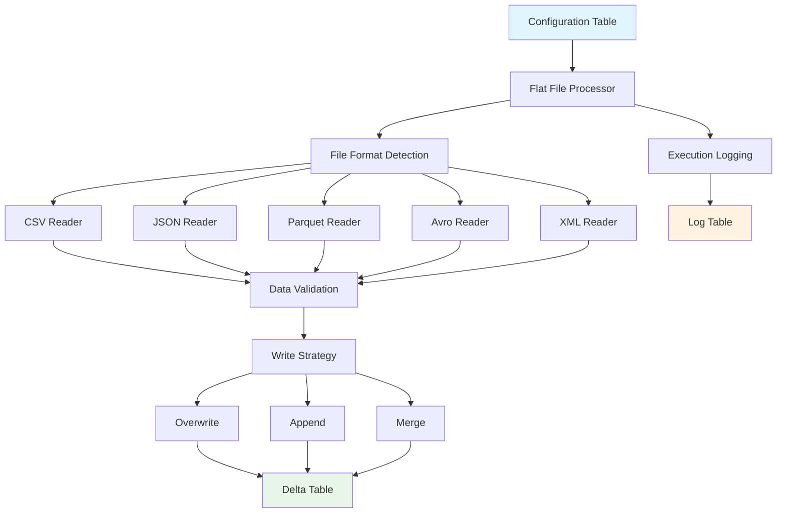

# Flat File Ingestion Package

The Flat File Ingestion package provides a comprehensive solution for processing various file formats and loading them into Delta tables in Microsoft Fabric. It supports CSV, JSON, Parquet, Avro, and XML files with configurable parsing options and robust error handling.

## Overview

This package enables you to:

- **Process multiple file formats** with a single, unified interface
- **Configure parsing options** per file type and use case
- **Implement data validation** with custom rules
- **Handle errors gracefully** with multiple strategies
- **Track execution** with comprehensive logging
- **Support multiple write modes** (overwrite, append, merge)

## Architecture



## Quick Start

### 1. Compile the Package

```bash
# Compile templates and DDL scripts
ingen_fab run package flat-file-ingestion compile
```

This generates:
- **Notebook**: `fabric_workspace_items/flat_file_ingestion/flat_file_ingestion_processor.Notebook/`
- **DDL Scripts**: `fabric_workspace_items/ddl_scripts/flat_file_ingestion/`

### 2. Deploy Configuration Tables

Deploy the generated DDL scripts to create the required metadata tables:

**For Lakehouses:**
```bash
# Deploy lakehouse DDL scripts
ingen_fab ddl compile --generation-mode=lakehouse
```

**For Warehouses:**
```bash
# Deploy warehouse DDL scripts
igen_fab ddl compile --generation-mode=warehouse
```

### 3. Configure File Processing

Add configuration records to the `config_flat_file_ingestion` table:

```sql
INSERT INTO config_flat_file_ingestion (
    config_id, 
    config_name, 
    source_file_path, 
    source_file_format,
    target_lakehouse_workspace_id,
    target_lakehouse_id,
    target_schema_name,
    target_table_name,
    file_delimiter,
    has_header,
    write_mode,
    error_handling_strategy,
    execution_group,
    active_yn,
    created_date,
    created_by
) VALUES (
    'sales_data_csv',
    'Sales Data CSV Import',
    'Files/input/sales_data.csv',
    'csv',
    'your-workspace-id',
    'your-lakehouse-id',
    'bronze',
    'sales_raw',
    ',',
    1,
    'overwrite',
    'fail',
    1,
    'Y',
    GETDATE(),
    'admin'
);
```

### 4. Run File Processing

```bash
# Process specific configuration
ingen_fab run package flat-file-ingestion run --config-id=sales_data_csv

# Process all configurations in execution group
ingen_fab run package flat-file-ingestion run --execution-group=1
```

## Configuration Schema

The package uses two main tables for configuration and logging:

### Configuration Table (`config_flat_file_ingestion`)

| Column | Type | Description |
|--------|------|-------------|
| `config_id` | String | Unique identifier for the configuration |
| `config_name` | String | Human-readable name for the configuration |
| `source_file_path` | String | Path to the source file |
| `source_file_format` | String | File format (csv, json, parquet, avro, xml) |
| `target_lakehouse_workspace_id` | String | Target workspace ID |
| `target_lakehouse_id` | String | Target lakehouse ID |
| `target_schema_name` | String | Target schema name |
| `target_table_name` | String | Target table name |
| `file_delimiter` | String | Delimiter for CSV files (e.g., ',', ';') |
| `has_header` | Boolean | Whether CSV files have headers |
| `encoding` | String | File encoding (utf-8, latin-1, etc.) |
| `date_format` | String | Date format pattern |
| `timestamp_format` | String | Timestamp format pattern |
| `schema_inference` | Boolean | Whether to infer schema automatically |
| `custom_schema_json` | String | Custom schema definition (JSON) |
| `partition_columns` | String | Comma-separated partition columns |
| `sort_columns` | String | Comma-separated sort columns |
| `write_mode` | String | Write mode (overwrite, append, merge) |
| `merge_keys` | String | Comma-separated merge keys |
| `data_validation_rules` | String | Custom validation rules (JSON) |
| `error_handling_strategy` | String | Error handling (fail, skip, log) |
| `execution_group` | Integer | Execution group for batch processing |
| `active_yn` | String | Active flag (Y/N) |

### Log Table (`log_flat_file_ingestion`)

| Column | Type | Description |
|--------|------|-------------|
| `log_id` | String | Unique log entry identifier |
| `config_id` | String | Reference to configuration |
| `execution_id` | String | Unique execution identifier |
| `job_start_time` | Timestamp | Job start time |
| `job_end_time` | Timestamp | Job end time |
| `status` | String | Execution status (running, completed, failed) |
| `source_file_path` | String | Source file path |
| `source_file_size_bytes` | Long | Source file size |
| `target_table_name` | String | Target table name |
| `records_processed` | Long | Number of records processed |
| `records_inserted` | Long | Number of records inserted |
| `records_updated` | Long | Number of records updated |
| `records_deleted` | Long | Number of records deleted |
| `records_failed` | Long | Number of failed records |
| `error_message` | String | Error message (if failed) |
| `error_details` | String | Detailed error information |
| `execution_duration_seconds` | Integer | Execution duration |
| `spark_application_id` | String | Spark application ID |

## Supported File Formats

### CSV Files

**Configuration Options:**
- `file_delimiter`: Field separator (default: ',')
- `has_header`: Header row present (default: true)
- `encoding`: File encoding (default: 'utf-8')
- `date_format`: Date parsing format
- `timestamp_format`: Timestamp parsing format

**Example Configuration:**
```sql
INSERT INTO config_flat_file_ingestion (
    config_id, source_file_format, file_delimiter, has_header, encoding,
    date_format, timestamp_format, ...
) VALUES (
    'csv_config', 'csv', ';', 1, 'utf-8',
    'yyyy-MM-dd', 'yyyy-MM-dd HH:mm:ss', ...
);
```

### JSON Files

**Configuration Options:**
- `date_format`: Date parsing format
- `timestamp_format`: Timestamp parsing format
- `custom_schema_json`: Custom schema for complex structures

**Example Configuration:**
```sql
INSERT INTO config_flat_file_ingestion (
    config_id, source_file_format, custom_schema_json, ...
) VALUES (
    'json_config', 'json', '{"type": "struct", "fields": [...]}', ...
);
```

### Parquet Files

**Configuration Options:**
- Minimal configuration required
- Schema is automatically inferred

**Example Configuration:**
```sql
INSERT INTO config_flat_file_ingestion (
    config_id, source_file_format, ...
) VALUES (
    'parquet_config', 'parquet', ...
);
```

### Avro Files

**Configuration Options:**
- Schema is embedded in the file
- Minimal configuration required

### XML Files

**Configuration Options:**
- `custom_schema_json`: Schema definition for XML structure

**Example Configuration:**
```sql
INSERT INTO config_flat_file_ingestion (
    config_id, source_file_format, custom_schema_json, ...
) VALUES (
    'xml_config', 'xml', '{"type": "struct", "fields": [...]}', ...
);
```

## Write Modes

### Overwrite Mode

Replaces all existing data in the target table:

```sql
UPDATE config_flat_file_ingestion 
SET write_mode = 'overwrite' 
WHERE config_id = 'my_config';
```

### Append Mode

Adds new data to the existing table:

```sql
UPDATE config_flat_file_ingestion 
SET write_mode = 'append' 
WHERE config_id = 'my_config';
```

### Merge Mode

Performs upsert operations based on merge keys:

```sql
UPDATE config_flat_file_ingestion 
SET write_mode = 'merge',
    merge_keys = 'customer_id,order_date'
WHERE config_id = 'my_config';
```

## Data Validation

### Custom Validation Rules

Define validation rules as JSON:

```json
{
  "required_columns": ["customer_id", "order_date"],
  "column_types": {
    "customer_id": "string",
    "order_amount": "decimal"
  },
  "value_ranges": {
    "order_amount": {"min": 0, "max": 10000}
  },
  "regex_patterns": {
    "email": "^[a-zA-Z0-9._%+-]+@[a-zA-Z0-9.-]+\\.[a-zA-Z]{2,}$"
  }
}
```

### Error Handling Strategies

**Fail Strategy:**
- Stops processing on first error
- Rolls back changes
- Logs error details

**Skip Strategy:**
- Skips invalid records
- Continues processing
- Logs skipped records

**Log Strategy:**
- Logs errors but continues
- Processes valid records
- Provides error summary

## Advanced Features

### Custom Schema Definition

For complex data structures, define custom schemas:

```json
{
  "type": "struct",
  "fields": [
    {"name": "customer_id", "type": "string", "nullable": false},
    {"name": "orders", "type": {
      "type": "array",
      "elementType": {
        "type": "struct",
        "fields": [
          {"name": "order_id", "type": "string", "nullable": false},
          {"name": "amount", "type": "decimal(10,2)", "nullable": false}
        ]
      }
    }}
  ]
}
```

### Partitioning and Sorting

Configure table partitioning and sorting:

```sql
UPDATE config_flat_file_ingestion 
SET partition_columns = 'year,month',
    sort_columns = 'order_date,customer_id'
WHERE config_id = 'my_config';
```

### Metadata Columns

The package automatically adds metadata columns:

- `_ingestion_timestamp`: When the record was ingested
- `_ingestion_execution_id`: Unique execution identifier
- `_source_file_path`: Source file path

## Monitoring and Troubleshooting

### Execution Monitoring

Monitor execution through the log table:

```sql
-- Check recent executions
SELECT 
    config_id,
    execution_id,
    status,
    records_processed,
    execution_duration_seconds,
    error_message
FROM log_flat_file_ingestion
WHERE job_start_time >= DATEADD(hour, -24, GETDATE())
ORDER BY job_start_time DESC;
```

### Performance Optimization

1. **Use appropriate write modes**
   - Overwrite for full refreshes
   - Append for incremental loads
   - Merge for upsert scenarios

2. **Configure partitioning**
   - Partition by frequently filtered columns
   - Avoid over-partitioning

3. **Optimize file sizes**
   - Combine small files
   - Split very large files

4. **Use schema inference sparingly**
   - Define schemas for better performance
   - Cache schema definitions

### Common Issues

**Issue: Schema Mismatch**
```
Error: Cannot cast string to integer
Solution: Update custom_schema_json or enable schema_inference
```

**Issue: File Not Found**
```
Error: File not found at path
Solution: Verify source_file_path in configuration
```

**Issue: Permission Denied**
```
Error: Access denied to lakehouse
Solution: Check workspace and lakehouse IDs
```

## Best Practices

### Configuration Management

1. **Use descriptive names** for configurations
2. **Group related configurations** with execution groups
3. **Document validation rules** in configuration names
4. **Version control** configuration changes

### File Organization

1. **Use consistent naming** conventions
2. **Organize files** by date/source/type
3. **Archive processed files** to avoid reprocessing
4. **Monitor file sizes** for performance

### Error Handling

1. **Choose appropriate** error handling strategies
2. **Monitor error rates** in log table
3. **Set up alerts** for failed executions
4. **Document known issues** and solutions

### Performance

1. **Process files in batches** using execution groups
2. **Use merge mode** sparingly for large datasets
3. **Optimize partition strategies** for query patterns
4. **Monitor resource usage** during processing

## Examples

### Example 1: CSV Sales Data

```sql
-- Configuration
INSERT INTO config_flat_file_ingestion VALUES (
    'sales_csv_daily',
    'Daily Sales CSV Processing',
    'Files/sales/daily/sales_{date}.csv',
    'csv',
    'workspace-123',
    'lakehouse-456',
    'bronze',
    'sales_daily',
    ',',
    1,
    'utf-8',
    'yyyy-MM-dd',
    'yyyy-MM-dd HH:mm:ss',
    1,
    NULL,
    'year,month',
    'sale_date,customer_id',
    'append',
    NULL,
    '{"required_columns": ["customer_id", "sale_date", "amount"]}',
    'fail',
    1,
    'Y',
    GETDATE(),
    'admin'
);

-- Run processing
-- Command: ingen_fab run package flat-file-ingestion run --config-id=sales_csv_daily
```

### Example 2: JSON API Response

```sql
-- Configuration for nested JSON
INSERT INTO config_flat_file_ingestion VALUES (
    'api_response_json',
    'API Response JSON Processing',
    'Files/api_responses/customers_*.json',
    'json',
    'workspace-123',
    'lakehouse-456',
    'bronze',
    'customer_data',
    NULL,
    NULL,
    'utf-8',
    'yyyy-MM-dd',
    'yyyy-MM-dd''T''HH:mm:ss''Z''',
    0,
    '{"type": "struct", "fields": [{"name": "customer", "type": "struct", "fields": [{"name": "id", "type": "string"}, {"name": "name", "type": "string"}]}]}',
    'customer_type',
    'last_updated',
    'merge',
    'customer.id',
    '{"required_columns": ["customer.id", "customer.name"]}',
    'log',
    2,
    'Y',
    GETDATE(),
    'admin'
);
```

### Example 3: Parquet Analytics Data

```sql
-- Configuration for large parquet files
INSERT INTO config_flat_file_ingestion VALUES (
    'analytics_parquet',
    'Analytics Parquet Processing',
    'Files/analytics/year=*/month=*/analytics_data.parquet',
    'parquet',
    'workspace-123',
    'lakehouse-456',
    'silver',
    'analytics_processed',
    NULL,
    NULL,
    NULL,
    NULL,
    NULL,
    1,
    NULL,
    'year,month,day',
    'event_timestamp,user_id',
    'overwrite',
    NULL,
    NULL,
    'skip',
    3,
    'Y',
    GETDATE(),
    'admin'
);
```

## CLI Reference

### Compile Command

```bash
ingen_fab run package flat-file-ingestion compile [OPTIONS]
```

**Options:**
- `--template-vars`: JSON string of template variables

**Examples:**
```bash
# Basic compilation
ingen_fab run package flat-file-ingestion compile

# With custom template variables
ingen_fab run package flat-file-ingestion compile --template-vars='{"custom_var": "value"}'
```

### Run Command

```bash
ingen_fab run package flat-file-ingestion run [OPTIONS]
```

**Options:**
- `--config-id`: Specific configuration ID to process
- `--execution-group`: Execution group number (default: 1)
- `--environment`: Environment name (default: development)

**Examples:**
```bash
# Process specific configuration
ingen_fab run package flat-file-ingestion run --config-id=sales_data_csv

# Process execution group
ingen_fab run package flat-file-ingestion run --execution-group=2

# Process with environment
ingen_fab run package flat-file-ingestion run --environment=production
```

## API Reference

### FlatFileIngestionConfig Class

```python
class FlatFileIngestionConfig:
    """Configuration class for flat file ingestion"""
    
    def __init__(self, config_row):
        self.config_id = config_row["config_id"]
        self.source_file_path = config_row["source_file_path"]
        self.source_file_format = config_row["source_file_format"]
        # ... additional properties
```

### FlatFileProcessor Class

```python
class FlatFileProcessor:
    """Main processor for flat file ingestion"""
    
    def read_file(self, config: FlatFileIngestionConfig) -> DataFrame:
        """Read file based on format and configuration"""
        
    def validate_data(self, df: DataFrame, config: FlatFileIngestionConfig) -> DataFrame:
        """Apply data validation rules"""
        
    def write_data(self, df: DataFrame, config: FlatFileIngestionConfig) -> Dict[str, Any]:
        """Write data to target table"""
```

## Related Documentation

- [Packages Overview](../developer_guide/packages.md) - Package system architecture
- [DDL Scripts](../developer_guide/ddl_scripts.md) - Template system details
- [CLI Reference](../user_guide/cli_reference.md) - Command documentation
- [Python Libraries](../developer_guide/python_libraries.md) - Core libraries

## Support

- **Documentation**: This page and related guides
- **Issues**: Report bugs on GitHub
- **Discussions**: Join community discussions
- **Examples**: See examples section above

Need help? Check the troubleshooting section or create an issue on GitHub!