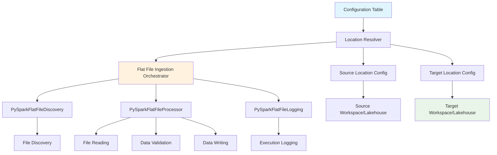
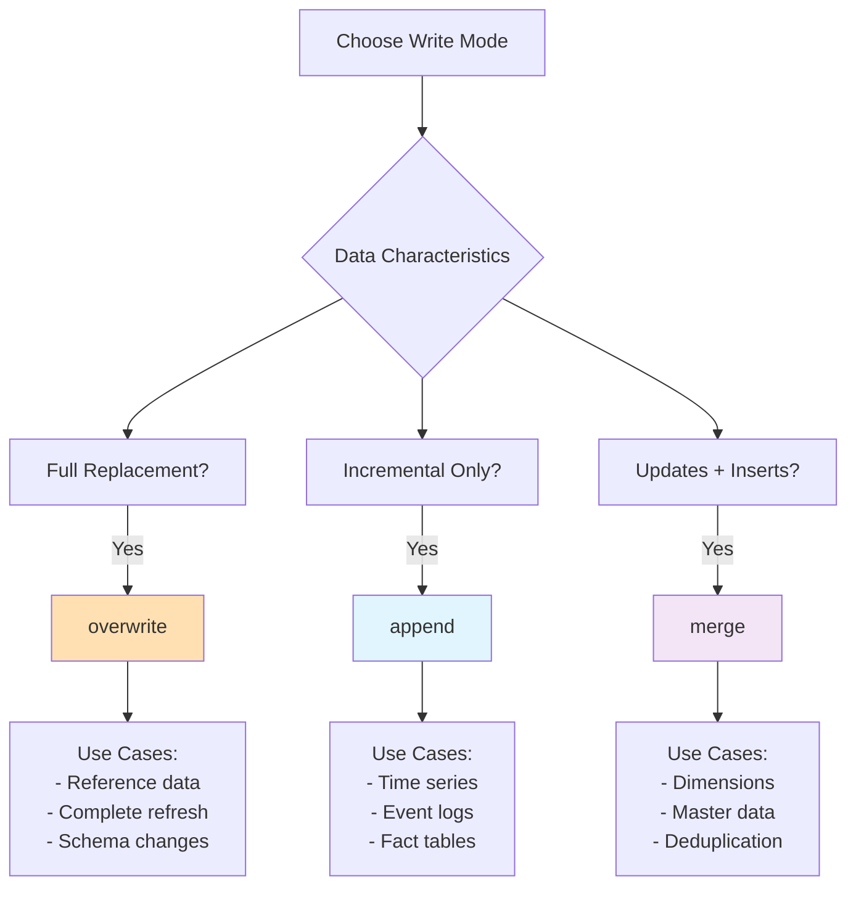

# Flat File Ingestion Package

[Home](../index.md) > [Packages](index.md) > Flat File Ingestion

## At a Glance

| Item | Summary |
|------|---------|
| Purpose | Config-driven ingestion of CSV/JSON/Parquet/Avro/XML into Lakehouse or Warehouse tables. |
| Inputs | Files in OneLake; rows in `config_flat_file_ingestion` (plus optional samples). |
| Outputs | Target tables populated; execution rows in `log_flat_file_ingestion`. |
| Core commands | `ingen_fab package ingest compile`, `ingen_fab ddl compile`, `ingen_fab deploy deploy`, `ingen_fab deploy upload-python-libs`. |
| When to use | You need standardized, repeatable flat-file ingestion with logging and dual targets. |

Note: For CLI flags and global options, see User Guide → CLI Reference and Deploy Guide.

The Flat File Ingestion package provides a comprehensive, modular solution for processing various file formats and loading them into Delta tables in Microsoft Fabric. It supports CSV, JSON, Parquet, Avro, and XML files with extensive configuration options, robust error handling, and cross-workspace data movement capabilities.

## Quick Start Guide

### Overview

The Flat File Ingestion package enables you to:

- **Process multiple file formats** with a unified interface
- **Configure parsing options** per file type with 53 available configuration fields
- **Move data across workspaces** with source and target location flexibility
- **Handle complex CSV files** with advanced parsing options
- **Implement data validation** with custom rules
- **Support multiple write modes** (overwrite, append, merge)
- **Track execution** with comprehensive logging
- **Process files in batches** using execution groups

### Step 1. Package Compilation
To add the package to your workspace codebase you need to compile it. This will generate the necessary DDL scripts and notebooks for configuration and processing.
To compile the package, run the following command in your terminal:
```bash
ingen_fab package ingest compile --include-samples --target-datastore both
```

This generates the notebooks and ddl scripts shown below in the nominated project directory. 

```text
fabric_workspace_items/
└── flat_file_ingestion/
    ├── flat_file_ingestion_processor_lakehouse.Notebook
    ├── flat_file_ingestion_processor_warehouse.Notebook
    ├── flat_file_config_generator_lakehouse.Notebook
    └── flat_file_config_generator_warehouse.Notebook

ddl_scripts/
└── Lakehouses/
    └── Config/
        ├── 001_Initial_Creation_Ingestion/
        └── 002_Sample_Data_Ingestion/
└── Warehouses/
    └── Config/
        ├── 001_Initial_Creation_Ingestion/
        └── 002_Sample_Data_Ingestion/
```


### Step 2: Compile project DDL
Packages copy their DDL scripts to the project directory but they dont inject them into the project's DDL maintenance notebooks. To do this you need to compile the top level project DDL. Do this by running the following command in your terminal:
```bash
ingen_fab ddl compile
```
This updates DDL notebooks to include config and log tables for the package. 

The fabric_workspace_items subdirectory within your project directory should now look like the directory structure below. Note, you may have addition directories for the DDL scripts generated as part of the core build and other packages.

```text
fabric_workspace_items/
└── ddl_scripts/
    ├── Lakehouses/
        ├── 00_all_lakehouses_orchestrator.Notebook/
            |── .platform 
            └── notebook-content.py
        └── Config/
            └── 001_Initial_Creation_Ingestion_Config_Lakehouses.Notebook
                |── .platform 
                └── notebook-content.py
            └── 002_Sample_Data_Ingestion_Config_Lakehouses.Notebook
                |── .platform 
                └── notebook-content.py
    └── Warehouses/
        ├── 00_all_warehouses_orchestrator.Notebook/
            |── .platform 
            └── notebook-content.py
        └── Config/
            └── 001_Initial_Creation_Ingestion_Config_Warehouses.Notebook
                |── .platform 
                └── notebook-content.py
            └── 002_Sample_Data_Ingestion_Config_Warehouses.Notebook
                |── .platform 
                └── notebook-content.py
└── flat_file_ingestion/
    ├── flat_file_ingestion_processor_lakehouse.Notebook
    │   ├── .platform
    │   └── notebook-content.py
    ├── flat_file_ingestion_processor_warehouse.Notebook
    │   ├── .platform
    │   └── notebook-content.py
    ├── flat_file_config_generator_lakehouse.Notebook
    │   ├── .platform
    │   └── notebook-content.py
    └── flat_file_config_generator_warehouse.Notebook
        ├── .platform
        └── notebook-content.py

### Step 3: Deploy the solution 
Now that we have generated the DDL scripts and notebooks, we need to deploy the solution to our Fabric workspace. To do this, run the following command in your terminal. Note, this assumes that you have already configured your project with the necessary Fabric workspace and lakehouse/warehouse IDs in the `varlib` directory (TBD add link to project initialization guide).
``` bash
ingen_fab deploy deploy
```

### Step 3: Deploy Python Libraries
The Flat File Ingestion package requires specific Python libraries to function correctly. To ensure these libraries are available in your Fabric workspace, you need to deploy them. You can do this by running the following command:

```bash
ingen_fab deploy --upload-python-libs
```

### Step 4: Run the DDL Maintenance Notebooks
After compiling the project DDL, you need to run the DDL maintenance notebooks to create the necessary metadata (config and log tables) in your target lakehouse or warehouse.

To do this you need to log in to your Fabric workspace and run the ``00_all_lakehouses_orchestrator.Notebook` notebook. This orchestrates the creation of config and log tables for all lakehouses which should now include the objects required by the Flat File Ingestion package. After running this notebook, you should see the following tables created in your config lakehouse: 
- `config_flat_file_ingestion`
- `log_flat_file_ingestion`

### Step 5: Run the File Processing Notebook

After setting up the config and log tables, you need to run the file processing notebooks to start the ingestion process. You can do this by running the following notebooks in your Fabric workspace:

1. `flat_file_ingestion_processor_lakehouse.Notebook`

Note that this will run the sample configurations provided in the package. You can modify these configurations or create new ones as needed.

### Step 6. Customising Configurations

The configuration table supports 53 fields for maximum flexibility. You can customize configurations using the config generator notebook or by inserting directly into the config table.

#### Using the Config Generator Notebook

The easiest way to create new configurations is to use the `flat_file_config_generator_lakehouse.Notebook`:

1. Open the notebook in your Fabric workspace
2. Run the notebook which provides a user-friendly interface for creating configurations
3. The notebook will validate your inputs and insert them into the config table

#### Manual Configuration

Alternatively, you can insert configurations directly. Here's a minimal example:

```python
from pyspark.sql import Row

# Minimal configuration with required fields only
config = Row(
    # Required fields
    config_id="sales_csv_001",
    config_name="Daily Sales CSV Import",
    source_file_path="Files/input/sales_data.csv",
    source_file_format="csv",
    target_workspace_id="{{varlib:target_workspace_id}}",
    target_datastore_id="{{varlib:target_lakehouse_id}}",
    target_datastore_type="lakehouse",
    target_schema_name="bronze",
    target_table_name="sales_raw",
    write_mode="overwrite",
    error_handling_strategy="fail",
    execution_group=1,
    active_yn="Y",
    created_date="2024-01-15",
    created_by="admin",
    schema_inference=True,
    
    # Optional fields (showing commonly used ones)
    file_delimiter=",",
    has_header=True,
    encoding="utf-8"
)

# Insert into config table
from ingen_fab.python_libs.pyspark.lakehouse_utils import lakehouse_utils

config_lakehouse = lakehouse_utils(
    target_workspace_id="{{varlib:config_workspace_id}}",
    target_datastore_id="{{varlib:config_lakehouse_id}}",
    spark=spark
)

config_lakehouse.write_to_table(
    df=spark.createDataFrame([config]),
    table_name="config_flat_file_ingestion",
    mode="append"
)
```

### Step 7. Running the File Processing

After configuring your file ingestion settings, you can process files using several methods:

#### Method 1: Run from Fabric Workspace

1. Navigate to your Fabric workspace
2. Open `flat_file_ingestion_processor_lakehouse.Notebook`
3. Run the notebook with parameters:
   - `config_id`: Process a specific configuration
   - `execution_group`: Process all configurations in a group
   - `environment`: Specify the environment (default: development)

#### Method 2: Run Using Notebook Orchestration

```python
# From another notebook, run the processor with parameters
notebookutils.notebook.run(
    "flat_file_ingestion_processor_lakehouse",
    timeout_seconds=3600,
    arguments={
        "config_id": "sales_csv_001",  # Process specific config
        # OR
        "execution_group": "1",  # Process all configs in group
        "environment": "development"
    }
)
```

#### Method 3: Schedule Processing

You can schedule the notebook to run automatically:
1. In Fabric workspace, select the notebook
2. Click on "Schedule" 
3. Set up your desired schedule (hourly, daily, etc.)
4. Configure parameters for the scheduled run

## Architecture

### Modular Component Design



### Key Components

1. **Location Resolver**: Manages source and target locations with intelligent defaults
2. **File Discovery Service**: Finds files based on patterns and configurations
3. **File Processor Service**: Reads, validates, and writes data
4. **Logging Service**: Tracks execution metrics and errors
5. **Orchestrator**: Coordinates all services for end-to-end processing

## Complete Configuration Reference

### Core Configuration Fields (Required)

| Field | Type | Description | Example |
|-------|------|-------------|---------|
| `config_id` | String | Unique identifier for the configuration | `"sales_csv_001"` |
| `config_name` | String | Human-readable name | `"Daily Sales Import"` |
| `source_file_path` | String | Path to source file(s) | `"Files/sales/data.csv"` |
| `source_file_format` | String | File format: csv, json, parquet, avro, xml | `"csv"` |
| `target_workspace_id` | String | Target workspace ID | `"{{varlib:workspace_id}}"` |
| `target_datastore_id` | String | Target lakehouse/warehouse ID | `"{{varlib:lakehouse_id}}"` |
| `target_datastore_type` | String | Target type: lakehouse or warehouse | `"lakehouse"` |
| `target_schema_name` | String | Target schema/database name | `"bronze"` |
| `target_table_name` | String | Target table name | `"sales_raw"` |
| `write_mode` | String | Write mode: overwrite, append, merge (see detailed section below) | `"overwrite"` |
| `schema_inference` | Boolean | Whether to infer schema automatically | `true` |
| `error_handling_strategy` | String | Error handling: fail, skip, log | `"fail"` |
| `execution_group` | Integer | Execution group for batch processing | `1` |
| `active_yn` | String | Active flag (Y/N) | `"Y"` |
| `created_date` | String | Creation date | `"2024-01-15"` |
| `created_by` | String | Creator | `"admin"` |

### Source Location Fields (Optional)

| Field | Type | Description | Default |
|-------|------|-------------|---------|
| `source_workspace_id` | String | Source workspace ID | Target workspace |
| `source_datastore_id` | String | Source lakehouse/warehouse ID | Target datastore |
| `source_datastore_type` | String | Source type: lakehouse or warehouse | `"lakehouse"` |
| `source_file_root_path` | String | Root path: Files, Tables | `"Files"` |

### CSV Configuration Fields

| Field | Type | Description | Default |
|-------|------|-------------|---------|
| `file_delimiter` | String | Field separator | `","` |
| `has_header` | Boolean | Header row present | `true` |
| `encoding` | String | File encoding | `"utf-8"` |
| `quote_character` | String | Quote character | `"\""` |
| `escape_character` | String | Escape character | `"\\"` |
| `multiline_values` | Boolean | Support multiline fields | `true` |
| `ignore_leading_whitespace` | Boolean | Trim leading spaces | `false` |
| `ignore_trailing_whitespace` | Boolean | Trim trailing spaces | `false` |
| `null_value` | String | String representing null | `""` |
| `empty_value` | String | String representing empty | `""` |
| `comment_character` | String | Comment line prefix | `null` |
| `max_columns` | Integer | Maximum columns allowed | `20480` |
| `max_chars_per_column` | Integer | Max characters per column | `-1` (unlimited) |

### Date/Time Configuration

| Field | Type | Description | Default |
|-------|------|-------------|---------|
| `date_format` | String | Date parsing format | `"yyyy-MM-dd"` |
| `timestamp_format` | String | Timestamp parsing format | `"yyyy-MM-dd HH:mm:ss"` |

### Schema and Processing Options

These options control how data is read, validated, transformed, and written to the target table. They work in conjunction with the `write_mode` setting to determine the final data processing behavior.

| Field | Type | Description | Default | Relationship with write_mode |
|-------|------|-------------|---------|------------------------------|
| `schema_inference` | Boolean | Automatically detect column types from data | `true` | Applies to all write modes. When `false`, requires `custom_schema_json` |
| `custom_schema_json` | String | JSON schema definition for complex/nested data structures | `null` | Used when `schema_inference=false`. Must match target table schema for `append`/`merge` modes |
| `partition_columns` | String | Comma-separated columns for table partitioning (see Partitioning section) | `""` | Creates partitioned tables. With `overwrite` mode, can overwrite specific partitions only |
| `sort_columns` | String | Comma-separated columns for data sorting/clustering | `""` | Optimizes query performance. Applied during write regardless of mode |
| `merge_keys` | String | Comma-separated unique columns for merge operations | `""` | **Required for `merge` mode**. Identifies records for update vs insert |
| `data_validation_rules` | String | JSON rules for data quality validation | `null` | Applied before write. Failed validations respect `error_handling_strategy` |
| `staging_table_name` | String | Temporary table for warehouse COPY INTO operations | `null` | Warehouse-specific. Used for two-stage loading pattern |

#### Schema Inference vs Custom Schema

**Schema Inference (`schema_inference=true`):**
- Automatically detects column names and data types from the source file
- Works well for CSV and JSON files with consistent structure
- Samples the file to determine optimal data types
- Best for initial data exploration and simple file structures

**Custom Schema (`schema_inference=false` with `custom_schema_json`):**
- Explicitly defines the expected schema structure
- Required for complex nested data structures (JSON with arrays/objects)
- Ensures consistent data types across multiple file loads
- Prevents schema evolution issues in production pipelines
- Must be provided when `schema_inference=false`

**Example Custom Schema:**
```json
{
  "type": "struct",
  "fields": [
    {"name": "id", "type": "integer", "nullable": false},
    {"name": "name", "type": "string", "nullable": true},
    {"name": "amount", "type": "decimal(10,2)", "nullable": true},
    {"name": "created_date", "type": "date", "nullable": false}
  ]
}
```

#### Partitioning Strategy

**Table Partitioning (`partition_columns`):**

Partitioning divides large tables into smaller, more manageable pieces based on column values. This significantly improves query performance and enables efficient data management.

**Benefits:**
- **Query Performance**: Queries filtering on partition columns only scan relevant partitions
- **Data Management**: Easy to delete/archive old partitions (e.g., drop old months)
- **Parallel Processing**: Different partitions can be processed independently
- **Incremental Updates**: With `overwrite` mode, can replace specific partitions without touching others

**Common Partition Strategies:**

| Strategy | Partition Columns | Use Case | Example |
|----------|------------------|----------|---------|
| Date-based | `year,month,day` or `date` | Time-series data | Event logs, transactions |
| Geographic | `country,region` | Multi-region data | Global sales data |
| Category | `product_category,product_type` | Hierarchical data | Product catalogs |
| Hash | `customer_id_hash` | Even distribution | Large dimension tables |

**Interaction with Write Modes:**

```python
# Overwrite specific partition only
config = Row(
    partition_columns="year,month",
    write_mode="overwrite",
    # If source data contains year=2024,month=06
    # Only the 2024/06 partition is overwritten
)

# Append to partitioned table
config = Row(
    partition_columns="load_date",
    write_mode="append",
    # New data added to appropriate partition
)

# Merge with partition pruning
config = Row(
    partition_columns="region",
    write_mode="merge",
    merge_keys="customer_id",
    # Merge operations optimized within partitions
)
```

**Best Practices:**
1. Choose partition columns with low-to-medium cardinality (10-10,000 distinct values)
2. Avoid over-partitioning (too many small partitions hurt performance)
3. Align partition columns with common query filters
4. Consider partition elimination in your queries
5. For date partitions, use consistent granularity (daily, monthly, etc.)

### Write Modes Detailed

The `write_mode` parameter determines how data is written to the target table and interacts with various configuration options. Understanding these modes is crucial for designing efficient data pipelines.

#### Write Mode: `overwrite`

**Behavior:**
- Completely replaces the entire table or specific partitions with new data
- Drops and recreates the table if schema changes are detected
- Most efficient for full data refreshes

**Metrics Tracking:**
- `records_inserted`: Total records in the new table
- `records_deleted`: Total records in the previous table
- `records_updated`: Always 0 (not applicable)

**Use Cases:**
- Reference data updates (customers, products)
- Complete data refreshes
- Initial data loads
- Fixing data quality issues requiring full reload

**Configuration Interactions:**
| Setting | Behavior with `overwrite` |
|---------|--------------------------|
| `partition_columns` | Can overwrite specific partitions if source data matches partition structure |
| `schema_inference` | Can change table schema on each run |
| `custom_schema_json` | Enforces consistent schema across runs |
| `merge_keys` | Ignored (not used) |
| `sort_columns` | Applied to optimize the new table |

**Example:**
```python
config = Row(
    write_mode="overwrite",
    partition_columns="year,month",  # Can overwrite specific year/month
    sort_columns="customer_id",      # Optimizes new table structure
    # merge_keys not needed
)
```

#### Write Mode: `append`

**Behavior:**
- Adds new records to the existing table
- Preserves all existing data
- Schema must match the existing table structure
- Most efficient for incremental loads

**Metrics Tracking:**
- `records_inserted`: New records added
- `records_deleted`: Always 0 (not applicable)
- `records_updated`: Always 0 (not applicable)
- Row count difference: `target_row_count_after - target_row_count_before`

**Use Cases:**
- Time-series data (logs, events, transactions)
- Incremental daily/hourly data loads
- Audit trails
- Append-only fact tables

**Configuration Interactions:**
| Setting | Behavior with `append` |
|---------|------------------------|
| `partition_columns` | Must match existing table partitions |
| `schema_inference` | Must produce compatible schema with existing table |
| `custom_schema_json` | Must match existing table schema exactly |
| `merge_keys` | Ignored (not used) |
| `sort_columns` | Applied to new data being appended |
| `skip_existing_dates` | Prevents duplicate date partitions |

**Example:**
```python
config = Row(
    write_mode="append",
    import_pattern="date_partitioned",
    date_partition_format="YYYY/MM/DD",
    skip_existing_dates=True,  # Prevents duplicates
    partition_columns="event_date",  # Must match existing
)
```

#### Write Mode: `merge` (Delta Merge/Upsert)

**Behavior:**
- Updates existing records and inserts new ones based on merge keys
- Requires unique identifier columns (`merge_keys`)
- Performs MERGE INTO operation (UPDATE + INSERT)
- Most complex but provides finest control

**Metrics Tracking:**
- `records_inserted`: New records not matching merge keys
- `records_updated`: Existing records matching merge keys
- `records_deleted`: Always 0 (unless implementing soft deletes)
- `records_processed`: Total records in source

**Use Cases:**
- Slowly changing dimensions (SCD Type 1)
- Master data synchronization
- Real-time data synchronization
- Deduplication scenarios

**Configuration Interactions:**
| Setting | Behavior with `merge` |
|---------|----------------------|
| `partition_columns` | Optimizes merge performance when aligned with merge keys |
| `schema_inference` | Must match target table for merge columns |
| `custom_schema_json` | Must include all merge key columns |
| `merge_keys` | **REQUIRED** - Comma-separated unique identifiers |
| `sort_columns` | Can improve merge performance |
| `data_validation_rules` | Critical for ensuring merge key uniqueness |

**Example:**
```python
config = Row(
    write_mode="merge",
    merge_keys="customer_id,order_id",  # Required for merge
    partition_columns="order_date",      # Optimize merge performance
    data_validation_rules=json.dumps({
        "unique_keys": ["customer_id", "order_id"],
        "required_columns": ["customer_id", "order_id"]
    })
)
```

#### Write Mode Selection Guide



#### Performance Considerations by Write Mode

| Write Mode | Performance | Best For | Avoid When |
|------------|-------------|----------|------------|
| `overwrite` | ⚡ Fastest | Large batch updates, schema changes | Need to preserve history |
| `append` | ⚡ Fast | High-volume streaming, time-series | Potential duplicates exist |
| `merge` | 🐢 Slowest | Accuracy critical, deduplication needed | Very large datasets without good partition strategy |

#### Common Patterns and Best Practices

**1. Daily Incremental Pattern (Append)**
```python
Row(
    write_mode="append",
    import_pattern="date_partitioned",
    partition_columns="load_date",
    skip_existing_dates=True
)
```

**2. Master Data Sync Pattern (Merge)**
```python
Row(
    write_mode="merge",
    merge_keys="entity_id",
    error_handling_strategy="fail"  # Critical for master data
)
```

**3. Reference Data Pattern (Overwrite)**
```python
Row(
    write_mode="overwrite",
    execution_group=999,  # Run last
    sort_columns="lookup_key"  # Optimize lookups
)
```

**4. Partitioned Overwrite Pattern**
```python
Row(
    write_mode="overwrite",
    partition_columns="year,month,day",
    import_pattern="date_partitioned"
)
```

### Import Pattern Configuration

The import pattern configuration controls how the system discovers and processes files. There are three main patterns:

#### 1. Single File Pattern (`single_file`)
Processes a single, specific file or folder.

**Example Configuration:**
```python
config = Row(
    import_pattern="single_file",
    source_file_path="Files/data/customer_export.csv",
    source_is_folder=False,  # Single file
    # Other fields...
)
```

**Use Case:** One-time imports, reference data, or when you have a specific file to process.

#### 2. Wildcard Pattern (`wildcard_pattern`)
Uses pattern matching to find files based on naming conventions. **Wildcard patterns can extract dates from matched filenames when configured with a `date_partition_format`.**

**For file `orders_20240601.parquet`:**
```python
config = Row(
    import_pattern="wildcard_pattern",
    source_file_path="Files/orders/",  # Base directory
    file_discovery_pattern="orders_*.parquet",  # Pattern to match
    date_partition_format="YYYYMMDD",  # Extract date from filename
    # Other fields...
)
```

**Date Extraction:** When `date_partition_format="YYYYMMDD"` is specified, the system will:
1. Match files using the wildcard pattern (`orders_*.parquet`)
2. Extract the date from the filename (`20240601` from `orders_20240601.parquet`)
3. Convert it to standard format (`2024-06-01`)
4. Use the extracted date for processing logic, filtering, and logging

**Additional Wildcard Examples:**
- `sales_*.csv` + `date_partition_format="YYYYMMDD"` → matches `sales_20240601.csv`, extracts `2024-06-01`
- `data_????_??.parquet` → matches `data_2024_01.parquet`, `data_2023_12.parquet`
- `export_*_final.json` → matches `export_customers_final.json` (no date extraction)

#### 3. Date-Partitioned Pattern (`date_partitioned`)
Discovers files organized in hierarchical date-based folder structures.

**For file structure like:**
```
Files/orders/
├── 2024/
│   ├── 06/
│   │   ├── 01/
│   │   │   └── orders.parquet
│   │   └── 02/
│   │       └── orders.parquet
```

**Configuration:**
```python
config = Row(
    import_pattern="date_partitioned",
    source_file_path="Files/orders/",
    date_partition_format="YYYY/MM/DD",
    date_range_start="2024-06-01",
    date_range_end="2024-06-30",
    # Other fields...
)
```

#### Complete Field Reference

| Field | Type | Description | Default | Example |
|-------|------|-------------|---------|---------|
| `import_pattern` | String | Pattern: single_file, date_partitioned, wildcard_pattern | `"single_file"` | `"wildcard_pattern"` |
| `date_partition_format` | String | Date partition format for hierarchical folders | `"YYYY/MM/DD"` | `"YYYY/MM/DD"` or `"YYYY-MM-DD"` |
| `file_discovery_pattern` | String | Wildcard pattern for file matching | `null` | `"orders_*.parquet"` |
| `source_is_folder` | Boolean | Read all part files from folder (Spark output) | `false` | `true` for Spark-generated folders |
| `batch_import_enabled` | Boolean | Enable batch processing across date ranges | `false` | `true` for incremental loads |
| `table_relationship_group` | String | Group related table imports together | `null` | `"retail_daily_load"` |
| `import_sequence_order` | Integer | Processing order within relationship group | `1` | `1` (customers), `2` (orders) |
| `date_range_start` | String | Start date for batch import (YYYY-MM-DD) | `null` | `"2024-01-01"` |
| `date_range_end` | String | End date for batch import (YYYY-MM-DD) | `null` | `"2024-01-31"` |
| `skip_existing_dates` | Boolean | Skip dates already processed successfully | `true` | `true` |

#### Pattern Matching Examples

**Example 1: Daily Order Files with Date in Filename**
```python
# File: orders_20240601.parquet
config = Row(
    import_pattern="wildcard_pattern",
    source_file_path="Files/daily_orders/",
    file_discovery_pattern="orders_*.parquet",
    batch_import_enabled=True,
    date_range_start="2024-06-01",
    date_range_end="2024-06-30"
)
```

**Example 2: Hierarchical Date Structure**
```python
# Files: 2024/06/01/transactions.csv, 2024/06/02/transactions.csv
config = Row(
    import_pattern="date_partitioned",
    source_file_path="Files/transactions/",
    date_partition_format="YYYY/MM/DD",
    file_discovery_pattern="transactions.csv",  # File name within each date folder
    batch_import_enabled=True,
    date_range_start="2024-06-01",
    date_range_end="2024-06-30"
)
```

**Example 3: Multiple File Types in Same Directory**
```python
# Files: orders_20240601.parquet, orders_20240602.parquet, customers_20240601.parquet
config = Row(
    import_pattern="wildcard_pattern",
    source_file_path="Files/data/",
    file_discovery_pattern="orders_*.parquet",  # Only process order files
    batch_import_enabled=False
)
```

**Example 4: Spark-Generated Folder Structure**
```python
# Folder: orders_20240601.parquet/ (contains part-00000-xxx.parquet files)
config = Row(
    import_pattern="wildcard_pattern",
    source_file_path="Files/spark_output/",
    file_discovery_pattern="orders_*.parquet",
    source_is_folder=True,  # Each match is a folder with part files
    batch_import_enabled=True
)
```

#### Advanced Date Partition Formats

| Format | Example Path/Filename | Description | Used For |
|--------|----------------------|-------------|----------|
| `YYYY/MM/DD` | `2024/06/01/data.csv` | Standard hierarchical format | Folder structures |
| `YYYY-MM-DD` | `2024-06-01/data.csv` or `data_2024-06-01.csv` | ISO date format | Folders or filenames |
| `YYYYMMDD` | `data_20240601.csv` | Compact date in filename | Filename extraction |
| `YYYY/MM` | `2024/06/data.csv` | Monthly partitioning | Folder structures |
| `YYYY` | `2024/data.csv` | Yearly partitioning | Folder structures |

**Date Extraction Support:**
- **Wildcard patterns** support `YYYYMMDD` and `YYYY-MM-DD` formats for extracting dates from filenames
- **Date-partitioned patterns** support hierarchical folder structures (`YYYY/MM/DD`, `YYYY/MM`, `YYYY`)
- The system uses the `DatePartitionUtils.extract_date_from_folder_name()` method to parse dates from matched patterns

#### Best Practices

1. **Use `single_file`** for:
   - Reference data that doesn't change often
   - One-time data migration
   - Specific file processing

2. **Use `wildcard_pattern`** for:
   - Files with consistent naming patterns
   - Daily/regular file drops in the same directory
   - When you need flexibility in file discovery

3. **Use `date_partitioned`** for:
   - Data organized in date-based folder hierarchies
   - Large datasets partitioned by date
   - When you need to process date ranges efficiently

4. **Combine with `batch_import_enabled=True`** when:
   - Processing multiple dates at once
   - Implementing incremental data loads
   - Need to catch up on missed processing dates

### Audit Fields

| Field | Type | Description | Default |
|-------|------|-------------|---------|
| `modified_date` | String | Last modification date | `null` |
| `modified_by` | String | Last modifier | `null` |

## Advanced Features

### Cross-Workspace Data Movement

Move data between different workspaces and lakehouses:

```python
config = Row(
    config_id="cross_workspace_001",
    config_name="Cross-Workspace Customer Import",
    source_file_path="exports/customers.parquet",
    source_file_format="parquet",
    
    # Source location (different workspace)
    source_workspace_id="source-workspace-id",
    source_datastore_id="source-lakehouse-id",
    source_datastore_type="lakehouse",
    source_file_root_path="Files",
    
    # Target location
    target_workspace_id="target-workspace-id",
    target_datastore_id="target-lakehouse-id",
    target_datastore_type="lakehouse",
    target_schema_name="silver",
    target_table_name="customers",
    
    write_mode="merge",
    merge_keys="customer_id",
    schema_inference=True,
    error_handling_strategy="log",
    execution_group=1,
    active_yn="Y",
    created_date="2024-01-15",
    created_by="admin"
)
```

### Complex CSV Handling

Handle complex CSV files with special characters and formatting:

```python
config = Row(
    config_id="complex_csv_001",
    config_name="Complex CSV with Special Characters",
    source_file_path="Files/complex_data.csv",
    source_file_format="csv",
    
    # Advanced CSV options
    file_delimiter="|",
    has_header=True,
    encoding="utf-16",
    quote_character="'",
    escape_character="\\",
    multiline_values=True,
    ignore_leading_whitespace=True,
    ignore_trailing_whitespace=True,
    null_value="NULL",
    empty_value="EMPTY",
    comment_character="#",
    max_columns=30000,
    max_chars_per_column=100000,
    
    # Rest of configuration...
)
```

### Date-Partitioned Import Pattern

Process files organized by date:

```python
config = Row(
    config_id="orders_incremental_001",
    config_name="Daily Orders Import",
    source_file_path="orders/",  # Base path
    source_file_format="csv",
    
    # Date partitioning configuration
    import_pattern="wildcard_pattern",
    file_discovery_pattern="orders_*.csv",
    date_partition_format="YYYY/MM/DD",
    batch_import_enabled=True,
    date_range_start="2024-01-01",
    date_range_end="2024-01-31",
    skip_existing_dates=True,
    
    # Target configuration
    write_mode="append",
    partition_columns="order_date",
    sort_columns="order_id,order_date",
    
    # Rest of configuration...
)
```

### Custom Schema Definition

Define complex schemas for nested data:

```json
{
  "type": "struct",
  "fields": [
    {
      "name": "customer_id",
      "type": "string",
      "nullable": false
    },
    {
      "name": "orders",
      "type": {
        "type": "array",
        "elementType": {
          "type": "struct",
          "fields": [
            {
              "name": "order_id",
              "type": "string",
              "nullable": false
            },
            {
              "name": "items",
              "type": {
                "type": "array",
                "elementType": {
                  "type": "struct",
                  "fields": [
                    {"name": "product_id", "type": "string"},
                    {"name": "quantity", "type": "integer"},
                    {"name": "price", "type": "decimal(10,2)"}
                  ]
                }
              }
            }
          ]
        }
      }
    }
  ]
}
```

### Data Validation Rules

Implement custom validation:

```json
{
  "required_columns": ["customer_id", "email", "order_date"],
  "column_types": {
    "customer_id": "string",
    "order_amount": "decimal",
    "quantity": "integer"
  },
  "value_ranges": {
    "order_amount": {"min": 0, "max": 1000000},
    "quantity": {"min": 1, "max": 999}
  },
  "regex_patterns": {
    "email": "^[a-zA-Z0-9._%+-]+@[a-zA-Z0-9.-]+\\.[a-zA-Z]{2,}$",
    "phone": "^\\+?[1-9]\\d{1,14}$"
  },
  "custom_rules": [
    {
      "name": "order_date_validation",
      "condition": "order_date <= current_date()",
      "error_message": "Order date cannot be in the future"
    }
  ]
}
```

## Monitoring and Troubleshooting

### Execution Monitoring

Monitor executions through the log table:

```sql
-- Recent executions summary
SELECT 
    config_id,
    config_name,
    execution_id,
    status,
    job_start_time,
    job_end_time,
    records_processed,
    records_failed,
    execution_duration_seconds,
    error_message
FROM log_flat_file_ingestion
WHERE job_start_time >= DATEADD(day, -7, CURRENT_TIMESTAMP())
ORDER BY job_start_time DESC;

-- Performance metrics by configuration
SELECT 
    config_id,
    COUNT(*) as execution_count,
    AVG(records_processed) as avg_records,
    AVG(execution_duration_seconds) as avg_duration,
    SUM(CASE WHEN status = 'failed' THEN 1 ELSE 0 END) as failed_count
FROM log_flat_file_ingestion
WHERE job_start_time >= DATEADD(month, -1, CURRENT_TIMESTAMP())
GROUP BY config_id;
```

### Common Issues and Solutions

**Issue: Missing source location fields**
```
Error: Could not resolve source location
Solution: Ensure source_workspace_id and source_datastore_id are provided 
         or defaults are properly configured
```

**Issue: Schema mismatch**
```
Error: Cannot cast string to integer for column 'quantity'
Solution: 
1. Enable schema_inference=true for automatic detection
2. Or provide custom_schema_json with correct types
3. Or preprocess data to ensure type consistency
```

**Issue: File not found**
```
Error: Path does not exist: file:/path/to/file
Solution:
1. Verify source_file_path is correct
2. Check source_file_root_path (should be "Files" or "Tables")
3. Ensure file exists in the specified location
4. For cross-workspace, verify source_workspace_id permissions
```

**Issue: CSV parsing errors**
```
Error: Malformed CSV - unclosed quoted field
Solution:
1. Check quote_character and escape_character settings
2. Enable multiline_values=true for multiline fields
3. Adjust max_chars_per_column if fields are truncated
```

### Performance Optimization

1. **File Discovery Optimization**
   - Use specific file paths instead of wildcards when possible
   - Limit date ranges for date-partitioned imports
   - Use file_discovery_pattern for targeted discovery

2. **Processing Optimization**
   - Enable schema caching with schema_inference=false
   - Use appropriate partition_columns for large datasets
   - Process files in parallel using execution groups

3. **Write Optimization**
   - Use overwrite mode for full refreshes
   - Use append mode for truly incremental data
   - Use merge mode sparingly (requires merge key lookups)

## Best Practices

### 1. Configuration Management

- Use descriptive config_id and config_name values
- Group related configurations with execution_group
- Document configurations with meaningful names
- Use variable library (varlib) for environment-specific values

### 2. File Organization

```
Files/
├── raw/
│   ├── daily/
│   │   ├── sales_20240101.csv
│   │   ├── sales_20240102.csv
│   │   └── ...
│   └── reference/
│       ├── customers.csv
│       └── products.csv
├── processed/
│   └── archive/
└── exports/
```

### 3. Error Handling Strategy

- **fail**: Use for critical data where accuracy is paramount
- **skip**: Use for data where some loss is acceptable
- **log**: Use for monitoring and analysis of data quality

### 4. Testing Approach

1. Start with a small subset of data
2. Verify schema inference results
3. Test with full dataset
4. Monitor performance metrics
5. Implement appropriate error handling

## Complete Examples

### Example 1: Multi-Format Data Pipeline

```python
# CSV customer data
csv_config = Row(
    config_id="customers_csv",
    config_name="Customer Master Data CSV",
    source_file_path="reference/customers.csv",
    source_file_format="csv",
    target_workspace_id="{{varlib:workspace_id}}",
    target_datastore_id="{{varlib:lakehouse_id}}",
    target_datastore_type="lakehouse",
    target_schema_name="bronze",
    target_table_name="customers_raw",
    file_delimiter=",",
    has_header=True,
    write_mode="overwrite",
    schema_inference=True,
    error_handling_strategy="fail",
    execution_group=1,
    active_yn="Y",
    created_date="2024-01-15",
    created_by="admin"
)

# JSON order data
json_config = Row(
    config_id="orders_json",
    config_name="Order Data JSON",
    source_file_path="orders/orders_*.json",
    source_file_format="json",
    target_workspace_id="{{varlib:workspace_id}}",
    target_datastore_id="{{varlib:lakehouse_id}}",
    target_datastore_type="lakehouse",
    target_schema_name="bronze",
    target_table_name="orders_raw",
    custom_schema_json='{"type": "struct", "fields": [...]}',
    write_mode="append",
    partition_columns="order_date",
    schema_inference=False,
    error_handling_strategy="log",
    execution_group=2,
    active_yn="Y",
    created_date="2024-01-15",
    created_by="admin"
)

# Parquet analytics data
parquet_config = Row(
    config_id="analytics_parquet",
    config_name="Analytics Events Parquet",
    source_file_path="analytics/events/",
    source_file_format="parquet",
    source_is_folder=True,
    target_workspace_id="{{varlib:workspace_id}}",
    target_datastore_id="{{varlib:lakehouse_id}}",
    target_datastore_type="lakehouse",
    target_schema_name="silver",
    target_table_name="analytics_events",
    write_mode="merge",
    merge_keys="event_id,user_id",
    partition_columns="event_date,event_type",
    sort_columns="event_timestamp",
    schema_inference=True,
    error_handling_strategy="skip",
    execution_group=3,
    active_yn="Y",
    created_date="2024-01-15",
    created_by="admin"
)
```

### Example 2: Incremental Date-Partitioned Import

```python
config = Row(
    config_id="sales_incremental",
    config_name="Incremental Sales Data Import",
    source_file_path="sales/daily/",
    source_file_format="csv",
    
    # Import pattern configuration
    import_pattern="wildcard_pattern",
    file_discovery_pattern="sales_*.csv",
    date_partition_format="YYYYMMDD",
    batch_import_enabled=True,
    date_range_start="2024-01-01",
    date_range_end="2024-01-31",
    skip_existing_dates=True,
    
    # Target configuration
    target_workspace_id="{{varlib:workspace_id}}",
    target_datastore_id="{{varlib:lakehouse_id}}",
    target_datastore_type="lakehouse",
    target_schema_name="bronze",
    target_table_name="sales_daily",
    
    # Processing options
    write_mode="append",
    partition_columns="sale_date",
    sort_columns="sale_id,sale_timestamp",
    
    # CSV options
    file_delimiter=",",
    has_header=True,
    date_format="yyyy-MM-dd",
    timestamp_format="yyyy-MM-dd HH:mm:ss.SSS",
    
    # Control fields
    schema_inference=True,
    error_handling_strategy="log",
    execution_group=1,
    active_yn="Y",
    created_date="2024-01-15",
    created_by="admin"
)
```

## CLI Reference

### Compile Command

```bash
ingen_fab package flat-file-ingestion compile [OPTIONS]
```

**Options:**
- `--target-datastore`: Target datastore type (lakehouse or warehouse)
- `--template-vars`: JSON string of template variables

**Examples:**
```bash
# Compile for lakehouse (default)
ingen_fab package flat-file-ingestion compile

# Compile for warehouse
ingen_fab package flat-file-ingestion compile --target-datastore warehouse

# With custom variables
ingen_fab package flat-file-ingestion compile \
  --template-vars '{"custom_schema": "analytics"}'
```

### Run Command

```bash
ingen_fab package flat-file-ingestion run [OPTIONS]
```

**Options:**
- `--config-id`: Specific configuration ID to process
- `--execution-group`: Execution group number
- `--environment`: Environment name (default: development)

**Examples:**
```bash
# Process specific configuration
ingen_fab package flat-file-ingestion run --config-id sales_csv_001

# Process execution group
ingen_fab package flat-file-ingestion run --execution-group 1

# Process with specific environment
ingen_fab package flat-file-ingestion run \
  --execution-group 1 \
  --environment production
```

## Advanced Features

### Incremental Synthetic Data Integration
For importing synthetic data generated by the synthetic data generation package, see [Incremental Synthetic Data Import Integration](incremental_synthetic_data_import_integration.md). This feature provides:

- Integration with synthetic data workflows
- Optimized handling of time-series synthetic datasets
- Automated configuration for synthetic data ingestion patterns

## Related Documentation

- [Packages Overview](../developer_guide/packages.md) - Package system architecture
- [DDL Scripts](../developer_guide/ddl_scripts.md) - Template system details
- [Python Libraries](../developer_guide/python_libraries.md) - Core library documentation
- [Workflow Utilities](../developer_guide/python_libraries.md#workflow_utilspy) - Cross-workspace data movement
- [CLI Reference](../user_guide/cli_reference.md) - Complete CLI documentation

## Support

- **Issues**: Report bugs on [GitHub Issues](https://github.com/your-repo/issues)
- **Discussions**: Join community discussions
- **Examples**: See the examples section above
- **Troubleshooting**: Check the troubleshooting section

Need help? Check the troubleshooting section or create an issue on GitHub!
