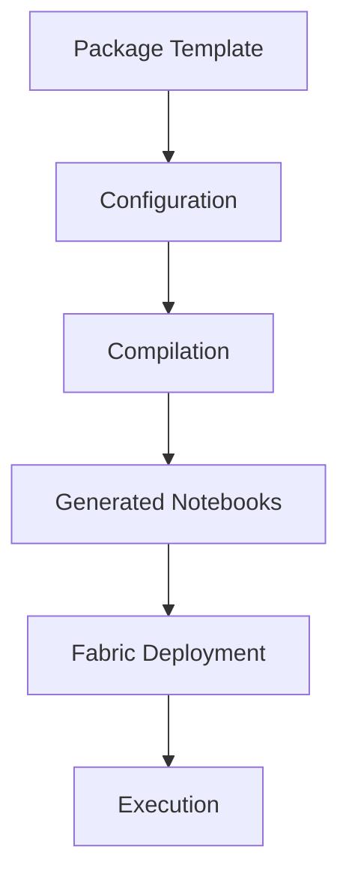

# Packages

[Home](../index.md) > Packages

Welcome to the Packages documentation! This section provides comprehensive information about available packages and how to use them in your Microsoft Fabric projects.

## What are Packages?

Packages are reusable workload extensions that provide specialized functionality for common data processing scenarios in Microsoft Fabric. Each package includes:

- **Pre-built templates** - Ready-to-use notebook templates and configurations
- **Processing logic** - Optimized code for specific data workflows
- **Configuration schemas** - Standardized configuration formats
- **Sample data and examples** - Complete working examples to get started quickly
- **Documentation** - Comprehensive guides and API references

## How Packages Work

### Package Architecture



### Package Lifecycle

1. **Template Definition** - Packages are defined using Jinja2 templates with configurable parameters
2. **Configuration** - Users provide environment-specific configuration via JSON or CLI parameters
3. **Compilation** - The CLI compiles templates into executable Fabric notebooks
4. **Deployment** - Generated notebooks are deployed to your Fabric workspace
5. **Execution** - Notebooks run in Fabric with full logging and error handling

### CLI Commands

All packages follow consistent CLI patterns:

```bash
# Compile a package (generates notebooks)
ingen_fab package <package-name> compile [OPTIONS]

# Run a package (executes the workflow)
ingen_fab package <package-name> run [OPTIONS]

# List available configurations
ingen_fab package <package-name> list [OPTIONS]
```

## Available Packages

### Data Ingestion

#### [Flat File Ingestion](flat_file_ingestion.md)
Automated ingestion of various file formats (CSV, JSON, Parquet, Avro, XML) into Delta tables with configuration-driven metadata management.

**Use Cases:**
- Batch file processing from data lakes
- Automated data pipeline ingestion
- Multi-format data standardization
- Data validation and quality checks

**Supported Targets:** Lakehouse, Warehouse

---

### Data Generation

#### [Synthetic Data Generation](synthetic_data_generation.md)
Generate realistic synthetic datasets for testing, development, and prototyping with configurable patterns and relationships.

**Use Cases:**
- Test data generation for development
- Performance testing with realistic data volumes
- Data masking and privacy-safe datasets
- Prototype development without production data

**Supported Patterns:** Retail, Finance, Healthcare, Custom

---

### Data Export

#### [Extract Generation](extract_generation.md)
Orchestrated data extract generation from Fabric warehouses and lakehouses with configurable scheduling and multiple output formats.

**Use Cases:**
- Data warehouse to data lake exports
- Scheduled data extracts for external systems
- Multi-format data distribution
- Data archival and backup workflows

**Supported Formats:** CSV, Parquet, JSON, Delta

---

### Data Synchronization

#### [Synapse Sync](synapse_sync.md)
Bidirectional data synchronization between Microsoft Fabric and Azure Synapse Analytics workspaces.

**Use Cases:**
- Migrating from Synapse to Fabric
- Hybrid Synapse-Fabric architectures
- Data replication and backup
- Cross-platform analytics workflows

**Sync Modes:** Full, Incremental, Bidirectional

---

### Data Analysis

#### [Data Profiling](data_profiling.md)
Comprehensive statistical analysis and automated relationship discovery for data quality assessment and schema understanding.

**Use Cases:**
- Statistical data profiling and analysis
- Automated relationship discovery between tables
- Data quality assessment and monitoring
- Schema understanding and documentation
- Data catalog population and governance

**Profile Types:** Basic, Statistical, Data Quality, Relationship Discovery, Full Analysis

---

## Package Development

### Creating Custom Packages

Want to build your own package? Learn about the package development process:

1. **[Package Architecture](../developer_guide/packages.md)** - Understanding the package system
2. **[Template Development](../developer_guide/ddl_scripts.md)** - Creating Jinja2 templates
3. **[Python Libraries](../developer_guide/python_libraries.md)** - Using shared utilities
4. **[Testing Packages](../developer_guide/python_libraries.md#testing)** - Local and platform testing

### Package Standards

All packages follow these standards:

- **Consistent CLI interface** - Same command patterns across all packages
- **Comprehensive logging** - Detailed execution logs and error handling
- **Environment isolation** - Configuration-driven behavior without code changes
- **Testing support** - Local testing capabilities before Fabric deployment
- **Documentation** - Complete usage guides and examples

## Getting Started

### Quick Start Workflow

1. **Choose a package** from the list above based on your use case
2. **Review the documentation** for configuration options and examples
3. **Compile the package** with your configuration:
   ```bash
   ingen_fab package <package-name> compile --include-samples
   ```
4. **Deploy to Fabric** using the standard deployment workflow:
   ```bash
   ingen_fab deploy deploy
   ```
5. **Execute the notebooks** in your Fabric workspace

### Best Practices

- **Start with samples** - Use `--include-samples` to get working examples
- **Test locally first** - Use local testing before Fabric deployment
- **Version your configurations** - Keep package configurations in source control
- **Monitor execution** - Review notebook logs for performance and errors
- **Customize gradually** - Start with defaults, then customize for your needs

## Support and Resources

- **[CLI Reference](../guides/cli-reference.md#package)** - Complete command documentation
- **[Examples](../examples/index.md)** - Real-world usage scenarios
- **[Troubleshooting](../guides/troubleshooting.md#package-issues)** - Common issues and solutions
- **[Developer Guide](../developer_guide/packages.md)** - Package development guide

---

*Need help with a specific package? Click on the package name above to access detailed documentation, configuration examples, and usage guides.*