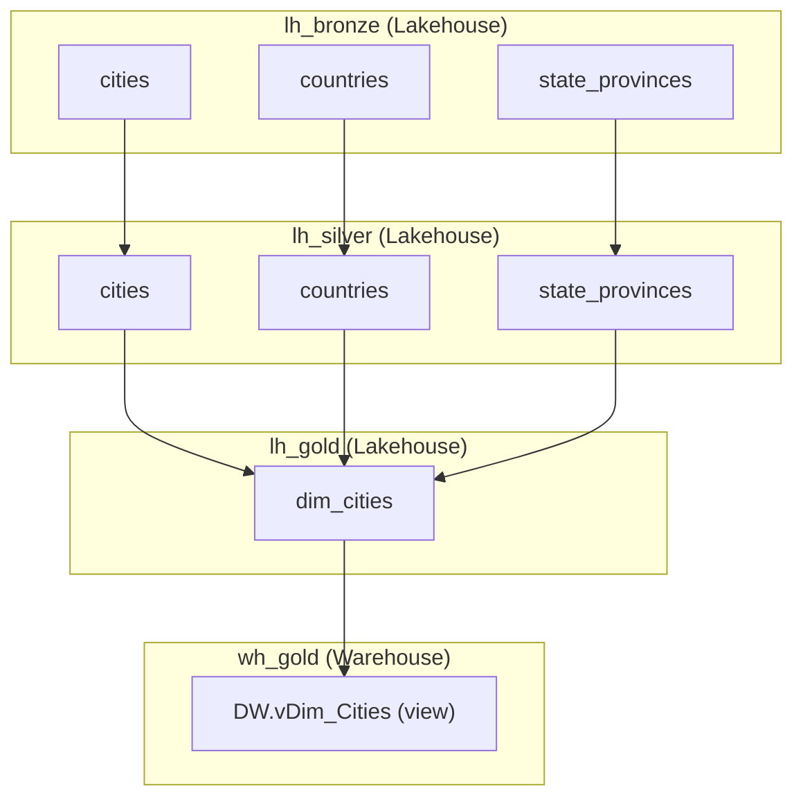

# DP Project Training

[Home](../../index.md) > [Training](../index.md) > DP Project

The DP (Data Platform) training scenario uses a **geography dataset** — cities, countries, and state/provinces — to guide you through a complete Microsoft Fabric data platform, from raw ingestion to analytics.

## The Dataset

| Table | Layer | Description |
|-------|-------|-------------|
| `cities` | Bronze | ~10 US cities with population figures |
| `countries` | Bronze | ~10 countries with continent and region data |
| `state_provinces` | Bronze | ~10 US states/provinces with sales territory |
| `cities` | Silver | CDC-processed cities (clean, current records only) |
| `countries` | Silver | CDC-processed countries |
| `state_provinces` | Silver | CDC-processed state/provinces |
| `dim_cities` | Gold | City dimension enriched with state and country |
| `DW.vDim_Cities` | Warehouse | Analytical view over the gold dimension |

## Architecture



## Project Structure

When you run `ingen_fab init new --with-samples`, you get:

```
your-project/
├── ddl_scripts/
│   ├── Lakehouses/
│   │   ├── lh_bronze/001_Initial_Creation/   ← 3 bootstrap scripts
│   │   ├── lh_bronze/002_Change/             ← schema evolution example
│   │   ├── lh_silver/001_Initial_Creation/   ← 2 transformation scripts
│   │   └── lh_gold/001_Initial_Creation/     ← 1 dimension script
│   └── Warehouses/
│       └── wh_gold/001_Initial_Creation/     ← schema + view scripts
├── dbt_project/
│   └── models/
│       ├── silver/  ← cities.sql, countries.sql
│       └── gold/    ← dim_cities.sql
├── fabric_config/
│   └── storage_config.yaml
└── fabric_workspace_items/
    └── config/var_lib.VariableLibrary/
```

## Exercises

Work through the exercises in order:

0. **[Exercise 0 — Environment Setup](exercise-00-prerequisites.md)**  
   Set up your Python environment, install `ingen_fab`, and confirm your Fabric workspace is ready.

1. **[Exercise 1 — Project Setup](exercise-01-project-setup.md)** ⭐  
   Initialise the DP project, compile DDL notebooks, deploy to Fabric, and verify the bronze tables are populated.

2. **[Exercise 2 — New Bronze Table](exercise-02-bronze-table.md)** ⭐  
   Write a bronze DDL script for `state_provinces` from scratch and deploy it.

3. **[Exercise 3 — Silver Transformation](exercise-03-silver-transformation.md)** ⭐⭐  
   Transform `state_provinces` from bronze to silver using the framework's abstraction libraries.

4. **[Exercise 4 — Gold Layer](exercise-04-gold-layer.md)** ⭐⭐  
   Build an enriched gold dimension that joins cities, countries, and state/provinces.

5. **[Exercise 5 — Semantic Model](exercise-05-semantic-model.md)** ⭐⭐  
   Create a Fabric semantic model over the `wh_gold` warehouse views.

6. **[Exercise 6 — Power BI Report](exercise-06-report.md)** ⭐⭐  
   Build a Power BI report from the semantic model.

7. **[Exercise 7 — GraphQL API](exercise-07-graphql.md)** ⭐⭐⭐ *(Stretch)*  
   Expose `wh_gold` data via a Fabric GraphQL API.

---

!!! info "Ready to begin?"
    Start with [Exercise 0 — Prerequisites](exercise-00-prerequisites.md).
