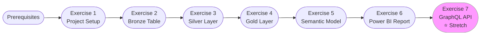
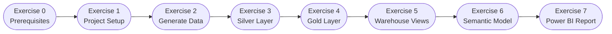
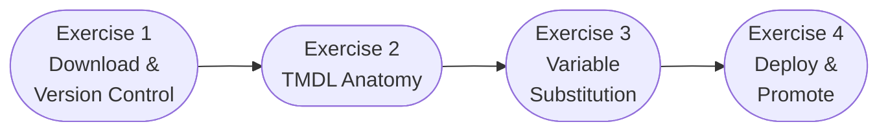

# Training Scenarios

Welcome to the **Ingenious Fabric Accelerator** training programme. This section provides hands-on exercises that guide you through building a complete data platform on Microsoft Fabric — from raw data ingestion through to analytics and reporting.

## What You'll Learn

By completing these exercises you will be able to:

- Initialise a new Fabric workspace project using the accelerator
- Write and execute DDL scripts to create and populate Delta tables
- Transform raw (bronze) data through silver and gold layers
- Build a semantic model and Power BI report on top of a Fabric Warehouse
- (Stretch) Expose data via a Fabric GraphQL API

## Prerequisites

Before starting you should have:

- [ ] Microsoft Fabric workspace provisioned (at least one Lakehouse and one Warehouse)
- [ ] Ingenious Fabric Accelerator installed (`pip install ingen-fab` or `uv sync`)
- [ ] Azure authentication configured (`az login` or service principal environment variables)
- [ ] Workspace and Lakehouse/Warehouse IDs noted (available from the Fabric UI)
- [ ] Familiarity with the [Quick Start](../user_guide/quick_start.md) guide

## Learning Path

## Available Training Scenarios

### DP Project — Cities & Countries Data Platform

The DP (Data Platform) training scenario walks you through building a complete data platform using a geography dataset (cities, countries, and state/provinces). It uses the project created by `ingen_fab init new --with-samples`.

| Exercise | Topic | Difficulty |
|----------|-------|-----------|
| [1 — Project Setup](dp/exercise-01-project-setup.md) | Initialise, compile, deploy | ⭐ Beginner |
| [2 — New Bronze Table](dp/exercise-02-bronze-table.md) | Write a bronze DDL script | ⭐ Beginner |
| [3 — Silver Transformation](dp/exercise-03-silver-transformation.md) | Transform bronze → silver | ⭐⭐ Intermediate |
| [4 — Gold Layer](dp/exercise-04-gold-layer.md) | Build a gold dimension | ⭐⭐ Intermediate |
| [5 — Semantic Model](dp/exercise-05-semantic-model.md) | Create a Fabric semantic model | ⭐⭐ Intermediate |
| [6 — Power BI Report](dp/exercise-06-report.md) | Build a report from the model | ⭐⭐ Intermediate |
| [7 — GraphQL API](dp/exercise-07-graphql.md) | Expose data via GraphQL *(stretch)* | ⭐⭐⭐ Advanced |

---

!!! tip "Start Here — DP"
    Begin with **[Exercise 1 — Project Setup](dp/exercise-01-project-setup.md)** to initialise the DP project and deploy the sample geography data.

---

### ER Project — Supply Chain Enterprise Reporting

The ER (Enterprise Reporting) training scenario walks you through building a complete reporting solution using a supply chain dataset (shipments, products, suppliers, and regions). It uses the project created by `ingen_fab init new --with-er-samples` and covers the full stack: Bronze/Silver/Gold lakehouses → Warehouse views → Semantic Model → Power BI Report.

| Exercise | Topic | Difficulty |
|----------|-------|------------|
| [0 — Prerequisites](er/exercise-00-prerequisites.md) | Environment setup, Azure auth | ⭐ Beginner |
| [1 — Project Setup](er/exercise-01-project-setup.md) | Scaffold, configure, deploy | ⭐ Beginner |
| [2 — Generate Data](er/exercise-02-generate-data.md) | Synthetic supply chain data | ⭐ Beginner |
| [3 — Silver Layer](er/exercise-03-silver-layer.md) | Clean & deduplicate bronze data | ⭐⭐ Intermediate |
| [4 — Gold Layer](er/exercise-04-gold-layer.md) | Build star schema (facts & dims) | ⭐⭐ Intermediate |
| [5 — Warehouse Views](er/exercise-05-warehouse-views.md) | T-SQL views for reporting | ⭐⭐ Intermediate |
| [6 — Semantic Model](er/exercise-06-semantic-model.md) | DAX measures & relationships | ⭐⭐ Intermediate |
| [7 — Power BI Report](er/exercise-07-report.md) | 3-page supply chain dashboard | ⭐⭐ Intermediate |

---

!!! tip "Start Here — ER"
    Begin with **[Exercise 0 — Prerequisites](er/exercise-00-prerequisites.md)** to set up your environment before scaffolding the Enterprise Reporting project.

---

### SM Project — Semantic Model Lifecycle

The SM (Semantic Model) training scenario is a standalone pack that focuses on the DevOps lifecycle of semantic models — downloading TMDL, version-controlling it, parameterizing with variable substitution, and deploying across environments. It does **not** require the DP or ER training packs, but you do need an existing semantic model in a Fabric workspace.

| Exercise | Topic | Difficulty |
|----------|-------|------------|
| [1 — Download & Version Control](sm/exercise-01-download-and-version-control.md) | Download TMDL, commit to Git | ⭐ Beginner |
| [2 — TMDL Anatomy](sm/exercise-02-tmdl-anatomy.md) | Understand the file structure | ⭐ Beginner |
| [3 — Variable Substitution](sm/exercise-03-variable-substitution.md) | Parameterize for multi-env | ⭐⭐ Intermediate |
| [4 — Deploy & Promote](sm/exercise-04-deploy-and-promote.md) | Deploy, iterate, promote | ⭐⭐ Intermediate |

---

!!! tip "Start Here — SM"
    Begin with **[Exercise 1 — Download & Version Control](sm/exercise-01-download-and-version-control.md)**. You need an existing semantic model in a Fabric workspace — from the DP/ER training packs or any model you have created.
