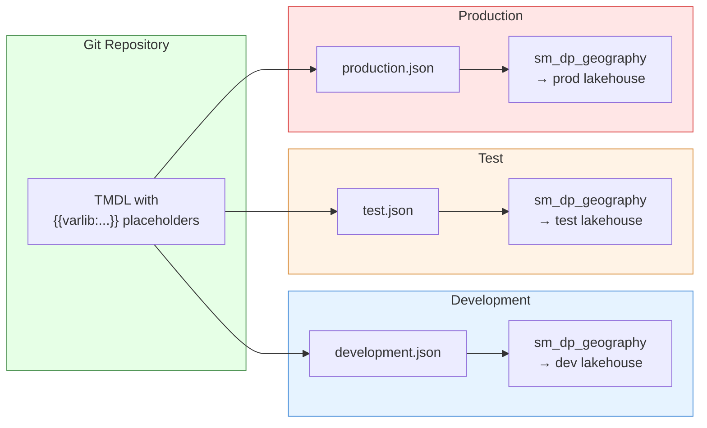

# Exercise 4 — Deploy & Promote

[Home](../../index.md) > [Training](../index.md) > [SM Project](index.md) > Exercise 4

## Learning Objectives

By the end of this exercise you will be able to:

- Deploy a parameterized semantic model to a Fabric workspace using IngenFab
- Make an iterative change (add a measure) and redeploy
- Understand how environment promotion works for semantic models

## Prerequisites

- [Exercise 3](exercise-03-variable-substitution.md) completed — TMDL files contain `{{varlib:...}}` placeholders
- Variable Library is configured for your target environment
- Azure authentication is active (`az login`)

## Steps

### 1. Set your environment

Ensure you are in your project root with the correct environment:

```bash
cd your-project
export FABRIC_WORKSPACE_REPO_DIR="$(pwd)"
export FABRIC_ENVIRONMENT="development"
```

### 2. Deploy the semantic model

Run the standard deployment command:

```bash
ingen_fab deploy deploy
```

IngenFab will:

1. Copy all artefacts from `fabric_workspace_items/` to a temporary output directory
2. Process every `.tmdl` file — replacing `{{varlib:...}}` placeholders with values from the `development.json` Variable Library
3. Upload the substituted TMDL to Fabric via the REST API
4. Report the results

Watch for the semantic model output:

```
✅ Updated 2 semantic model files with variable substitution
✅ Deployed SemanticModel: sm_dp_geography
```

!!! note "First deployment vs update"
    If `sm_dp_geography` already exists in the workspace (because you created it in the Fabric UI earlier), IngenFab will **update** it with the TMDL definition. If it does not exist, IngenFab will **create** it. The artefact name is used for matching.

### 3. Verify in the Fabric UI

1. Open your Fabric workspace
2. Find `sm_dp_geography` in the item list — it should show type **Semantic model**
3. Open the model and confirm:
   - Tables and columns are present
   - Relationships are intact
   - Measures (`Total Population`, `City Count`) appear under their respective tables
   - The data source connects to the correct lakehouse/warehouse for this environment

### 4. Make an iterative change — add a new measure

This is the key benefit of TMDL-based version control: you can edit the model locally and redeploy without touching the Fabric UI.

Open the table file and add a new measure:

```bash
# Edit the file in your preferred editor
code fabric_workspace_items/SemanticModel/sm_dp_geography/definition/tables/vDim_Cities.tmdl
```

Add the following measure block after the existing measures (before the `partition` block):

```tmdl
    measure 'Avg Population' =
        AVERAGE(vDim_Cities[LatestRecordedPopulation])
        formatString: #,0
```

!!! warning "Indentation matters"
    TMDL uses indentation to denote hierarchy. The `measure` keyword must be indented at the same level as other `measure` and `column` blocks within the `table` definition. Use **tabs** (not spaces) to match the existing file.

### 5. Redeploy

```bash
ingen_fab deploy deploy
```

### 6. Verify the new measure

1. Refresh the semantic model in the Fabric UI (close and reopen if needed)
2. The `Avg Population` measure should now appear under `vDim_Cities`
3. Test it: click **Explore** in the ribbon and add a card visual using `Avg Population`

### 7. Commit the change

```bash
git add fabric_workspace_items/SemanticModel/sm_dp_geography/
git commit -m "feat: add Avg Population measure to sm_dp_geography"
```

### 8. (Optional) Create a UAT-test environment

!!! tip "Optional — skip if you already have a second environment"
    This step walks you through creating a **uat-test** environment so you have a second target for promotion. If your project already has `test.json`, `production.json`, or any other environment configured with real GUIDs, you can skip straight to **Step 9**.

To promote a semantic model you need at least two environments in your Variable Library. If you only have `development` so far, follow these sub-steps to create a `uat-test` environment.

#### 8a. Create the valueSet file

Copy your existing development valueSet as a starting point:

```bash
cp fabric_workspace_items/config/var_lib.VariableLibrary/valueSets/development.json \
   fabric_workspace_items/config/var_lib.VariableLibrary/valueSets/uat-test.json
```

#### 8b. Update the environment name

Open `uat-test.json` and change the `"name"` field from `"development"` to `"uat-test"`:

```json
{
  "name": "uat-test",
  "variableOverrides": [
    {
      "name": "fabric_environment",
      "value": "uat-test"
    },
    ...
  ]
}
```

!!! note "You also need a Fabric workspace"
    The `init workspace` command in the next step discovers artefact GUIDs from a **live Fabric workspace**. You need a second workspace provisioned in the Fabric portal before proceeding. If you do not have one, add `--create-if-not-exists` to the command and IngenFab will create it for you:
    ```bash
    ingen_fab init workspace --workspace-name "Your-UAT-Workspace-Name" --create-if-not-exists
    ```

#### 8c. Auto-populate GUIDs with `init workspace`

Point IngenFab at the UAT workspace and let it discover the artefact IDs:

```bash
export FABRIC_ENVIRONMENT="uat-test"
ingen_fab init workspace --workspace-name "Your-UAT-Workspace-Name"
```

The command will prompt you about deployment topology:

```
Is this a single workspace deployment?
(All components - config, raw, edw - will be in the same workspace) [Y/n]:
```

Answer **`y`** — this sets all workspace ID variables to the same UAT workspace GUID.

If the workspace is brand new (no lakehouses or warehouses deployed yet), you will also see:

```
⚠️  The following artifacts were not found in the workspace:
  - Lakehouse 'config'
  - Lakehouse 'lh_bronze'
  ...
```

**This is expected.** The workspace ID variables (`fabric_deployment_workspace_id`, `config_workspace_id`, etc.) are correctly updated to the new workspace's GUID. However, the lakehouse and warehouse ID variables will still hold the values copied from `development.json`, because those artifacts don't exist yet in the new workspace.

You need to manually clear those stale artifact IDs before deploying. Open `uat-test.json` and set each lakehouse/warehouse ID to an empty string:

```json
{ "name": "config_lakehouse_id", "value": "" },
{ "name": "lh_bronze_lakehouse_id", "value": "" },
{ "name": "lh_silver_lakehouse_id", "value": "" },
{ "name": "lh_gold_lakehouse_id", "value": "" },
{ "name": "wh_reporting_warehouse_id", "value": "" }
```

Once you run `ingen_fab deploy deploy` for the UAT environment, the missing artifacts will be created in the new workspace. You can then re-run `ingen_fab init workspace` to auto-populate the IDs with the newly created values.

#### 8d. Verify the valueSet

Confirm the GUIDs now reflect your UAT workspace (not your development workspace):

```bash
diff fabric_workspace_items/config/var_lib.VariableLibrary/valueSets/development.json \
     fabric_workspace_items/config/var_lib.VariableLibrary/valueSets/uat-test.json
```

You should see the workspace ID and artefact IDs differ between the two files — `init workspace` will have overwritten the copied development values with the UAT workspace's GUIDs. If the diff shows only the `"name"` field changed, the command did not find matching artefacts in the UAT workspace; double-check the `--workspace-name` value and re-run.

#### 8e. Commit the new environment

```bash
git add fabric_workspace_items/config/var_lib.VariableLibrary/valueSets/uat-test.json
git commit -m "feat: add uat-test environment valueSet"
```

### 9. Promote to another environment

Now deploy the **same** semantic model to a different environment. If you created `uat-test` in Step 8, use that; otherwise substitute your own environment name (`test`, `production`, etc.):

```bash
export FABRIC_ENVIRONMENT="uat-test"   # or "test", "production", etc.
ingen_fab deploy deploy
```

IngenFab reads the `uat-test.json` Variable Library and substitutes the UAT workspace/lakehouse IDs into the same TMDL files. The model is deployed to the UAT workspace with the correct data source bindings.

The same Git commit, the same TMDL — different environment values.



## Verification

- [ ] `ingen_fab deploy deploy` completes without errors and reports the semantic model as deployed
- [ ] The semantic model in the Fabric UI shows all tables, relationships, and measures
- [ ] The `Avg Population` measure (added in step 4) is visible and functional
- [ ] The data source points to the correct lakehouse/warehouse for the current environment
- [ ] (Optional) If you created `uat-test` in Step 8, `uat-test.json` contains real GUIDs and the model deployed successfully to the UAT workspace

## Full Workflow Summary

Here is the end-to-end lifecycle you have now practised:

| Step | Command / Action | What happens |
|------|-----------------|--------------|
| **Create** | Fabric UI | Build the semantic model interactively |
| **Download** | `ingen_fab deploy download-artefact` | Pull TMDL into local repo |
| **Understand** | Read `.tmdl` files | Identify structure and environment-specific values |
| **Parameterize** | Edit TMDL + Variable Library | Replace hard-coded IDs with `{{varlib:...}}` |
| **Add Environment** *(optional)* | Copy valueSet + `ingen_fab init workspace` | Create a new target environment |
| **Deploy** | `ingen_fab deploy deploy` | Substitute variables and push to Fabric |
| **Iterate** | Edit TMDL locally (add measures, columns) | Make changes in code, not UI |
| **Commit** | `git add` + `git commit` | Version control every change |
| **Promote** | Change `FABRIC_ENVIRONMENT` + redeploy | Same code, different environment |

## Notes

- If deployment fails with a 409 conflict, the model may be open in the Fabric UI by another user. Close the model designer and retry.
- Semantic models with **import mode** tables will need a refresh after deployment. Direct Lake models refresh automatically.
- For CI/CD pipelines (GitHub Actions, Azure DevOps), the same `ingen_fab deploy deploy` command works — set `FABRIC_ENVIRONMENT` as a pipeline variable.

---

[← Exercise 3 — Variable Substitution](exercise-03-variable-substitution.md) | [Back to SM Project Index](index.md)
