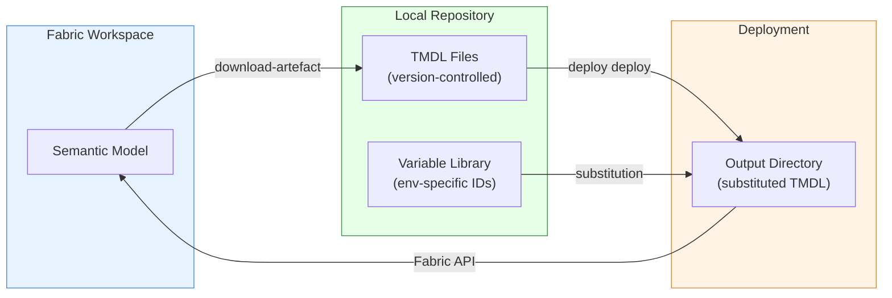

# SM Project — Semantic Model Lifecycle

[Home](../../index.md) > [Training](../index.md) > SM Project

## What Is This Training?

The DP and ER training packs each include a single exercise where you create a semantic model in the Fabric UI. This standalone **SM (Semantic Model)** scenario picks up where those exercises leave off and focuses on what happens *after* you create the model:

- Downloading the TMDL definition into your local repo
- Understanding the TMDL file structure
- Parameterizing data source expressions with `{{varlib:...}}` placeholders
- Deploying the semantic model across environments with IngenFab
- Making iterative changes and redeploying

This is the DevOps lifecycle for semantic models on Microsoft Fabric.

## Prerequisites

You need **one** of the following already completed:

- **[DP Exercise 5](../dp/exercise-05-semantic-model.md)** — the `sm_dp_geography` semantic model exists in your workspace, OR
- **[ER Exercise 6](../er/exercise-06-semantic-model.md)** — the `sem_supply_chain` semantic model exists in your workspace, OR
- **Any semantic model** you have already created in a Fabric workspace

You also need:

- IngenFab installed (`ingen_fab --help` returns usage output)
- An existing IngenFab project directory (from `ingen_fab init new`)
- Azure authentication configured (`az login`)

## Architecture

## Exercises

| Exercise | Topic | Difficulty |
|----------|-------|------------|
| [1 — Download & Version Control](exercise-01-download-and-version-control.md) | Download TMDL, commit to Git | ⭐ Beginner |
| [2 — TMDL Anatomy](exercise-02-tmdl-anatomy.md) | Understand the file structure | ⭐ Beginner |
| [3 — Variable Substitution](exercise-03-variable-substitution.md) | Parameterize for multi-env | ⭐⭐ Intermediate |
| [4 — Deploy & Promote](exercise-04-deploy-and-promote.md) | Deploy, iterate, promote | ⭐⭐ Intermediate |

---

!!! tip "Start Here"
    Begin with **[Exercise 1 — Download & Version Control](exercise-01-download-and-version-control.md)** to pull your semantic model's definition into source control.
