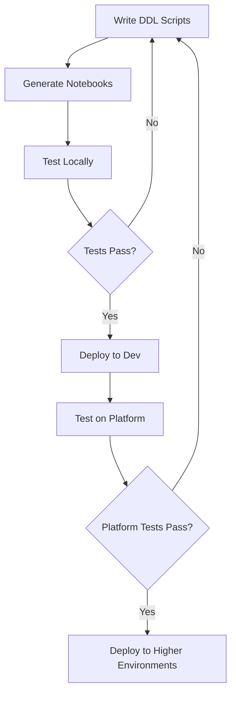

# Workflows

This guide covers best practices and common workflows for using the Ingenious Fabric Accelerator effectively in your projects.

## Development Workflow

### 1. Project Setup

```bash
# Initialize new project
ingen_fab init solution --project-name "Data Analytics Platform"

# Configure your environment variables
export FABRIC_WORKSPACE_REPO_DIR="."
export FABRIC_ENVIRONMENT="development"
```

### 2. Development Cycle



**Step-by-step:**

1. **Write DDL Scripts**
   ```bash
   # Create DDL scripts in numbered order
   mkdir -p ddl_scripts/Lakehouses/Config/001_Initial_Setup
   vim ddl_scripts/Lakehouses/Config/001_Initial_Setup/001_create_tables.py
   ```

2. **Generate Notebooks**
   ```bash
   ingen_fab ddl compile-notebooks --output-mode fabric --generation-mode lakehouse
   ```

3. **Test Locally**
   ```bash
   ingen_fab test local libraries --base-dir .
   ```

4. **Deploy to Development**
   ```bash
   ingen_fab deploy to-environment --fabric-workspace-repo-dir . --fabric-environment development
   ```

5. **Test on Platform**
   ```bash
   ingen_fab test platform notebooks --base-dir ./fabric_workspace_items
   ```

## Environment Management

### Environment Strategy

Recommended environment progression:

```
Local Development → Development → Test → Production
```

### Environment Configuration

Each environment should have its own configuration:

```bash
fabric_workspace_items/config/var_lib.VariableLibrary/valueSets/
├── development.json
├── test.json
└── production.json
```

**Example configuration:**

=== "development.json"
    ```json
    {
      "fabric_environment": "development",
      "config_workspace_id": "dev-workspace-guid",
      "config_lakehouse_id": "dev-lakehouse-guid",
      "data_retention_days": 30,
      "enable_debug_logging": true
    }
    ```

=== "test.json"
    ```json
    {
      "fabric_environment": "test",
      "config_workspace_id": "test-workspace-guid",
      "config_lakehouse_id": "test-lakehouse-guid",
      "data_retention_days": 90,
      "enable_debug_logging": false
    }
    ```

=== "production.json"
    ```json
    {
      "fabric_environment": "production",
      "config_workspace_id": "prod-workspace-guid",
      "config_lakehouse_id": "prod-lakehouse-guid",
      "data_retention_days": 365,
      "enable_debug_logging": false
    }
    ```

### Deployment Strategy

```bash
# Deploy to development first
ingen_fab deploy to-environment --fabric-workspace-repo-dir . --fabric-environment development

# Test thoroughly
ingen_fab test platform notebooks --base-dir ./fabric_workspace_items

# Deploy to test
ingen_fab deploy to-environment --fabric-workspace-repo-dir . --fabric-environment test

# Final deployment to production
ingen_fab deploy to-environment --fabric-workspace-repo-dir . --fabric-environment production
```

## DDL Script Organization

### Directory Structure

```
ddl_scripts/
├── Lakehouses/
│   ├── Config/
│   │   ├── 001_Initial_Setup/
│   │   │   ├── 001_create_config_tables.py
│   │   │   └── 002_insert_initial_data.py
│   │   └── 002_Schema_Updates/
│   │       └── 001_add_new_columns.py
│   └── Data/
│       └── 001_Initial_Setup/
│           └── 001_create_data_tables.py
└── Warehouses/
    └── EDW/
        ├── 001_Initial_Setup/
        │   ├── 001_create_schemas.sql
        │   └── 002_create_tables.sql
        └── 002_Data_Load/
            └── 001_load_reference_data.sql
```

### Naming Conventions

**Folders:**
- Use descriptive names: `001_Initial_Setup`, `002_Schema_Updates`
- Include version numbers for ordering
- Group related scripts together

**Files:**
- Start with numbers: `001_`, `002_`, etc.
- Use descriptive names: `create_config_tables.py`
- Use appropriate extensions: `.py` for Python, `.sql` for SQL

### Script Best Practices

1. **Idempotent Operations**
   ```python
   # Always use IF NOT EXISTS
   sql = """
   CREATE TABLE IF NOT EXISTS config.metadata (
       id BIGINT,
       name STRING,
       value STRING
   ) USING DELTA
   """
   ```

2. **Error Handling**
   ```python
   try:
       ddl_utils.execute_ddl(sql, "Create metadata table")
       print("✅ Metadata table created successfully")
   except Exception as e:
       print(f"❌ Failed to create metadata table: {e}")
       raise
   ```

3. **Logging**
   ```python
   ddl_utils.log_execution("001_create_config_tables.py", "Create configuration tables")
   ```

## Testing Strategies

### Local Testing

Test your code before deploying:

```bash
# Test Python libraries
ingen_fab test local libraries --base-dir .

# Test specific modules
python -m pytest ./ingen_fab/python_libs_tests/ -v

# Test notebook generation
ingen_fab ddl compile-notebooks --output-mode local --generation-mode lakehouse
```

### Platform Testing

Test on Fabric platform:

```bash
# Test generated notebooks
ingen_fab test platform notebooks --base-dir ./fabric_workspace_items

# Or run specific test notebooks in Fabric
# - platform_testing/python_platform_test.Notebook
# - platform_testing/pyspark_platform_test.Notebook
```

### Continuous Integration

Example CI/CD workflow:

```yaml
# .github/workflows/ci.yml
name: CI

on: [push, pull_request]

jobs:
  test:
    runs-on: ubuntu-latest
    steps:
    - uses: actions/checkout@v4
    
    - name: Setup Python
      uses: actions/setup-python@v4
      with:
        python-version: '3.12'
    
    - name: Install dependencies
      run: |
        pip install uv
        uv sync
    
    - name: Run tests
      run: |
        uv run ingen_fab test local libraries --base-dir .
    
    - name: Generate notebooks
      run: |
        uv run ingen_fab ddl compile-notebooks --output-mode local --generation-mode warehouse
        uv run ingen_fab ddl compile-notebooks --output-mode local --generation-mode lakehouse
    
    - name: Deploy to staging
      if: github.ref == 'refs/heads/main'
      run: |
        uv run ingen_fab deploy to-environment --fabric-workspace-repo-dir . --fabric-environment development
      env:
        AZURE_TENANT_ID: ${{ "{{" }} secrets.AZURE_TENANT_ID {{ "}}" }}
        AZURE_CLIENT_ID: ${{ "{{" }} secrets.AZURE_CLIENT_ID {{ "}}" }}
        AZURE_CLIENT_SECRET: ${{ "{{" }} secrets.AZURE_CLIENT_SECRET {{ "}}" }}
```

## Troubleshooting Workflow

### Common Issues and Solutions

1. **Authentication Failures**
   ```bash
   # Check Azure CLI authentication
   az account show
   
   # Or use environment variables
   export AZURE_TENANT_ID="your-tenant-id"
   export AZURE_CLIENT_ID="your-client-id"
   export AZURE_CLIENT_SECRET="your-client-secret"
   ```

2. **DDL Script Failures**
   ```bash
   # Check script syntax locally
   python ddl_scripts/Lakehouses/Config/001_Initial_Setup/001_create_tables.py
   
   # Review generated notebooks
   cat fabric_workspace_items/ddl_scripts/Lakehouses/Config/001_Initial_Creation_Config_Lakehouses.Notebook/notebook-content.py
   ```

3. **Variable Resolution Issues**
   ```bash
   # Verify variable files
   cat fabric_workspace_items/config/var_lib.VariableLibrary/valueSets/development.json
   
   # Test variable injection
   ingen_fab deploy to-environment --fabric-workspace-repo-dir . --fabric-environment development --dry-run
   ```

### Debug Workflow

```bash
# 1. Use dry-run to preview changes
ingen_fab deploy to-environment --fabric-workspace-repo-dir . --fabric-environment development --dry-run

# 2. Test locally first
ingen_fab test local libraries --base-dir . --verbose

# 3. Check notebook content
ingen_fab notebook scan-blocks --base-dir ./fabric_workspace_items --output-format json

# 4. Deploy with verbose output
ingen_fab deploy to-environment --fabric-workspace-repo-dir . --fabric-environment development --verbose
```

## Advanced Workflows

### Multi-Project Management

```bash
# Create multiple related projects
for project in analytics ml-pipeline reporting; do
    mkdir $project
    cd $project
    ingen_fab init solution --project-name "$project"
    cd ..
done
```

### Shared Libraries

```bash
# Create shared library project
ingen_fab init solution --project-name "shared-libs"

# Reference shared libraries in other projects
# Update python_libs/ to include shared components
```

### Environment Promotion

```bash
# Promote from development to test
ingen_fab deploy to-environment --fabric-workspace-repo-dir . --fabric-environment test

# Validate in test environment
ingen_fab test platform notebooks --base-dir ./fabric_workspace_items

# Promote to production
ingen_fab deploy to-environment --fabric-workspace-repo-dir . --fabric-environment production
```

## Best Practices

### Code Organization

- **Separate concerns**: Keep DDL scripts focused on single responsibilities
- **Version control**: Use descriptive commit messages and branch strategies
- **Documentation**: Include README files in each major directory

### Development Practices

- **Test early and often**: Run local tests before platform deployment
- **Use version control**: Commit changes frequently with meaningful messages
- **Environment parity**: Keep environments as similar as possible

### Deployment Practices

- **Gradual rollout**: Deploy to development first, then test, then production
- **Backup strategy**: Ensure you can rollback changes if needed
- **Monitoring**: Monitor execution logs in Fabric after deployment

### Security Practices

- **Secret management**: Use Azure Key Vault or environment variables
- **Access control**: Implement proper RBAC in Fabric workspaces
- **Audit logging**: Enable audit logs for all environments

## Performance Optimization

### Notebook Generation

```bash
# Generate notebooks in parallel for large projects
ingen_fab ddl compile-notebooks --output-mode fabric --generation-mode warehouse &
ingen_fab ddl compile-notebooks --output-mode fabric --generation-mode lakehouse &
wait
```

### Testing

```bash
# Run tests in parallel
ingen_fab test local libraries --base-dir . --parallel
```

### Deployment

```bash
# Use dry-run to validate before actual deployment
ingen_fab deploy to-environment --fabric-workspace-repo-dir . --fabric-environment production --dry-run
```

This workflow guide provides a comprehensive approach to using the Ingenious Fabric Accelerator effectively in your projects. Adapt these patterns to fit your specific needs and organizational requirements.