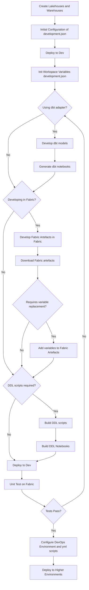

# Workflows

[Home](../index.md) > [User Guide](index.md) > Workflows

This guide covers best practices and common workflows for using the Ingenious Fabric Accelerator effectively in your projects.

The guide assumes that you are working in a cloned DevOps repo.

## Development Workflow

### 1. Project Setup

```bash
# Initialize new project (minimal template)
ingen_fab init new --project-name "dp"

# Or initialize with sample configurations and platform manifests
ingen_fab init new --project-name "dp" --with-samples

# Set environment (development, UAT, production)
$env:FABRIC_ENVIRONMENT = "development"

# Set workspace directory 
$env:FABRIC_WORKSPACE_REPO_DIR = "dp"
```

!!! tip "Choosing the Right Template"
    - **Default template** (`project_templates`): Minimal structure, best for starting from scratch
    - **Sample template** (`--with-samples`): Includes platform manifests and sample configurations, ideal for learning or quick prototyping

### 2. Development Cycle



**Step-by-step:**

1.  **Create Lakehouses and Warehouses**

    Create lakehouse and warehouse definitions in your project. These are .Lakehouse and .Warehouse items under fabric_workspace_items/
    
    For examples, see the sample project.

2.  **Initial Configuration of development.json**

    Configure environment-specific variables by editing fabric_workspace_items/config/var_lib.VariableLibrary/valueSets/development.json

    For the initial configurations, the variables below are important.

    ```json
    {
      "$schema": "https://developer.microsoft.com/json-schemas/fabric/item/variableLibrary/definition/valueSet/1.0.0/schema.json",
      "name": "development",
      "variableOverrides": [
        {
          "name": "fabric_environment",
          "value": "development"
        },
        {
          "name": "fabric_deployment_workspace_id",
          "value": "xxxxxxxx-xxxx-xxxx-xxxx-xxxxxxxxxxxx"
        },
        {
          "name": "config_workspace_name",
          "value": "dp_dev"
        }
      ]
    }
    ```

    Note: The structure of the json files under valueSets must align with the structure of variables.json

3.  **Deploy to Dev**

    ```bash
    $env:FABRIC_ENVIRONMENT = "development"
    $env:FABRIC_WORKSPACE_REPO_DIR = "dp"

    ingen_fab deploy deploy
    ```

4.  **Initialize Workspace Variables**

    This process will update the lakehouse and warehouse specific variable values in your development.json

    ```bash
    # Sync variable library to workspace
    ingen_fab init workspace --workspace-name dp_dev
    ```

5.  **Choose Development Approach**

    **If using dbt adapter:**
    
    ```bash
    # Develop dbt models and snapshots. Update schema.yml files
   
    # Extract metadata for lakehouses
    ingen_fab deploy get-metadata --target lakehouse

    # Convert metadata for dbt format (uses default metadata/lakehouse_metadata_all.csv)
    ingen_fab dbt convert-metadata --dbt-project dbt_project
    
    # Or use custom metadata file if needed
    # ingen_fab dbt convert-metadata --dbt-project dbt_project --metadata-file metadata/custom_export.csv
    
    # Build dbt models and masters
    ingen_fab dbt exec -- stage run build --project-dir dbt_project
    ingen_fab dbt exec -- stage run post-scripts --project-dir dbt_project

    # Generate dbt notebooks
    ingen_fab dbt create-notebooks --dbt-project dbt_project
    ```

    **If developing in Fabric:**
    
    - Develop notebooks, data pipelines, and other artifacts directly in Fabric workspace
    - Download artifacts when ready:
      ```bash
      ingen_fab deploy download-artefact --artefact-name "my_notebook" --artefact-type Notebook
      ```
    - Add variable replacement markers if needed for environment-specific values

6.  **Build DDL Scripts (if required)**

    Create DDL scripts, following folder and file naming conventions

7.  **Generate DDL Notebooks**

    ```bash
    # For warehouses from DDL
    ingen_fab ddl compile --output-mode fabric_workspace_repo --generation-mode Warehouse
    
    # For lakehouses from DDL
    ingen_fab ddl compile --output-mode fabric_workspace_repo --generation-mode Lakehouse
    ```

8.  **Deploy to Dev and Test**

    ```bash   
    # Deploy to dev workspace
    ingen_fab deploy
    ```

9.  **Commit and Push Changes**

    Commit changes to repository.
    A trunk based development approach is recommended with Pull Requests for quality control.

10. **Deploy to Higher Environments**

    Deploy to higher environments using DevOpS CI\CD pipelines.
    Remember to create \ configure value sets specific to the environments:

    - test.json
    - uat.json
    - production.json
    

## Environment Management

### Environment Strategy

Recommended environment progression:

```
Development → Test → UAT → Production
```

### Environment Configuration

Each environment should have its own configuration:

```bash
fabric_workspace_items/config/var_lib.VariableLibrary/valueSets/
├── development.json
├── test.json
├── uat.json
└── production.json
```

**Example configuration:**

For example configurations, see the json files under the sample project.


### Deployment Strategy

```bash
# Deploy to development first. Note that with trunk based development, this may require developer workspaces and branches
# Set environment variables first
$env:FABRIC_WORKSPACE_REPO_DIR = "dp"
$env:FABRIC_ENVIRONMENT = "development"

ingen_fab deploy deploy

# Validate in development workspace, then deploy to test using DevOps pipelines

# Validate in test workspace, then deploy to UAT using DevOps pipelines

# Final deployment to production using DevOps pipelines
```

Note that deploy deploy can be used from Visual Studio Code to deploy to any environment, but a DevOps appraoch is recommended.

!!! tip "DDL Script Organization"
    For detailed guidance on organizing DDL scripts, including naming conventions, best practices, and examples, see the [DDL Script Organization Guide](ddl-organization.md).

## Troubleshooting Workflow

### Common Issues and Solutions

1. **Authentication Failures**
   ```bash
   # Check Azure CLI authentication
   az account show
   
   # Or use environment variables
   export AZURE_TENANT_ID="your-tenant-id"
   export AZURE_CLIENT_ID="your-client-id"
   export AZURE_CLIENT_SECRET="your-client-secret"
   ```

2. **DDL Script Failures**

   DDL notebooks may fail if the python or SQL scripts have not been developed properly

3. **Variable Resolution Issues**

   Variables in json value set files must correspond with those in variables.json
   
   settings.json must list all value sets

### Working with Flat File Ingestion (Requires review)

The flat file ingestion package supports both lakehouse and warehouse targets with different processing approaches:

```bash
# Compile for lakehouse (PySpark runtime with Delta tables)
ingen_fab package ingest compile --target-datastore lakehouse --include-samples

# Compile for warehouse (Python runtime with COPY INTO operations)
ingen_fab package ingest compile --target-datastore warehouse --include-samples

# Compile both versions
ingen_fab package ingest compile --target-datastore both --include-samples

# Run ingestion for specific configuration
ingen_fab package ingest run --config-id "customers_import" --execution-group 1
```

**Choosing Target Datastore:**
- **Lakehouse**: Use for Delta table operations, schema evolution, and PySpark-based transformations
- **Warehouse**: Use for high-performance bulk loading with COPY INTO and SQL-based operations
- **Both**: Generate separate notebooks for maximum flexibility


### Schema Change Management

Track and validate schema changes across environments using metadata extraction and comparison:

```bash
# 1. Extract baseline metadata before changes
ingen_fab deploy get-metadata --target both --format csv -o baseline_schema.csv

# 2. Make schema changes via DDL scripts
# ... edit your DDL scripts ...

# 3. Generate and deploy updated notebooks
ingen_fab ddl compile --output-mode fabric_workspace_repo --generation-mode Warehouse
ingen_fab deploy deploy

# 4. Extract updated metadata
ingen_fab deploy get-metadata --target both --format csv -o updated_schema.csv

# 5. Compare and analyze changes
ingen_fab deploy compare-metadata -f1 baseline_schema.csv -f2 updated_schema.csv  -o schema_changes.json --format json
```

**What the comparison detects:**
- Missing tables (added/removed)
- Missing columns (added/removed)  
- Data type changes (e.g., `varchar(50)` → `varchar(100)`)
- Nullable constraint changes (`NULL` → `NOT NULL`)

## Related Topics

For best practices on dbt, code organization, development, deployment, security, and performance optimization, see the [Best Practices Guide](best-practices.md).

This workflow guide provides a comprehensive approach to using the Ingenious Fabric Accelerator effectively in your projects. Adapt these patterns to fit your specific needs and organizational requirements.
