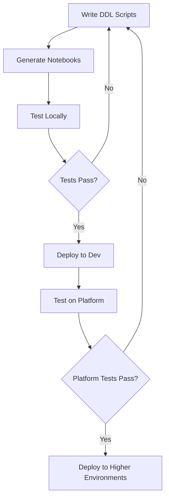

# Workflows

[Home](../index.md) > [User Guide](index.md) > Workflows

This guide covers best practices and common workflows for using the Ingenious Fabric Accelerator effectively in your projects.

## Development Workflow

### 1. Project Setup

```bash
# Initialize new project (minimal template)
ingen_fab init new --project-name "Data Analytics Platform"

# Or initialize with sample configurations and platform manifests
ingen_fab init new --project-name "Data Analytics Platform" --with-samples

# Set environment (development, UAT, production)
$env:FABRIC_ENVIRONMENT = "development"

# Set workspace directory 
$env:FABRIC_WORKSPACE_REPO_DIR = "Data Analytics Platform"
```

!!! tip "Choosing the Right Template"
    - **Default template** (`project_templates`): Minimal structure, best for starting from scratch
    - **Sample template** (`--with-samples`): Includes platform manifests and sample configurations, ideal for learning or quick prototyping

### 2. Development Cycle



**Step-by-step:**

1. **Write DDL Scripts**
   ```bash
   # Create DDL scripts in numbered order
   mkdir -p ddl_scripts/Lakehouses/Config/001_Initial_Setup
   vim ddl_scripts/Lakehouses/Config/001_Initial_Setup/001_create_tables.py
   ```

2. **Generate Notebooks**
   ```bash
   # For warehouses
   ingen_fab ddl compile --output-mode fabric_workspace_repo --generation-mode Warehouse
   
   # For lakehouses
   ingen_fab ddl compile --output-mode fabric_workspace_repo --generation-mode Lakehouse
   ```

3. **Test Locally**
   ```bash
   # Set environment for local testing
   export FABRIC_ENVIRONMENT=local
   
   # Test Python implementations
   ingen_fab test local python
   
   # Test PySpark implementations
   ingen_fab test local pyspark
   ```

4. **Deploy to Development**
   ```bash
   # Set environment back to development
   export FABRIC_ENVIRONMENT=development
   
   # Deploy
   ingen_fab deploy deploy --fabric-workspace-repo-dir . --fabric-environment development
   ```

5. **Generate Platform Tests**
   ```bash
   ingen_fab test platform generate
   ```

## Environment Management

### Environment Strategy

Recommended environment progression:

```
Local Development → Development → Test → Production
```

### Environment Configuration

Each environment should have its own configuration:

```bash
fabric_workspace_items/config/var_lib.VariableLibrary/valueSets/
├── local.json
├── development.json
├── test.json
└── production.json
```

**Example configuration:**

=== "development.json"
    ```json
    {
      "fabric_environment": "development",
      "config_workspace_id": "dev-workspace-guid",
      "config_lakehouse_id": "dev-lakehouse-guid",
      "data_retention_days": 30,
      "enable_debug_logging": true
    }
    ```

=== "test.json"
    ```json
    {
      "fabric_environment": "test",
      "config_workspace_id": "test-workspace-guid",
      "config_lakehouse_id": "test-lakehouse-guid",
      "data_retention_days": 90,
      "enable_debug_logging": false
    }
    ```

=== "production.json"
    ```json
    {
      "fabric_environment": "production",
      "config_workspace_id": "prod-workspace-guid",
      "config_lakehouse_id": "prod-lakehouse-guid",
      "data_retention_days": 365,
      "enable_debug_logging": false
    }
    ```

### Deployment Strategy

```bash
# Deploy to development first
ingen_fab deploy deploy --fabric-workspace-repo-dir . --fabric-environment development

# Generate and run platform tests
ingen_fab test platform generate

# Deploy to test
ingen_fab deploy deploy --fabric-workspace-repo-dir . --fabric-environment test

# Final deployment to production
ingen_fab deploy deploy --fabric-workspace-repo-dir . --fabric-environment production
```

## DDL Script Organization

### Directory Structure

```
ddl_scripts/
├── Lakehouses/
│   ├── Config/
│   │   ├── 001_Initial_Setup/
│   │   │   ├── 001_create_config_tables.py
│   │   │   └── 002_insert_initial_data.py
│   │   └── 002_Schema_Updates/
│   │       └── 001_add_new_columns.py
│   └── Data/
│       └── 001_Initial_Setup/
│           └── 001_create_data_tables.py
└── Warehouses/
    └── EDW/
        ├── 001_Initial_Setup/
        │   ├── 001_create_schemas.sql
        │   └── 002_create_tables.sql
        └── 002_Data_Load/
            └── 001_load_reference_data.sql
```

### Naming Conventions

**Folders:**
- Use descriptive names: `001_Initial_Setup`, `002_Schema_Updates`
- Include version numbers for ordering
- Group related scripts together

**Files:**
- Start with numbers: `001_`, `002_`, etc.
- Use descriptive names: `create_config_tables.py`
- Use appropriate extensions: `.py` for Python, `.sql` for SQL

### Script Best Practices

1. **Idempotent Operations**
   ```python
   # Always use IF NOT EXISTS
   sql = """
   CREATE TABLE IF NOT EXISTS config.metadata (
       id BIGINT,
       name STRING,
       value STRING
   ) USING DELTA
   """
   ```

2. **Error Handling**
   ```python
   try:
       ddl_utils.execute_ddl(sql, "Create metadata table")
       print("✅ Metadata table created successfully")
   except Exception as e:
       print(f"❌ Failed to create metadata table: {e}")
       raise
   ```

3. **Logging**
   ```python
   ddl_utils.log_execution("001_create_config_tables.py", "Create configuration tables")
   ```

## Testing Strategies

### Local Testing

Test your code before deploying:

```bash
# Set environment for local testing
export FABRIC_ENVIRONMENT=local

# Test Python libraries
ingen_fab test local python

# Test PySpark libraries
ingen_fab test local pyspark

# Test common libraries
ingen_fab test local common

# Test specific module
ingen_fab test local python ddl_utils
```

### Platform Testing

Generate platform tests:

```bash
# Generate platform test notebooks
ingen_fab test platform generate

# The generated test notebooks can then be run in Fabric:
# - platform_testing/python_platform_test.Notebook
# - platform_testing/pyspark_platform_test.Notebook
```

### Continuous Integration

Example CI/CD workflow:

```yaml
# .github/workflows/ci.yml
name: CI

on: [push, pull_request]

jobs:
  test:
    runs-on: ubuntu-latest
    steps:
    - uses: actions/checkout@v4
    
    - name: Setup Python
      uses: actions/setup-python@v4
      with:
        python-version: '3.12'
    
    - name: Install dependencies
      run: |
        pip install uv
        uv sync
    
    - name: Run tests
      run: |
        export FABRIC_ENVIRONMENT=local
        uv run ingen_fab test local python
        uv run ingen_fab test local pyspark
    
    - name: Generate notebooks
      run: |
        uv run ingen_fab ddl compile --output-mode fabric_workspace_repo --generation-mode Warehouse
        uv run ingen_fab ddl compile --output-mode fabric_workspace_repo --generation-mode Lakehouse
    
    - name: Deploy to staging
      if: github.ref == 'refs/heads/main'
      run: |
        export FABRIC_ENVIRONMENT=development
        uv run ingen_fab deploy deploy --fabric-workspace-repo-dir . --fabric-environment development
      env:
        AZURE_TENANT_ID: ${{ "{{" }} secrets.AZURE_TENANT_ID {{ "}}" }}
        AZURE_CLIENT_ID: ${{ "{{" }} secrets.AZURE_CLIENT_ID {{ "}}" }}
        AZURE_CLIENT_SECRET: ${{ "{{" }} secrets.AZURE_CLIENT_SECRET {{ "}}" }}
```

## Troubleshooting Workflow

### Common Issues and Solutions

1. **Authentication Failures**
   ```bash
   # Check Azure CLI authentication
   az account show
   
   # Or use environment variables
   export AZURE_TENANT_ID="your-tenant-id"
   export AZURE_CLIENT_ID="your-client-id"
   export AZURE_CLIENT_SECRET="your-client-secret"
   ```

2. **DDL Script Failures**
   ```bash
   # Check script syntax locally
   python ddl_scripts/Lakehouses/Config/001_Initial_Setup/001_create_tables.py
   
   # Review generated notebooks
   cat fabric_workspace_items/ddl_scripts/Lakehouses/Config/001_Initial_Creation_Config_Lakehouses.Notebook/notebook-content.py
   ```

3. **Variable Resolution Issues**
   ```bash
   # Verify variable files
   cat fabric_workspace_items/config/var_lib.VariableLibrary/valueSets/development.json
   
   # Compile libraries with variable injection
   ingen_fab libs compile
   ```

### Debug Workflow

```bash
# 1. Test locally first
export FABRIC_ENVIRONMENT=local
ingen_fab test local python

# 2. Check notebook content
ingen_fab notebook scan-notebook-blocks --base-dir ./fabric_workspace_items

# 3. Find all notebook files
ingen_fab notebook find-notebook-content-files --base-dir ./fabric_workspace_items

# 4. Deploy to development
export FABRIC_ENVIRONMENT=development
ingen_fab deploy deploy --fabric-workspace-repo-dir . --fabric-environment development
```

## Advanced Workflows

### Multi-Project Management

```bash
# Create multiple related projects
for project in analytics ml-pipeline reporting; do
    ingen_fab init new --project-name "$project"
done
```

### Shared Libraries

```bash
# Create shared library project
ingen_fab init new --project-name "shared-libs"

# Reference shared libraries in other projects
# Update python_libs/ to include shared components
```

### Environment Promotion

```bash
# Promote from development to test
ingen_fab deploy deploy --fabric-workspace-repo-dir . --fabric-environment test

# Generate platform tests for validation
ingen_fab test platform generate

# Promote to production
ingen_fab deploy deploy --fabric-workspace-repo-dir . --fabric-environment production
```

### Working with Flat File Ingestion

The flat file ingestion package supports both lakehouse and warehouse targets with different processing approaches:

```bash
# Compile for lakehouse (PySpark runtime with Delta tables)
ingen_fab package ingest compile --target-datastore lakehouse --include-samples

# Compile for warehouse (Python runtime with COPY INTO operations)
ingen_fab package ingest compile --target-datastore warehouse --include-samples

# Compile both versions
ingen_fab package ingest compile --target-datastore both --include-samples

# Run ingestion for specific configuration
ingen_fab package ingest run --config-id "customers_import" --execution-group 1
```

**Choosing Target Datastore:**
- **Lakehouse**: Use for Delta table operations, schema evolution, and PySpark-based transformations
- **Warehouse**: Use for high-performance bulk loading with COPY INTO and SQL-based operations
- **Both**: Generate separate notebooks for maximum flexibility

```

### Schema Change Management

Track and validate schema changes across environments using metadata extraction and comparison:

```bash
# 1. Extract baseline metadata before changes
ingen_fab deploy get-metadata --target both --format csv -o baseline_schema.csv

# 2. Make schema changes via DDL scripts
# ... edit your DDL scripts ...

# 3. Generate and deploy updated notebooks
ingen_fab ddl compile --output-mode fabric_workspace_repo --generation-mode Warehouse
ingen_fab deploy deploy

# 4. Extract updated metadata
ingen_fab deploy get-metadata --target both --format csv -o updated_schema.csv

# 5. Compare and analyze changes
ingen_fab deploy compare-metadata \
  -f1 baseline_schema.csv \
  -f2 updated_schema.csv \
  -o schema_changes.json --format json
```

**Environment comparison workflow:**
```bash
# Compare production vs staging schemas
ingen_fab deploy get-metadata --target both -o prod_schema.csv --fabric-environment production
ingen_fab deploy get-metadata --target both -o staging_schema.csv --fabric-environment staging

# Generate comparison report
ingen_fab deploy compare-metadata \
  -f1 prod_schema.csv \
  -f2 staging_schema.csv \
  --format table
```

**Migration validation workflow:**
```bash
# Before migration
ingen_fab deploy get-metadata --target lakehouse -o pre_migration.csv

# Run migration scripts
# ... execute your migration ...

# After migration  
ingen_fab deploy get-metadata --target lakehouse -o post_migration.csv

# Validate changes match expectations
ingen_fab deploy compare-metadata \
  -f1 pre_migration.csv \
  -f2 post_migration.csv \
  -o migration_validation.json --format json

# Review differences for unexpected changes
cat migration_validation.json | jq '.differences[] | select(.type == "missing_table")'
```

**What the comparison detects:**
- Missing tables (added/removed)
- Missing columns (added/removed)  
- Data type changes (e.g., `varchar(50)` → `varchar(100)`)
- Nullable constraint changes (`NULL` → `NOT NULL`)

### Managing Python Libraries

```bash
# Compile Python libraries with variable injection
ingen_fab libs compile

# Compile specific library file
ingen_fab libs compile --target-file "python_libs/common/config_utils.py"

# Upload libraries to Fabric
ingen_fab deploy upload-python-libs
```

## Best Practices

### Code Organization

- **Separate concerns**: Keep DDL scripts focused on single responsibilities
- **Version control**: Use descriptive commit messages and branch strategies
- **Documentation**: Include README files in each major directory

### Development Practices

- **Test early and often**: Run local tests before platform deployment
- **Use version control**: Commit changes frequently with meaningful messages
- **Environment parity**: Keep environments as similar as possible

### Deployment Practices

- **Gradual rollout**: Deploy to development first, then test, then production
- **Backup strategy**: Ensure you can rollback changes if needed
- **Monitoring**: Monitor execution logs in Fabric after deployment

### Security Practices

- **Secret management**: Use Azure Key Vault or environment variables
- **Access control**: Implement proper RBAC in Fabric workspaces
- **Audit logging**: Enable audit logs for all environments

## Performance Optimization

### Notebook Generation

```bash
# Generate notebooks for multiple types sequentially
ingen_fab ddl compile --output-mode fabric_workspace_repo --generation-mode Warehouse
ingen_fab ddl compile --output-mode fabric_workspace_repo --generation-mode Lakehouse
```

### Testing

```bash
# Run specific test modules for faster feedback
ingen_fab test local python ddl_utils
ingen_fab test local pyspark lakehouse_utils
```

### Deployment

```bash
# Clean up old items before deployment if needed
ingen_fab deploy delete-all --environment development --force

# Deploy fresh
ingen_fab deploy deploy --fabric-workspace-repo-dir . --fabric-environment development
```

This workflow guide provides a comprehensive approach to using the Ingenious Fabric Accelerator effectively in your projects. Adapt these patterns to fit your specific needs and organizational requirements.